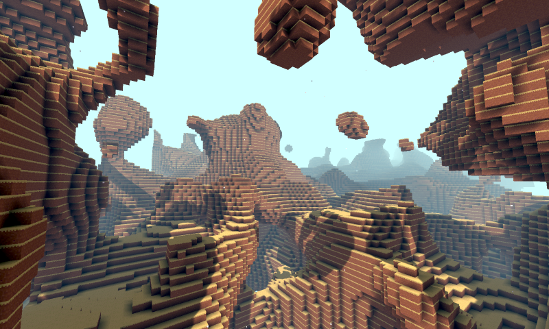

Voxel Tools for Godot
=========================

C++ module for creating volumetric worlds in Godot Engine.

Setup
------

You need to get the source of Godot 3.1+ and recompile it with this module.

Install the contents of the repo in a folder under "modules/", named "voxel".

IMPORTANT: if you clone the repo, Git will create the folder as the repo name, "godot_voxel". But because Godot SCons scripts consider the folder name as the module's name, it will generate wrong function calls, so you must rename the folder "voxel".
For more info about Godot modules, see http://docs.godotengine.org/en/3.1/development/cpp/custom_modules_in_cpp.html

What this module provides
---------------------------

- Fully editable terrain as long as you call the right functions (see demo: https://github.com/Zylann/voxelgame)
- Voxel storage using 8-bit channels like images for any general purpose
- Data paging using blocks of 16x16x16 voxels, so the world can be streamed with threads as you move
- Minecraft-style terrain with voxels as types, with multiple materials and baked ambient occlusion
- Smooth terrain with voxels as distance field (using extensions of marching cubes on a distance field)
- Simple interface for custom terrain generators (block by block using threads)

What this module doesn't provides
-----------------------------------

- Level of detail for blocky terrain
- Level of detail for smooth terrain (not YET)
- Game specific features such as cave generation or procedural trees (though it might include tools to help doing them)
- Editor tools (only a few things are exposed)
- Import and export of voxel formats

Roadmap
---------

I work on this module whenever I want and add things I'd like to have, so the roadmap is pretty much depending on my personal agenda.
