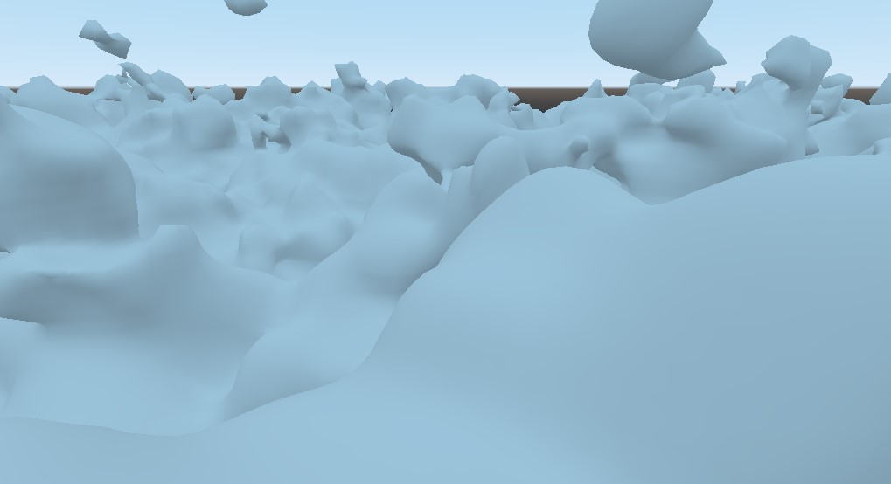

# Creating A Voxel Terrain
Now that your Godot Engine has voxel support built in, you can either download one of the demos ([Zylann's demos](https://github.com/Zylann/voxelgame) or [TinmanJuggernaut's fps_demo](https://github.com/tinmanjuggernaut/voxelgame)) and start playing with them, or start creating your own terrain.

## Create A Terrain In The Editor: VoxelTerrain + Heightmap
1. Create a new project and a new 3D scene, with a Spatial type root node.
1. Add a Camera and elevate it by setting the transform: Translation Y = 75 and Rotation X = -25. The terrain starts generating around (0,0,0), but creates high hills, and may be invisible from underneath. We will be looking down from above.
1. Import a black and white heightmap texture such as [this one](https://github.com/Zylann/voxelgame/blob/master/project/blocky_terrain/noise_distorted.png) from the demo. Make sure that the file is imported as an Image and NOT a Texture on the Import panel. You'll likely have to re-import and restart.
1. Add a `VoxelTerrain` node and adjust the following settings:
	1. Stream: New VoxelStreamImage. Then click VoxelStreamImage again.
	1. Image: Load. Select your imported noise texture.
	1. Decide on the type of terrain you want:
		* Blocky: Set Channel = "Type" (or 0), and leave Smooth Meshing Enabled unchecked (lower down).
		* Smooth: Set Channel = "SDF" (or 1), and enable Smooth Meshing Enabled.
	1. Voxel Library: add a New VoxelLibrary
	1. Set the Viewer Path, Assign, select your camera or player (the parent of your camera).
1. Play your scene and you should see a terrain.


## Create A Terrain In The Editor: VoxelLODTerrain + 3D Noise
Here we'll look at `VoxelLODTerrain` with a noise data stream.

1. Create a new project and a new 3D scene, with a Spatial type root node.
1. Add a Camera and adjust the following settings:
	1. Transform: Translation Y = 200. 
	1. Rotation X = -25.
	1. Far: 2048 (or up to the maximum of 8192, which I use). 
1. Add a `VoxelLODTerrain` node and adjust the following settings:
	1. Stream: New VoxelStreamNoise. Then click VoxelStreamNoise again.
	1. Noise: New OpenSimplexNoise. Then click OpenSimplexNoise again. Leave the settings at the default, but here's where they are.
	1. Set the Viewer Path, Assign, select your camera or player (the parent of your camera).
1. Play your scene and you should see a terrain.




### Experiment With Noise
Now try playing with the numbers. For instance, these settings will reach the horizon and give a noise terrain with a greater distance between the highest and lowest points:

1. Camera
	1. Far: 8192
	1. Translate: Y = 240 (Make sure Y is near or above Height Start + Height Range below).
1. VoxelLODTerrain
	1. Adjust the noise values as desired or leave at the defaults.
	1. Noise: Height Start: -200
	1. Noise: Height Range: 600 (This will kill your performance if set too high. However I've experimented with 10,000 on a GTX1060.)
	1. View Distance: 4096
	1. LOD Count: 8


### Additional Notes
* We will add materials on the next page.

* Heightmaps, 3D Noise, and custom streams all work with either `VoxelTerrain` or `VoxelLODTerrain`. 


## Create A Terrain With Code

Add your own camera and environment as desired, or from above. Then drop this into a script:

```
const HEIGHT_MAP = preload("res://blocky_terrain/noise_distorted.png")

var terrain = VoxelTerrain.new()

func _ready():
	terrain.voxel_library = VoxelLibrary.new()
	terrain.stream = VoxelStreamImage.new()
	terrain.stream.image = HEIGHT_MAP
	terrain.view_distance = 256	
	terrain.viewer_path = "/root/Spatial/Player"	# Change to the path of your camera or player node
	add_child(terrain)				# Add the terrain to the tree so Godot will render it
```


---
* [Next Page](04_materials.md)
* [Doc Index](01_get-started.md)
