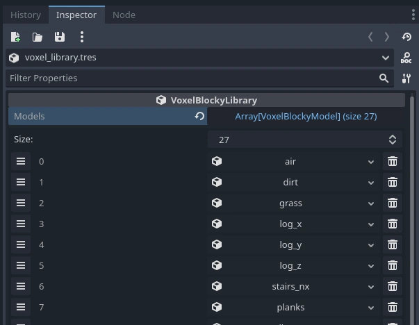
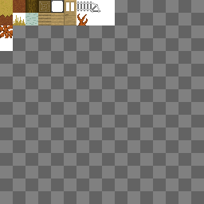
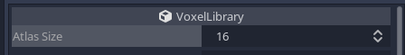
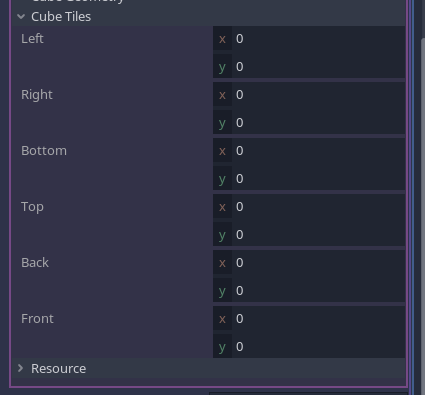
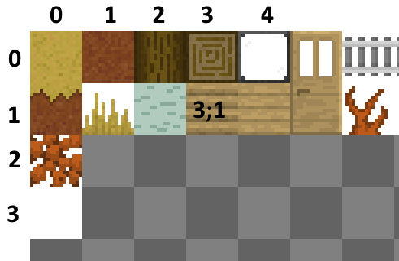
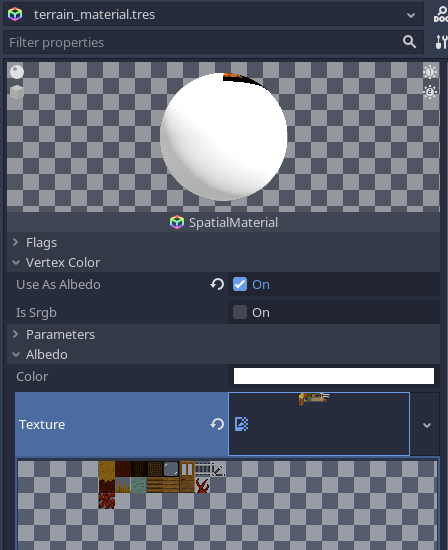
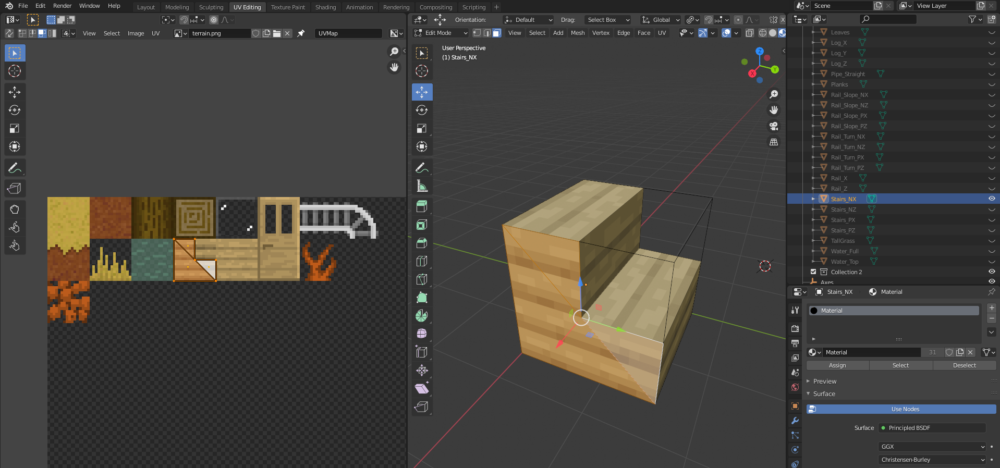
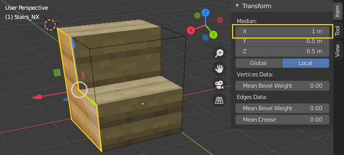
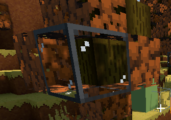
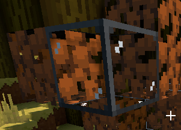

Blocky terrains
=====================

This page focuses more in detail on blocky terrains, Minecraft-like, or made of cubes.


`VoxelMesherBlocky`
---------------------

This mesher combines small meshes corresponding to voxel IDs into chunks. It culls faces occluding each other, but doesn't do greedy meshing. This is a similar technique used in Minecraft.

Voxel data used by this mesher may be stored in the following channel: `VoxelBuffer.CHANNEL_TYPE`

### Creating voxel types

The mesher has a `library` property of type `VoxelBlockyLibrary`. This is a resource containing a list of all the models you want to use in order to build a voxel mesh: grass, dirt, wood, leaves, water, shrubs, stairs, door parts etc. You can create a new library in place, or make one saved to a file if you want to re-use it in several places. You can also create it from code.

First, set how many voxel types you need by setting the `voxel_count` property. If you need more later, you can increase it.
A list of voxel types is shown below:



Each slot can contain a `VoxelBlockyModel` resource. The index shown on their left will be the ID they use in voxel data. Voxel `0` is a special case: by convention, it may be used as the default "air" voxel. You may assign a new `VoxelBlockyModel` resource to each slot, and fill in their properties.

With default 16-bit voxel data, you can create up to 65,536 voxel types. But in the future, some bits of the `TYPE` channel might be used to store orientation, so a more realistic limit could be around 4,096.

### Cubes

A simple start is to set the `geometry_type` to `Cube`, so the voxel will be a cube. 

With this mesher, using atlases is recommended to allow re-using materials and reduce the number of draw calls. You can create a texture containing all the tiles your voxels can use. For example, here is one from the [blocky game](https://github.com/Zylann/voxelgame/tree/master/project/blocky_game) demo:



This atlas is a square texture and can contain up to 16x16 tiles. This number is important and needs to be set on the `VoxelBlockyLibrary` `atlas_size` property, so texture coordinates can be generated properly when you use the `Cube` geometry type:



Voxel types using the `Cube` geometry can have different tiles on each of their faces. You can decide which one to use by assigning properties of `Voxel`, under the `Cube tiles` category. Coordinates here are in tiles, not pixels.



For example, if you want to use the "planks" tile, you may use x=3 and y=1:



So far we defined a cubic voxel with specific texture coordinates on its faces, but we still have to actually assign the texture and material used to render it. This can be done in the `Material overrides` section, in which you can assign a material with the texture in it.

Make sure to assign its `albedo_texture` to your texture. You may also check the `Vertex Color/Use as albedo` property, because this will allow the mesher to bake ambient occlusion on the edge of cubes.



Each model can use different materials with different textures, but keep in mind the more you re-use materials, the better. It reduces the number of draw calls and makes rendering faster.

Note, there are several levels at which materials get applied, each one overriding the other:
- Materials present on meshes are the default (if you use meshes explicitely)
- Materials specified on `VoxelBlockyModel` will override mesh materials
- The material specified on `VoxelTerrain` will override all library materials

### Meshes

Creating voxel types with the `Cube` geometry is a shortcut that can be used for simple voxels, but the most versatile workflow is to use actual meshes. If you change `geometry_type` to `CustomMesh`, you are allowed to assign a mesh resource. In this mode, the `Cube tiles` properties are not available, because you will have to assign texture coordinates of the mesh within a 3D modeler like Blender.



Meshes can have any shape you want, however there are a few constraints to respect:

- The origin of the mesh should be its lower corner.
- Blender's coordinate system is Z-up, but Godot is Y-up. Make sure the meshes you export don't go into negative coordinates once imported in Godot.
- Vertices should preferably be located within the 0..1 range, in all directions
- Keep it low-poly. The mesher can deal with large models, but performance can decrease very quickly if a complex model appears a lot of times.
- Faces lying on the sides of the 1x1x1 unit cube will be the only faces that can be culled by the mesher. Make sure they are perfectly lining up. If they don't, it can cause dramatic slowdowns due to the amount of generated geometry not getting culled.



The best format to use to export your meshes is OBJ. Godot imports this format by default as a mesh resource. Other formats are not suitable because Godot imports them as scenes, and `VoxelBlockyModel` resources require meshes, not scenes.
You can choose to export materials from here too, but it is recommended to do it in Godot because it allows you to re-use them.

!!! note
	A second material can be used in each model. This is useful if a given mesh needs both transparent and opaque parts. This works as usual, by having a mesh with two surfaces. However, face culling will still use properties of the model regardless. For example, if a model has opaque sides and is transparent in the middle, it may be defined as a non-transparent block, so when placed next to other opaque blocks, geometry of its sides will be culled. See (Transparency)[#transparency] section for more info.

### Usage of voxel type IDs

Voxel IDs defined in a `VoxelBlockyLibrary` are like tiles in a tilemap: for simple games, they can directly correspond to a type of block. However, you may want to avoid treating them directly this way over time. Instead, you may define your own list of block types, and each type can correspond to one, or multiple `VoxelBlockyModel` IDs. 

Examples from Minecraft:

- Stairs can be placed at different orientations, and sometimes have different appearance. These are actually multiple voxel IDs.
- Crops can have several growth stages. Each stage is a different voxel ID, for the same type of block.
- One door is actually made of 2 voxels. Its top, and bottom. There could be even more if we consider opened and closed doors.
- One rail can correspond to many different voxels: straight rails, slopes, and turns. They are all rails, but in different sub-configurations.

Managing the correspondance between your "game's block" IDs and voxel IDs is up to you.

!!! note
	At the moment, rotating or flipping voxels is not supported, so you have to create each rotated version you may need for a type of voxel.

### Transparency

You may want some of your voxel types to be transparent. There is in fact two main ways to achieve this:

- Using alpha clip: transparent pixels are discarded, allowing rendering through the opaque pass, which avoids some typical issues with transparent surfaces.
- Alpha blend: actual transparency, which has a few limitations when multiple transparent surfaces are rendered behind each other

Both require to use a different material from the default one you may have used. Note if you use a texture atlas, a typical setup only needs 3 materials using the same atlas: opaque, alpha clip and transparent.

`VoxelBlockyModel` resources also have a `transparency_index` property. This property allows to tune how two voxels occlude their faces. For example, let's say you have two transparent voxels, glass and leaves. By default, if you put them next to each other, the face they share will be culled, allowing you to see through the leaves from the glass block:



If two faces touch each other, if they have the same transparency index, they can get culled. But if their transparency index is different, they may not. This allows to see the leaves directly behind glass, instead of seeing the insides.

Here, glass has `transparency_index=2`, and leaves have `transparency_index=1`:




### Random tick

`VoxelBlockyModel` has a property named `random_tickable`. This is for use with a very specific function of `VoxelToolTerrain`: [run_blocky_random_tick](api/VoxelToolTerrain.md)


`VoxelMesherCubes`
------------------

TODO


Fast collisions alternative
------------------------------

### Move and slide

Mesh-based collisions are quite accurate and feature-rich in Godot, however it has some drawbacks:

- Trimesh collision shapes have to be built each time the terrain is modified, which is [very slow](https://github.com/Zylann/godot_voxel/issues/54).
- The physics engine has to process arbitrary triangles near the player, which can't take advantage of particular situations, such as everything being cubes
- Sometimes you may also want a simpler, more game-oriented collision system

The `VoxelBoxMover` class provides a Minecraft-like collision system, which can be used in a similar way to `move_and_slide()`. It is more limited, but is extremely fast and is not affected by tunnelling.

The code below shows how to use it, but see the [blocky demo](https://github.com/Zylann/voxelgame/tree/master/project/blocky_terrain) for the full code.

```gdscript
var box_mover = VoxelBoxMover.new()
var character_box  = AABB(Vector3(-0.4, -0.9, -0.4), Vector3(0.8, 1.8, 0.8))
var terrain = get_node("VoxelTerrain")

func _physics_process(delta):
	# ... Input commands that set velocity go here ...

    # Apply terrain collision
	var motion : Vector3 = velocity * delta
	motion = box_mover.get_motion(get_translation(), motion, character_box, terrain)
	global_translate(motion)
	velocity = motion / delta
```

This technique mainly works if you use `VoxelMesherBlocky`, because it gets information about which block is collidable from the `VoxelBlockyLibrary` used with it. It might have some limited support in other meshers though.

If you use `VoxelMesherBlocky`, it will use the list of AABBs specified in `VoxelBlockyModel` resources. If the list is empty, the voxel won't have collisions. You can also filter out some collisions by assigning the `collision mask` property of `VoxelBoxMover`. This will be matched against the `collision mask` property found on `VoxelBlockyModel` resources.


### Raycast

An alternative raycast function exists as well, which returns voxel-specific results. It may be useful if you turned off classic collisions as well. This is accessible with the `VoxelTool` class. An instance of it bound to the terrain can be obtained with `get_voxel_tool()`.

```gdscript
var terrain : VoxelTerrain = get_node("VoxelTerrain")
var vt : VoxelTool = terrain.get_voxel_tool()
var hit = vt.raycast(origin, direction, 10)

if hit != null:
    # The returned position is in voxel coordinates,
    # and can be used to access the value of the voxel with other functions of `VoxelTool`
    print("Hit voxel ", hit.position)
```

If you use `VoxelMesherBlocky`, it is possible to filter out some voxel types by specifying the `collision mask` argument. This will be matched against the `collision mask` property found on `VoxelBlockyModel` resources.
