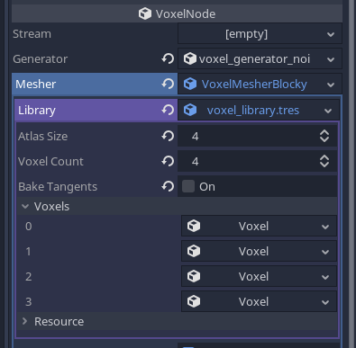

Blocky terrains
=====================

This page focuses more in detail on blocky terrains, Minecraft-like, or made of cubes.


`VoxelMesherBlocky` with models
--------------------------------

This mesher combines small meshes corresponding to model IDs into chunks. It culls faces occluding each other, but doesn't do greedy meshing. This is a similar technique used in Minecraft.

Voxel data used by this mesher may be stored in the following channel: `VoxelBuffer.CHANNEL_TYPE`

### Creating voxel models

The mesher has a `library` property of type `VoxelBlockyLibraryBase`. This is a resource containing a list of all the models you want to use in order to build a voxel mesh: grass, dirt, wood, leaves, water, shrubs, stairs, door parts etc. You can create a new library in place, or make one saved to a file if you want to re-use it in several places. You can also create it from code.

There are two kinds of libraries that can be used:

- `VoxelBlockyLibrary`: a simple list of models, where the index in the list corresponds to the ID to use in voxel data.
- `VoxelBlockyTypeLibrary`: a higher-level library storing a list of `VoxelBlockyType`. This is an experimental workflow similar to how Minecraft works, which will be explained later.

It is easier to get started with `VoxelBlockyLibrary`.



Each slot can contain a `VoxelBlockyModel` resource. The index shown on their left will be the ID they use in voxel data. Voxel `0` is a special case: by convention, it may be used as the default "air" voxel. You may assign a new `VoxelBlockyModel` resource to each slot, and fill in their properties.

With default 16-bit voxel data, you can create up to 65,536 models.

!!! warning
	To allow conversion from older versions of the module, `VoxelBlockyModel` can be instanced, which means the inspector and scripts can create it. However, it is not actually expected. You should not create instances of `VoxelBlockyModel`, instead you should use its derived classes.

### Cubes

There are several kinds of models. A simple one is `VoxelBlockyModelCube`, which renders a cube with specific textures on its sides.

With `VoxelMesherBlocky`, using texture atlases is recommended to allow re-using materials and reduce the number of draw calls. You can create a texture containing all the tiles your voxels can use. For example, here is one from the [blocky game](https://github.com/Zylann/voxelgame/tree/master/project/blocky_game) demo:


This atlas is a square texture and can contain up to 16x16 tiles. This number is important and needs to be set on the `VoxelBlockyModelCube` `atlas_size_in_tiles` property, so texture coordinates can be generated properly.

Cube models can have different tiles on each of their faces. You can decide which one to use by assigning properties of `Voxel`, under the `Cube tiles` category. Coordinates here are in tiles, not pixels.


For example, if you want to use the "planks" tile, you may use x=3 and y=1:


So far we defined a cubic voxel with specific texture coordinates on its faces, but we still have to actually assign the texture and material used to render it. This can be done in the `Material overrides` section, in which you can assign a material with the texture in it.

Make sure to assign its `albedo_texture` to your texture. You may also check the `Vertex Color/Use as albedo` property, because this will allow the mesher to bake ambient occlusion on the edge of cubes.


Each model can use different materials with different textures, but keep in mind the more you re-use materials, the better. It reduces the number of draw calls and makes rendering faster.

Note, there are several levels at which materials get applied, each one overriding the other:
- Materials present on meshes are the default (if you use meshes explicitely)
- Materials specified on `VoxelBlockyModel` will override mesh materials
- The material specified on `VoxelTerrain` will override all library materials

### Meshes

Creating voxel types with the `Cube` geometry is a shortcut that can be used for simple voxels, but the most versatile workflow is to use actual meshes. If you use `VoxelBlockyModelMesh`, you are allowed to assign a mesh resource instead. The `Cube tiles` properties are not available, because you will have to assign texture coordinates of the mesh within a 3D modeler like Blender.


Meshes can have any shape you want, however there are a few constraints to respect:

- The origin of the mesh should be its lower corner.
- Blender's coordinate system is Z-up, but Godot is Y-up. Make sure the meshes you export don't go into negative coordinates once imported in Godot.
- Vertices should preferably be located within the 0..1 range, in all directions
- Keep it low-poly. The mesher can deal with large models, but performance can decrease very quickly if a complex model appears a lot of times.
- Faces lying on the sides of the 1x1x1 unit cube will be the only faces that can be culled by the mesher. Make sure they are perfectly lining up. If they don't, it can cause dramatic slowdowns due to the amount of generated geometry not getting culled.


The best format to use to export your meshes is OBJ. Godot imports this format by default as a mesh resource. Other formats are not suitable because Godot imports them as scenes, and `VoxelBlockyModelMesh` resources require meshes, not scenes.
You can choose to export materials from here too, but it is recommended to do it in Godot because it allows you to re-use them.

!!! note
	A second material can be used in each model. This is useful if a given mesh needs both transparent and opaque parts. This works as usual, by having a mesh with two surfaces. However, face culling will still use properties of the model regardless. For example, if a model has opaque sides and is transparent in the middle, it may be defined as a non-transparent block, so when placed next to other opaque blocks, geometry of its sides will be culled. See [Transparency](#transparency) section for more info.

!!! warning
	If your voxels use mesh-based physics (GodotPhysics, Jolt...) and you export your game with "Export as dedicated server" in the resources tab of an export preset, make sure meshes you used in `VoxelBlockyModelMesh` are **not** stripped. Mesh data is required at runtime to generate colliders. If you don't do this, models using a mesh will not generate any mesh-based collision.

### Usage of voxel model IDs

Voxel IDs defined in a `VoxelBlockyLibrary` are like tiles in a tilemap: for simple games, they can directly correspond to a type of block. However, you may want to avoid treating them directly this way over time. Instead, you may define your own list of block types, and each type can correspond to one, or multiple `VoxelBlockyModel` IDs. 

Examples from Minecraft:

- Stairs can be placed at different orientations, and sometimes have different appearance. These are actually multiple voxel IDs.
- Crops can have several growth stages. Each stage is a different voxel ID, for the same type of block.
- One door is actually made of 2 voxels. Its top, and bottom. There could be even more if we consider opened and closed doors.
- One rail can correspond to many different voxels: straight rails, slopes, and turns. They are all rails, but in different sub-configurations.

Managing the correspondance between your "game's block" IDs and voxel IDs is up to you.

### Rotating models

At the moment, rotating or flipping voxels automatically is not supported, so you have to create each rotated version you may need for a type of voxel. However it is possible to create these model variants in the editor, by using the rotation buttons in the inspector:


These buttons are not for previewing, they actually rotate the model and it will appear in that rotation when placed in game.

### Transparency

You may want some of your voxel types to be transparent. There is in fact two main ways to achieve this:

- Using alpha clip: transparent pixels are discarded, allowing rendering through the opaque pass, which avoids some typical issues with transparent surfaces.
- Alpha blend: actual transparency, which has a few limitations when multiple transparent surfaces are rendered behind each other

Both require to use a different material from the default one you may have used. Note if you use a texture atlas, a typical setup only needs 3 materials using the same atlas: opaque, alpha clip and transparent.

`VoxelBlockyModel` resources also have a `transparency_index` property. This property allows to tune how two voxels occlude their faces. For example, let's say you have two transparent voxels, glass and leaves. By default, if you put them next to each other, the face they share will be culled, allowing you to see through the leaves from the glass block:


If two faces touch each other, if they have the same transparency index, they can get culled. But if their transparency index is different, they may not. This allows to see the leaves directly behind glass, instead of seeing the insides.

Here, glass has `transparency_index=2`, and leaves have `transparency_index=1`:


`VoxelBlockyModel` also has a `culls_neighbors` property. This is enabled by default and prevents unnecessary rendering of neighboring voxel sides. However, for some transparent voxels it may be more desirable to always render neighboring voxel sides. For example, foliage can be made to look denser if all of the inner voxel sides
are visible.

Here is a group of leaves with `culls_neighbors=true` (the default):


Here is that same group of leaves with `culls_neighbors=false`. The sides in-between the voxels are rendered, making the group of leaves look less hollow.


### Random tick

`VoxelBlockyModel` has a property named `random_tickable`. This is for use with a very specific function of `VoxelToolTerrain`: [run_blocky_random_tick](api/VoxelToolTerrain.md)


`VoxelMesherBlocky` with types
--------------------------------

!!! warning
	This feature is experimental, may have bugs, missing parts and may change over time. It proposes a way to organize models for a game and automates a few things, but you may still use `VoxelBlockyLibrary` if you want to handle this in your own way. See also the [corresponding issue on Github](https://github.com/Zylann/godot_voxel/issues/506).

An alternative library type exists, `VoxelBlockyTypeLibrary`. Instead of directly containing a list of models, it contains a list of `VoxelBlockyType`. A type is closer to what you would call a "block type" in a game, and this system was designed to be very similar to how blocks are defined in Minecraft (inspiration from https://docs.minecraftforge.net/en/1.19.2/blocks/states/).


### Attributes

A type can have a few `VoxelBlockyAttribute`. Each attribute is like a variable representing a state of the type. They could be the orientation of a log, a button being pressed or not, a block being the top or bottom part of a door, connections with neighbors, or the growth level of crops.

Types should usually have very few attributes, and each attribute can take only a few values as well (between 0 and 255). This limitation relates to the lightweight nature of voxels, you can't store too much into a single voxel otherwise it looses its ability to be part of a terrain with millions of them.
If you need a block to have much more complex states, such as objects and lists of things, this system may not work for your case and you will have to fallback on using voxel metadata and actual nodes (like entities in Minecraft).


### Variant models

After you assigned attributes to a type, the inspector will show you a list of models for every combination of states:


You can also preview combinations by using the side panel next to the type's 3D preview on top of the inspector.

If you have many attributes or many states, it is possible that this list becomes very large. In Minecraft, redstone dust technically has [1,296 model variants](https://minecraftitemids.com/item/redstone-dust). It is therefore not made using a list of variants, but a conditional combination of models. In the future a similar feature may be implemented.


### Rotations

A very common use for attributes are rotations. It is so common that `VoxelBlockyType` automates the generation of rotated models, if you use a built-in rotation attribute:

- `VoxelBlockyAttributeAxis`
- `VoxelBlockyAttributeDirection`
- `VoxelBlockyAttributeRotation`

Each rotation attribute comes with a default rotation, and you may design your models as if they had that rotation, so that every other rotation can be generated properly.

Because these variants are generated automatically, they won't be displayed in the inspector, but they are internally stored like other variants.

!!! note
	It can be tempting to use `VoxelBlockyAttributeRotation` for everything, but it has the highest number of variants. The engine has to generate pre-rotated models for every combinations, so it has a cost in memory. Similarly, if you don't need certain rotations, consider changing properties of these attributes (you can exclude vertical rotations).


### Model names and numerical IDs

The name of types and attributes matter. They are used to uniquely identify models, in the following form:

```
<type_name>[attribute1=value,attribute2=value,...]
```

For example, a particular voxel could be identified as `button[direction=up,pressed=yes]`. If you rename, remove or add an attribute causing this identifier to change, it will effectively become a different voxel, and may be given a different ID. That means if you have a saved world with the old names, those won't appear after you change the type.

A type can correspond to one, or multiple models with different numerical IDs. Contrary to `VoxelBlockyLibrary`, you don't choose those IDs. They are automatically generated based on all the combinations of all attributes you gave to each type. The more attributes and states a type has, the more model IDs will be reserved for it.

Once a particular model is baked, its name and attribute states will be associated to a specific numerical ID.

One reason numerical IDs are not manually assigned, is first because it's tedious to do without mistakes when you have many types, but also because of modding. In Minecraft, each world may have different numerical IDs for each voxel compared to other worlds, because of resource packs and mods that could be adding different models. Adding or removing mods should not make IDs clash with each other.
In the end, it is not the numerical IDs that uniquely identify a model. Instead, types and attribute names are used. Type names may even be namespaced with a syntax like `minecraft:flower` and `mymod:thingy`.

Numerical IDs are only unique within a specific world. They are used to store voxel data and send it across network, which is more efficient, but not portable across different worlds.

Numerical IDs and names are mapped with what we could call an "ID map". You can see a list of generated IDs by clicking on the `Inspect model IDs` at the very bottom of a `VoxelBlockyTypeLibrary` in the inspector.


### Usage in scripts

When dealing with voxel data, you still need to get and set model IDs with `VoxelTool`, because that's what voxels actually store. If a voxel from a given type needs to change state, that means it will change value to another model ID, like you would do in a game based on the classic `VoxelBlockyLibrary`.

`VoxelBlockyTypeLibrary` has functions to obtain a model ID from a type name and the value of each of its attributes, and inversely. If you need specific IDs a large number of times, consider caching them in a local variable for performance.

Type names and attribute names use `StringName` instead of `String`, which is a little bit more efficient to compare against other names. So you will need to use a specific syntax using `&`:

```gdscript
var model_id := library.get_model_index_with_attributes(&"button",
	# Note that dictionary keys don't use `&`, because Godot converts StringName keys into String.
	{
		"direction": VoxelBlockyAttributeDirection.DIR_POSITIVE_X,
		"active": 1,
		"powered": 0
	})
```

If the type only has one attribute, you can use a faster shortcut:

```gdscript
var model_id := library.get_model_index_single_attribute(&"log", VoxelBlockyAttributeAxis.AXIS_Z)
```

And if the type has no attribute, or you just want its default state:

```gdscript
var model_id := library.get_model_index_default(&"leaves")
```


`VoxelMesherCubes`
------------------

This mesher exclusively generates cubes with spefific colors.

TODO


Fast collisions alternative
------------------------------

### Move and slide

Mesh-based collisions are quite accurate and feature-rich in Godot, however it has some drawbacks:

- Trimesh collision shapes have to be built each time the terrain is modified, which is [very slow](https://github.com/Zylann/godot_voxel/issues/54).
- The physics engine has to process arbitrary triangles near the player, which can't take advantage of particular situations, such as everything being cubes
- Sometimes you may also want a simpler, more game-oriented collision system

The `VoxelBoxMover` class provides a Minecraft-like collision system, which can be used in a similar way to `move_and_slide()`. It is more limited, but is extremely fast and is not affected by tunnelling.

The code below shows how to use it, but see the [blocky demo](https://github.com/Zylann/voxelgame/tree/master/project/blocky_terrain) for the full code.

```gdscript
var box_mover = VoxelBoxMover.new()
var character_box  = AABB(Vector3(-0.4, -0.9, -0.4), Vector3(0.8, 1.8, 0.8))
var terrain = get_node("VoxelTerrain")

func _physics_process(delta):
	# ... Input commands that set velocity go here ...

    # Apply terrain collision
	var motion : Vector3 = velocity * delta
	motion = box_mover.get_motion(get_translation(), motion, character_box, terrain)
	global_translate(motion)
	velocity = motion / delta
```

This technique mainly works if you use `VoxelMesherBlocky`, because it gets information about which block is collidable from the `VoxelBlockyLibrary` used with it. It might have some limited support in other meshers though.

If you use `VoxelMesherBlocky`, it will use the list of AABBs specified in `VoxelBlockyModel` resources. If the list is empty, the voxel won't have collisions. You can also filter out some collisions by assigning the `collision mask` property of `VoxelBoxMover`. This will be matched against the `collision mask` property found on `VoxelBlockyModel` resources.


### Raycast

An alternative raycast function exists as well, which returns voxel-specific results. It may be useful if you turned off classic collisions as well. This is accessible with the `VoxelTool` class. An instance of it bound to the terrain can be obtained with `get_voxel_tool()`.

```gdscript
var terrain : VoxelTerrain = get_node("VoxelTerrain")
var vt : VoxelTool = terrain.get_voxel_tool()
var hit = vt.raycast(origin, direction, 10)

if hit != null:
    # The returned position is in voxel coordinates,
    # and can be used to access the value of the voxel with other functions of `VoxelTool`
    print("Hit voxel ", hit.position)
```

If you use `VoxelMesherBlocky`, it is possible to filter out some voxel types by specifying the `collision mask` argument. This will be matched against the `collision mask` property found on `VoxelBlockyModel` resources.
