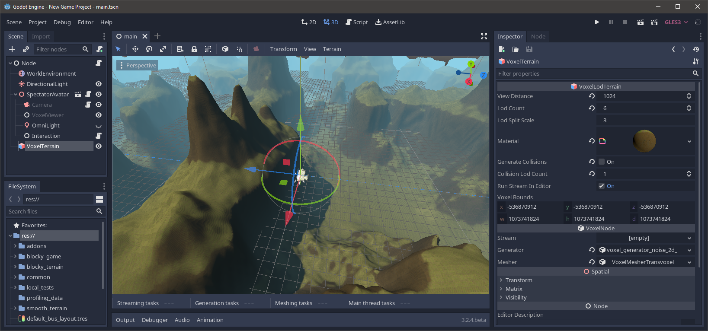
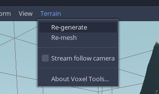
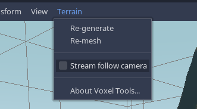

Editor
============

Previewing in the editor
---------------------------

### Preview options

Terrains with a generator or valid stream assigned to them are able to show up in the editor when `run_stream_in_editor` is enabled. It is on by default.

If the generator or stream is providing a type of voxel data which is not supported by the mesher, nothing will show up. This is usually fixed by changing the mesher or its channel option, when available.

The whole terrain can be told to re-mesh or re-load by using one of the options in the `Terrain` menu:

!!! warning
    If you use a script on either [VoxelGeneratorScript](api/VoxelGeneratorScript.md) or [VoxelStreamScript](api/VoxelStreamScript.md), the `run_stream_in_editor` option will automatically turn off and the volume will not be visible. If a script gets modified while it is used by a thread in the editor, unpredictable bugs can happen. You can force it by enabling the option, but you have to make sure no change happens. This limitation is tracked in [issue177](https://github.com/Zylann/godot_voxel/issues/177).

### Camera options

Blocks will only load around the node's origin by default. If the volume is very big or uses LOD, it will not load further and concentrate detail at its center. You can override this by going in the `Terrain` menu and enabling `Stream follow camera`. This will make the terrain adapt its level of detail and blocks to be around the editor's camera, and will update as the camera moves. Turning off the option will freeze the terrain.

This option exists for large volumes because they need to stream blocks in and out as you move around. While this is often done in a controlled manner in a game, in the editor the camera could be moving very fast without any restriction, which can demand much more work for the CPU.
You can monitor the amount of ongoing tasks in the bottom panel, while the node is selected.

The terrain also needs to be selected, partially because of [this](https://github.com/godotengine/godot-proposals/issues/1302)).

Terrains can be very big, and sometimes Godot might prevent you from zooming out further. You can workaround this by increasing the editor's Camera `far` clip in the `View -> Settings` menu. That might slightly degrade visual quality if set too high, so you can also increase `near` clip to keep it balanced. These two numbers cannot be too far apart due to 32-bit float precision.

Editing
--------

Editing voxel volumes destructively in the Godot Editor is not supported yet. This feature may be implemented in the future.

It is possible to use non-destructive [modifiers](generators.md#modifiers).

Terrains can be fully edited in-game using scripts and [VoxelTool](scripting.md).

