Generators
=============

`VoxelGenerator` allows to generate voxels given a specific area in space, or from a single position. They can serve as a base to automate the creation of large landscapes, or can be used in a game to generate worlds. They have an important place because storing voxel data is expensive, while procedural sources are lightweight.


How generators work
----------------------

Generators currently run on the CPU and primarily work on blocks of voxels. For example, given a `VoxelBuffer` of 16x16x16 voxels, they decide what value each one will take. Using blocks makes it easier to split the work across multiple threads, and focus only on the area the player is located, especially if the world is infinite.

Voxel data is split into various channels, so depending on the kind of volume to generate, one or more different channels will be used. For example, a Minecraft generator will likely use the `TYPE` channel for voxel types, while a smooth terrain generator will use the `SDF` channel to fill in distance field values.

Generators have a thread-safe API. The same generator `generate_block` method may be used by multiple threads at once. However, depending on the class, some parameters might only be modifiable from the main thread, so check the documentation to be sure.

If a volume is not given a generator, blocks will be filled with air by default.


Basic generators
-------------------

The module provides several built-in generators. They are simple examples to get a quick result, and showing how the base API can be implemented (see source code).

Some of these generators have an option to choose which channel they will work on. If you use a smooth mesher, use the `SDF` channel (1), otherwise use the `TYPE` channel (0).

The following screenshots use a smooth `VoxelLodTerrain`.

### [Flat](api/VoxelGeneratorFlat.md)

Generates a flat ground.

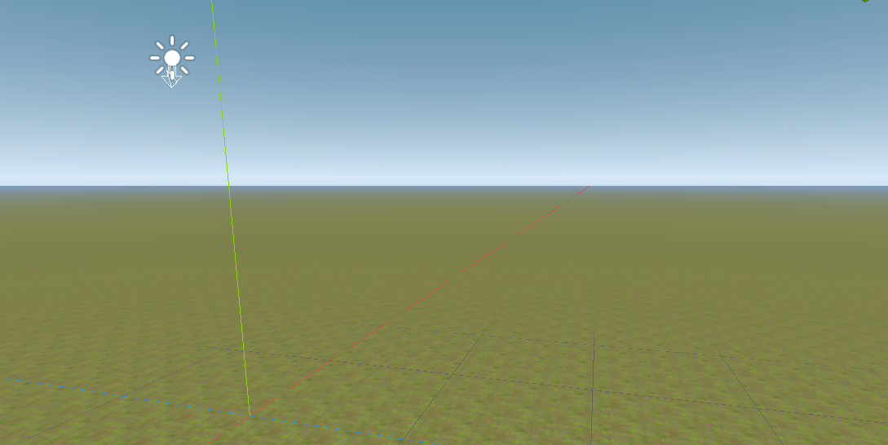

### [Waves](api/VoxelGeneratorWaves.md)

Generates waves.

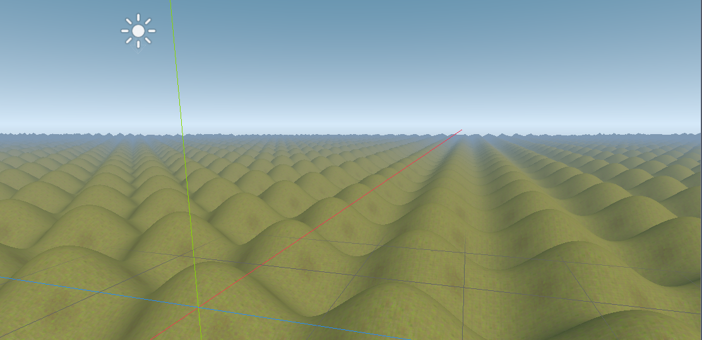

### [Image](api/VoxelGeneratorImage.md)

Generates a heightmap based on an image, repeated infinitely.

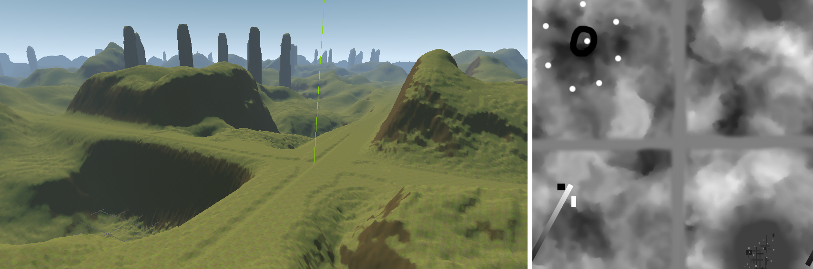

!!! note
    With this generator, an `Image` resource is required. By default, Godot imports image files as `StreamTexture`. You may change this in the Import dock. At time of writing, in Godot 3, this requires an editor restart.

### [Noise2D](api/VoxelGeneratorNoise2D.md)

Generates a heightmap based on fractal noise.

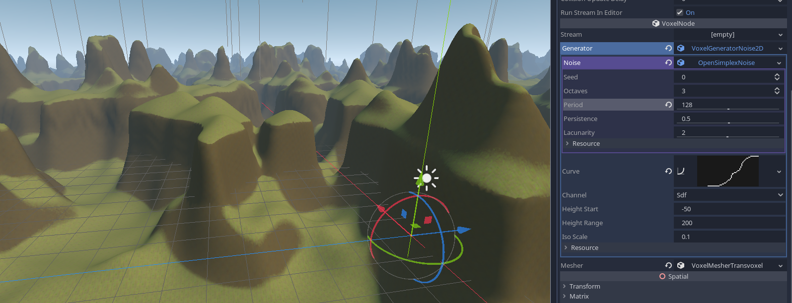

### [Noise (3D)](api/VoxelGeneratorNoise.md)

Generates a blobby terrain with overhangs using 3D fractal noise. A gradient is applied along height so the volume becomes air when going up, and closes down into matter when going down.

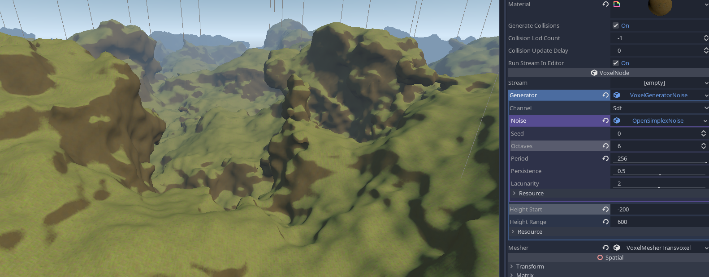


Node-graph generators (VoxelGraphs)
------------------------------------

Basic generators may often not be suited to make a whole game from, but you don't necessarily need to program one. C++ is a very fast language to program a generator but it can be a tedious workflow, especially when prototyping. If you need smooth terrain, a graph-based generator is available, which offers a very customizable approach to make procedural volumes.

!!! warn
    This generator currently doesn't support blocky terrains.


### Concept

Voxel graphs allow to represent a 3D density by connecting operation nodes together. It takes 3D coordinates (X, Y, Z), and computes the value of every voxel from them. For example it can do a simple 2D or 3D noise, which can be scaled, deformed, masked using other noises, curves or even images.

A big inspiration of this approach comes again from sculpting of signed-distance-fields (every voxel stores the distance to the nearest surface), which is why the main output node may be an `SdfOutput`. A bunch of nodes are meant to work on SDF as well. However, it is not strictly necessary to respect perfect distances, as long as the result looks correct for a game, so most of the time it's easier to work with approximations.

!!! note
    Voxel graphs are half-way between programming 3D shaders and procedural design. It has similar speed to C++ generators but has only basic instructions, so there are some maths involved. This might get eased a bit in the future when more high-level nodes are added.


### Examples

#### Flat plane

The simplest possible graph with a visible output is a flat plane. The SDF of a flat plane is the distance to sea-level (0), which is `sdf = y`. In other words, the surface appears where voxel values are crossing zero.

Right-click the background of the graph, choose the nodes `InputY` and `SdfOutput`, then connect them together by dragging their ports together.

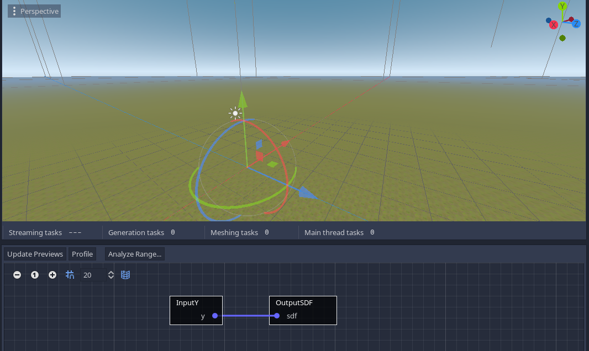

It is possible to decide the height of the plane by subtracting a constant (`sdf = y - height`), so that `sdf == 0` will occur at a higher coordinate. To do this, an extra node must be added:

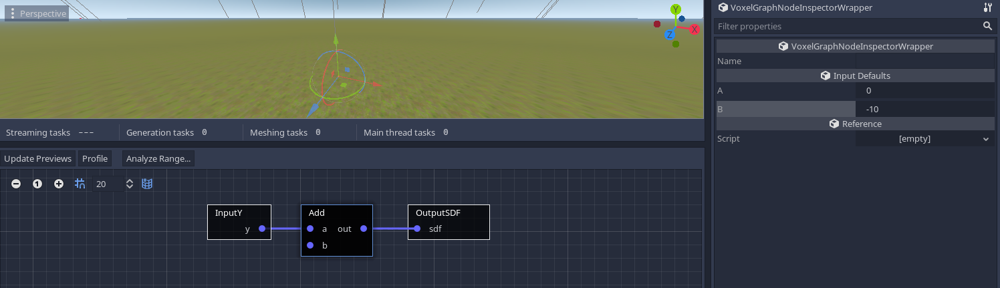

By default, the `Add` node does nothing because its `b` port is not connected to anything. It is possible to give a default value to such port. You can set it by clicking on the node and changing it in the inspector.

(note: I used `Add` with a negative value for `b`, but you can also use a `Subtract` node to get the same result).

#### Noise

A flat plane is simple but a bit boring, so one typical way to generate a terrain is adding good old fractal noise. You can do this in 2D (heightmap) or 3D (volumetric).
The 2D approach is simpler, as we only need to take our previous setup, and add 2D noise to the result. Also, since noise is generated in the range [-1 to 1], we also need a multiplier to make it larger (`sdf = y - height + noise2d(x, y) * noise_multiplier`).

There are several types of noise available, each with their own parameters. At time of writing, `FastNoise2D` noise is the best option. `Noise2D` works too but it is slower and more limited (it uses Godot's `OpenSimplexNoise` class).

!!! note
    After you create this node, a new `FastNoiseLite` resource must be created in its parameters. If that resource is not setup, an error will occur and no voxels will be generated.

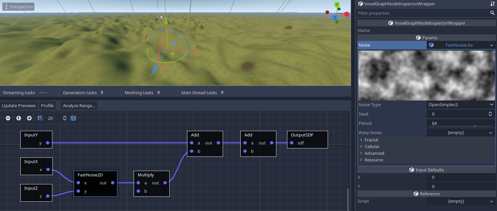

3D noise is more expensive to compute, but is interesting because it actually produces overhangs or even small caves. It is possible to replace 2D noise with 3D noise in the previous setup:

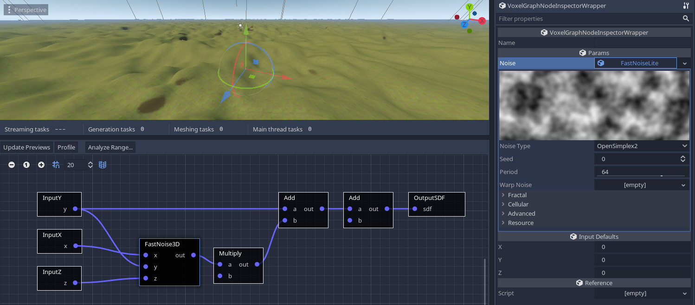

You might notice that despite it being 3D, it still appears to produce a heightmap. That's because the addition of `Y` in the graph is gradually offsetting noise values towards higher and higher values when going towards the sky, which makes the surface fade away quickly. So if we multiply `Y` with a small value, it will increase slower, letting the 3D noise expand more (`sdf = y * height_multiplier - height + noise3d(x, y, z)`):

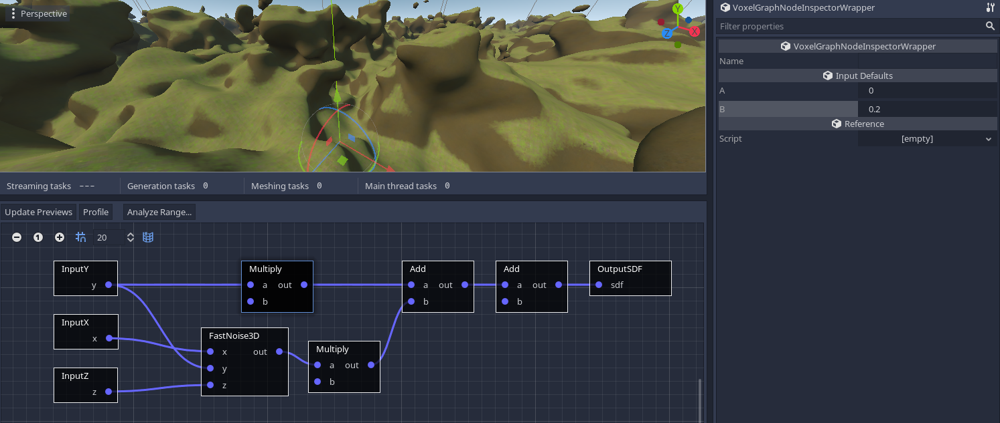

#### Planet

We are not actually forced to keep generating the world like a plane. We can go even crazier, and do planets. A good way to begin a planet is to make a sphere with the `SdfSphere` node:

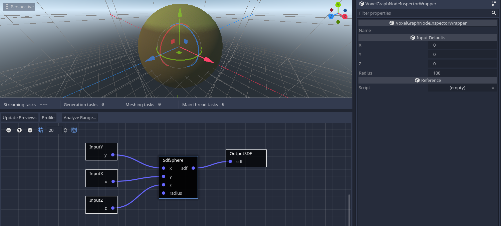

We cannot really use 2D noise here, so we can add 3D noise as well:

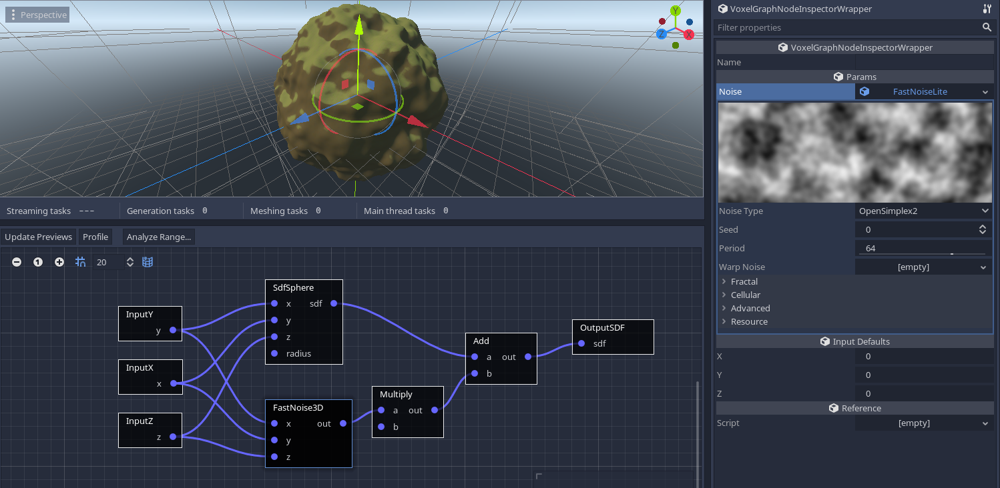

However you might still want a heightmap-like result. One way to do this is to feed the 3D noise normalized coordinates, instead of global ones. Picking a ridged fractal can also give an eroded look, although it requires to negate the noise multiplier node to invert its distance field (if we leave it positive it will look puffed instead of eroded).

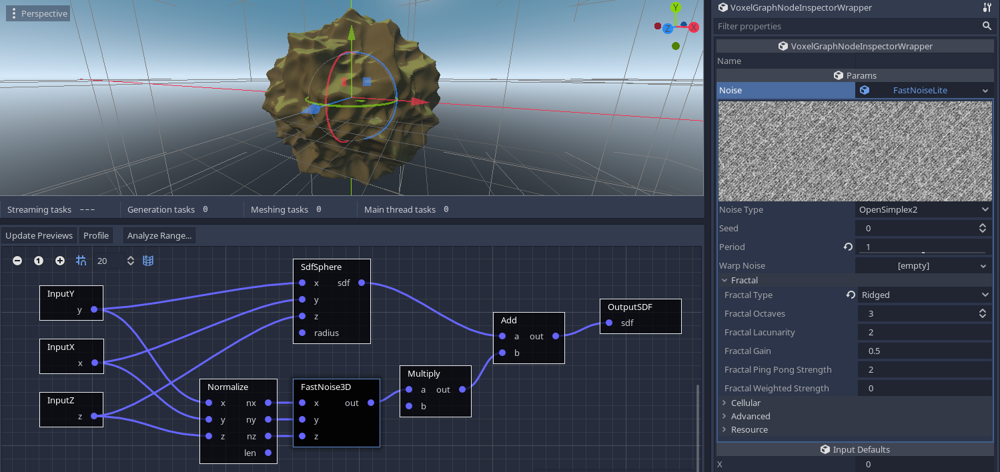

!!! note
    You can obtain a donut-shaped planet if you replace the `SdfSphere` node with a `SdfTorus` node.
    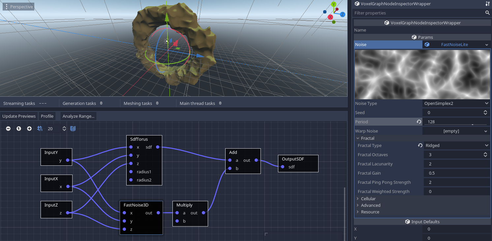


#### Caves

!!! warn
    This section is a bit advanced and lacks details because at the moment there is no built-in "macro" to do this in a user-friendly way, and I kind of came up with it by experimentation

It is possible to generate caves by subtracting noise "worms" from a base SDF terrain. To simplify the approach, let's first look at what 2D noise looks like, with a few octaves:

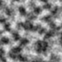

If we multiply that noise by itself (i.e square it), we obtain this:


And if we clamp it to highlight values below a threshold close to zero, we can notice a path-like pattern going on:

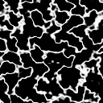

In 2D (or in 3D when using normalized coordinates) this is the key to produce rivers, or ravines. But the problem with caves is to obtain 3D, round-shaped "worms", not just 2D shapes. So we can cheat a little, by still using 2D noise, but instead we modulate the threshold along the Y axis. We need a parabola-shaped curve for this, which can be obtained with a second-degree polynome like `y^2 - 1`:

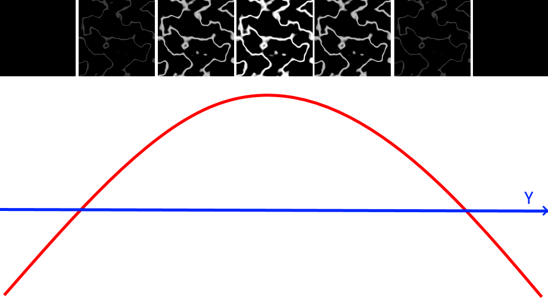

Back to the voxel graph, we may connect directly the cave generation nodes to the output just to preview what they look like, without the rest of the terrain:

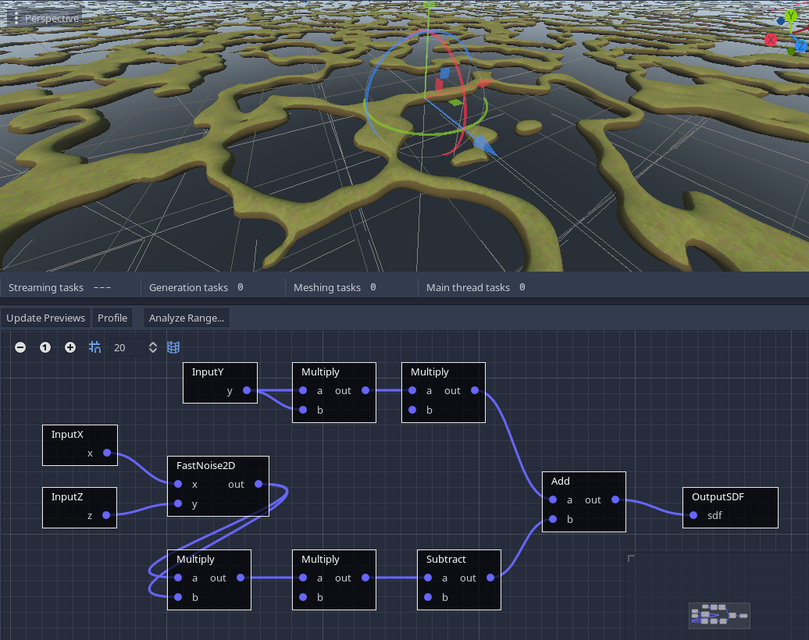

After tweaking noise and other values, we obtain those famous worms, but there are two problems:

- The caves are still flat, they don't go up or down
- They go on endlessly, there are no dead-ends

We can fix the first problem by adding an extra layer of 2D noise to the Y coordinate so it can perturb the caves vertically. Re-using the ground surface noise with an extra multiplier can prove effective sometimes, so we avoid computing extra noise.

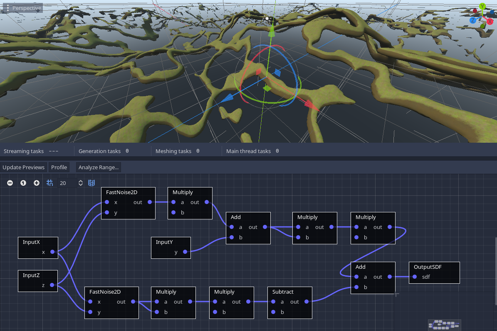

The second problem can also be fixed with yet another layer of low-frequency noise, which can be added to the cave threshold so caves will shrink to become dead-ends on some regions. Again, adding multipliers may change how sharply that transition occurs.

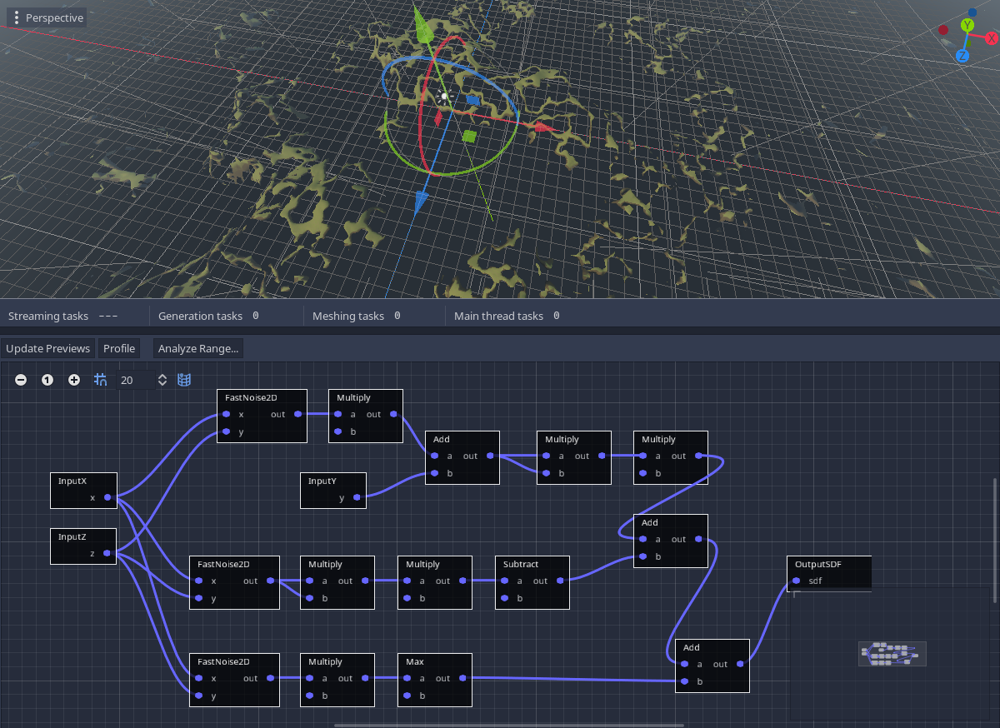

Finally, we can blend our terrain with caves by subtracting them. This can be done with the `SdfSmoothSubtract` node, essentially doing `terrain - caves`.

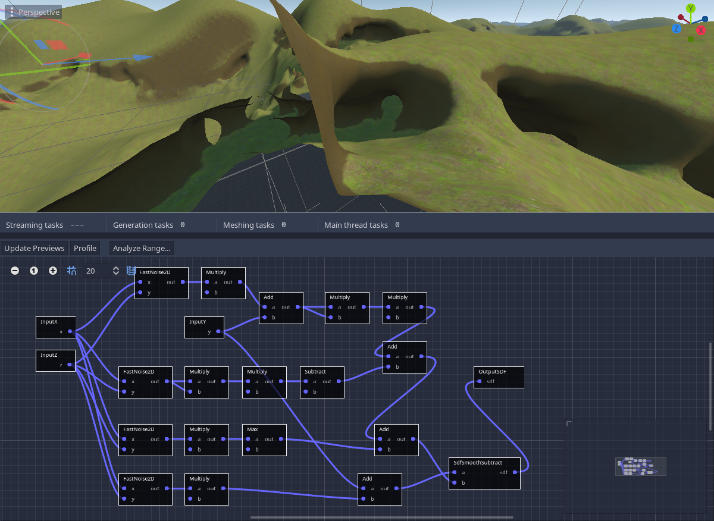

There are likely variants of this to obtain different results.


### Performance tuning

This is a more technical section.

This generator uses a number of optimization strategies to make the calculations faster. You may want to fine-tune them in some cases depending on the kind of volume you want to generate. When you get more familiar with the tool it may be useful to know how it works under the hood, notably to troubleshoot generation issues when they occur.

#### Buffer processing

Contrary to many node-based or expression tools existing in Godot so far, voxel graphs are not tailored to run on voxels one by one. The main use case is to process a bunch of them. Indeed, for a 16x16x16 block, there are 4096 voxels to generate. That would mean traversing the entire graph 4096 times, and the cost of doing that individually can exceed the cost of the calculations themselves. Besides, switching constantly between node types to run different operations is not CPU-friendly due to all the jumps required.

So instead, outputs of each node are associated small buffers for a subset of the voxels, say, a 16x16 slice. Then, the graph is traversed once ahead-of-time to obtain a simple list of operations. It is guaranteed that if a node depends on another, the other will have run before.

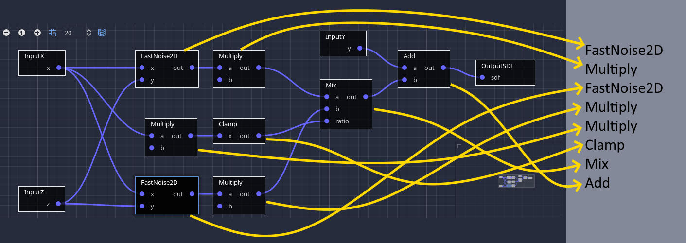

Finally, the generator executes the list, node by node, and each node computes a bunch of voxels at once instead of just one. This ensures that the CPU is almost exclusively used for the operations themselves, providing performance similar to C++, while graph traversal becomes neglibible. It also offers the opportunity to use [SIMD](https://en.wikipedia.org/wiki/SIMD) very easily, which can be even faster than if the code was written in plain C++.

Buffer processing is mostly an internal detail so there are no particular settings on the scripting API.

#### Range analysis

Before processing voxels in a specific region of space (a box), the generator first runs a [range analysis](https://en.wikipedia.org/wiki/Interval_arithmetic) pass. Each node has an alternative implementation using intervals, with the sole purpose of estimating the range of values it will output in the area. It's like a broad-phase before the heavy work.

It is possible to inspect results of this pass in the editor by enabling it with the `Analyse range` button. The analysis will focus on the box specified in the dialog, which will appear as a yellow wireframe in the 3D viewport.

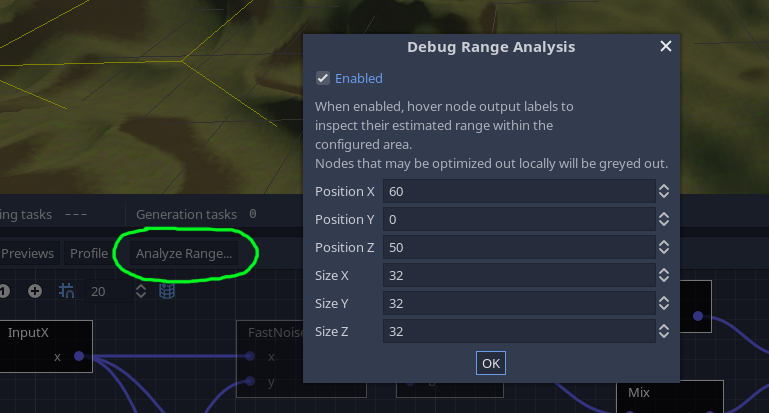

You can also hover the output label of any node to see what range was calculated for it:

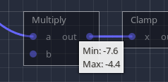

!!! note
    Noise is typically between -1 and 1, but we take it a step further. Ranges are approximated using maximum derivatives, which is how fast noise can vary along a given distance. Each noise algorithm has its own. We calculate noise at the center of the box, and add half of the maximum derivative, positively and negatively. In other words, in the box, we know noise cannot exceed the central value + the maximum variation along extents of the box. At close range, this can successfully detect valleys and hills, without fully computing them.

Results of this pass are used for several optimization techniques described below.

#### SDF clipping

3D volumes represented with meshes to form a terrain have an interesting property: to generate them, we are mostly interested in the areas where voxel values are crossing the isolevel (zero). That means we could completely discard regions of space that are guaranteed to never get near zero, and simplify them to a single value (like "only matter" or "only air"). Doing that in 3 dimensions has tremendous speed implications so it is a major feature of this generator.

Range analysis is used to perform this optimization. In a given area, if the maximum value of SDF is lower than a threshold below zero, then the whole block is skipped and assigned a uniform negative value. The same happens with a threshold above zero.

It is possible to choose that threshold with the `sdf_clip_threshold` property in the inspector. If given an extremely large value like `10000`, it will essentially turn off this optimization.

It is exposed because in some situations, clipping can cause artifacts when the edge of a block is too close from a clipped one. Indeed, clipping blocks cause discontinuities in the distance field.

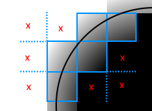

Usually they happen far enough from the surface to be of any concern, but sometimes they can come close if the threshold is too low:

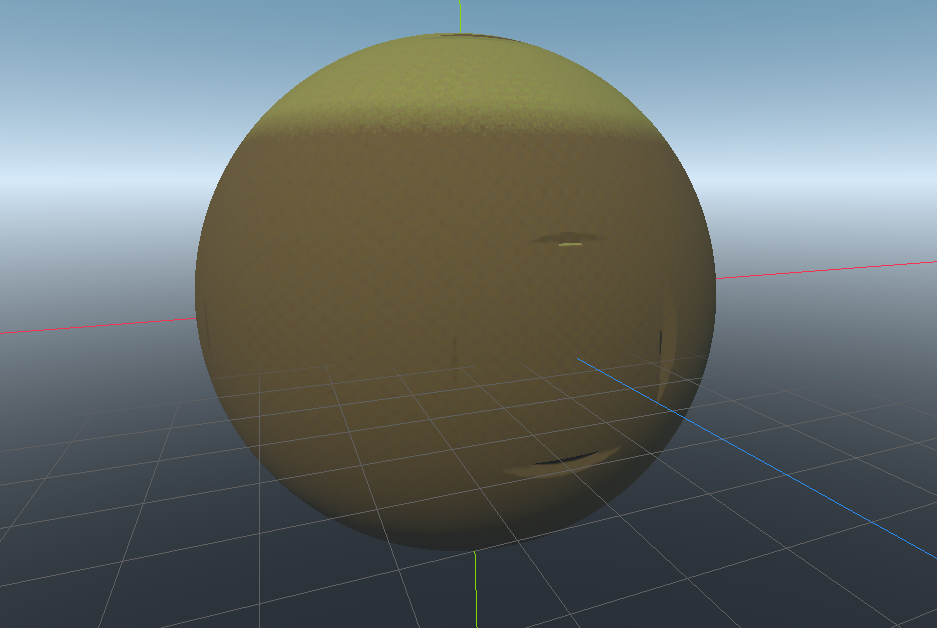

So by default the threshold is above zero and should cover most cases.

It is also possible to instruct the generator to invert clipped blocks, which will make them stand out:

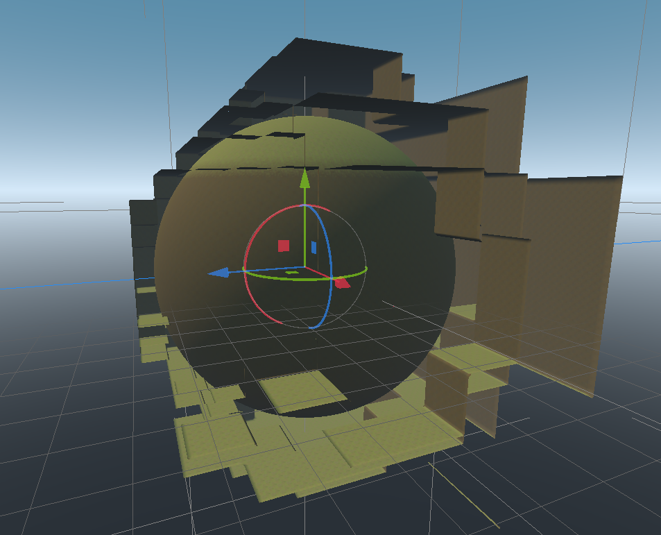


#### Local optimization

Conditionals (`if/else`) are not supported by this voxel graph implementation. The main reason is because of the buffer processing approach. The CPU can churn through buffers very fast, but branching on a per-voxel basis would disrupt it. Besides, range analysis might get a lot more complicated if branching was added. They can exist within nodes, but cannot exist as a graph-level primitive. So the usual approach is to blend things by mixing, adding, subtracting parts of the graph. But when a graph becomes big, even with SDF clipping, performance could be better. Conditionals are often used to optimize locally, so how can we do this without?

Let's consider an example world made of two biomes, each generated with a big node setup, and blended together across the world's X axis.

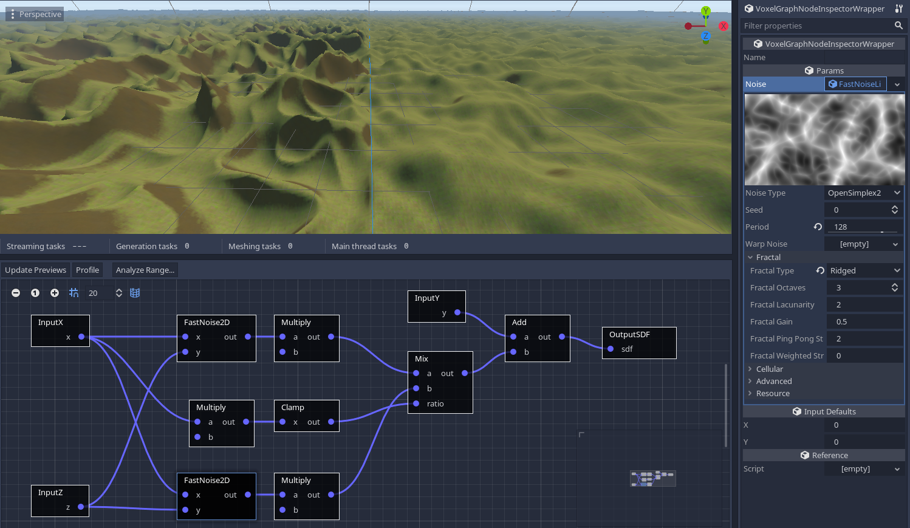

If we don't optimize this, both biomes will constantly get calculated at every point of space close enough to the surface. But if we look at the range analysis we performed earlier, and focus on one of the biomes, we notice that the range of values received by the `Mix` node are such that only one biome is blended. In other words, one of the inputs of `Mix` has no effect on its result, and is therefore ignored there.

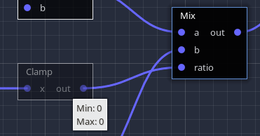

So each biome then only computes its own branch when far away enough from the blending area:

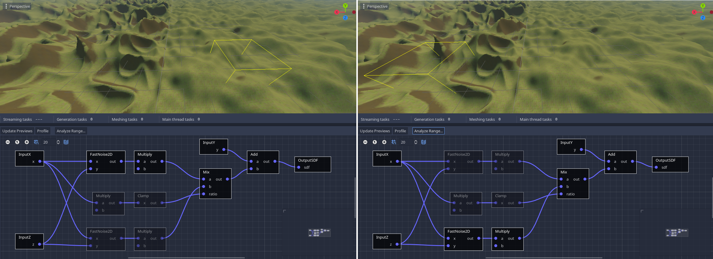

Thanks again to range analysis, the generator is able to detect this locally, and *dynamically skips whole branches of nodes* if they are found to not affect the final result. Therefore, it is not required to add conditionals for this use case, it's done automatically. You can visualize this by turning on the analysis tool, which will grey out nodes that are ignored in the specified area.

Internally, the generator parses the graph locally (using a faster data structure since the graph is compiled) to obtain an alternative list of operations. This list is currently nicknamed an `execution map`, because it maps the full list of operations to a reduced one.

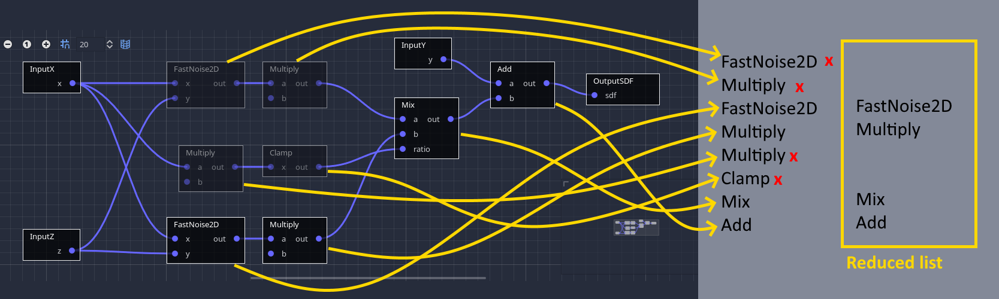

This setting can be toggled in the inspector.

!!! note
    This feature may be more or less precise depending on the range of values parts of the graph are producing. So it is possible that two different graphs providing the same result can run at different speeds. For this reason, analysing ranges can prove useful to understand why parts of the graph are still computed.


#### Subdivision

Previous optimizations are tied to the size of the considered area. The bigger the area, the less precise they will be. For example, with a larger box, it is more likely to find a place where voxels produce a surface. It is also more likely for more biomes or other shapes to appear and blend together. Besides, changing the size of our world chunks isn't a light decision.

So a simple improvement is to tell the generator to further subdivide itself the region of space it works on. Usually a subdivision size of 16x16x16 is ok. 8x8x8 is even more precise, but below that size the cost of iteration will eventually exceed the cost of computations again (see Buffer processing). Subdivision sizes must also divide volume block sizes without remainder. This is mostly to avoid having to deal with buffers of different sizes.


#### XZ caching

When generating voxel-based terrains, despite the attractiveness of overhangs, there can be a large part of your generator only relying on the X and Z coordinates. Typically, generating from 2D noise as a base layer is one of these situations.
When the generator is done with a slice along X and Z, it increases Y and does the slice above. But since 2D noise only depends on X and Z, it would get recomputed again. And noise is expensive.

This situation is similar to the following pseudocode:

```
for z in size_z:
    for x in size_x:
        for y in size_y:
            set_voxel(x, y, z, noise2d(x, z) + y)
```

Typically, to optimize this, you would move out the `noise2d` call into the outer loop, like so:

```
for z in size_z:
    for x in size_x:
        n = noise2d(x, z)
        for y in size_y:
            set_voxel(x, y, z, n + y)
```

This way, the 2D noise is only computed once for each column of voxels along Y, which speeds up generation a lot.

In Voxel Graphs, the same optimization occurs. When the list of operations is computed, all operations that only depend on X and Z are put first in the list. Then a specific index is remembered where the first operation dependent on Y can be found. When generating a block of voxels, the first XZ slice is computed by reading the list from its beginning. But every following slice, the list is read starting from that special index instead, skipping all the first nodes. The next nodes can still refer to the result of the nodes that depend on X and Z because their buffers are not reset between slices. In other words, results are cached.

This optimization only applies on both X and Z axes. It can be toggled in the inspector.


Custom generator
-----------------

See [Scripting](scripting.md)
