Generators
=============

`VoxelGenerator` allows to generate voxels given a specific area in space, or from a single position. They can serve as a base to automate the creation of large landscapes, or can be used in a game to generate worlds. They have an important place because storing voxel data is expensive, while procedural sources are lightweight.


How generators work
----------------------

Generators currently run on the CPU and primarily work on blocks of voxels. For example, given a `VoxelBuffer` of 16x16x16 voxels, they decide what value each one will take. Using blocks makes it easier to split the work across multiple threads, and focus only on the area the player is located, especially if the world is infinite.

Voxel data is split into various channels, so depending on the kind of volume to generate, one or more different channels will be used. For example, a Minecraft generator will likely use the `TYPE` channel for voxel types, while a smooth terrain generator will use the `SDF` channel to fill in distance field values.

Generators have a thread-safe API. The same generator `generate_block` method may be used by multiple threads at once. However, depending on the class, some parameters might only be modifiable from the main thread, so check the documentation to be sure.

If a volume is not given a generator, blocks will be filled with air by default.


Basic generators
-------------------

The module provides several built-in generators. They are simple examples to get a quick result, and showing how the base API can be implemented (see source code).

Some of these generators have an option to choose which channel they will work on. If you use a smooth mesher, use the `SDF` channel (1), otherwise use the `TYPE` channel (0).

The following screenshots use a smooth `VoxelLodTerrain`.

### [Flat](api/VoxelGeneratorFlat.md)

Generates a flat ground.

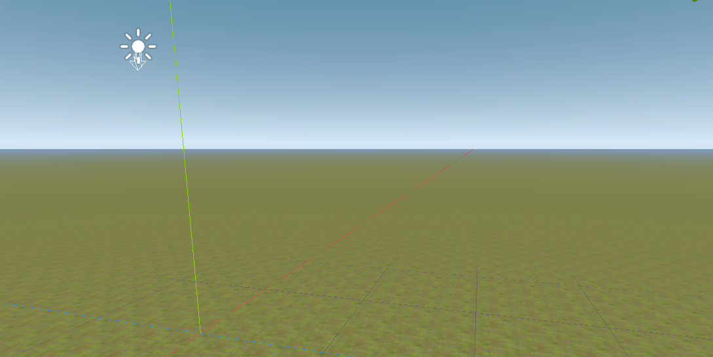

### [Waves](api/VoxelGeneratorWaves.md)

Generates waves.

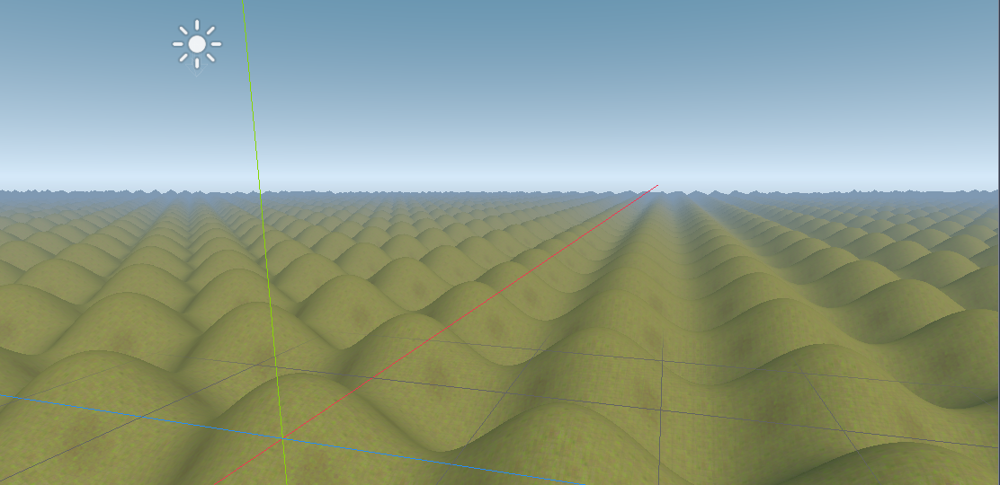

### [Image](api/VoxelGeneratorImage.md)

Generates a heightmap based on an image, repeated infinitely.

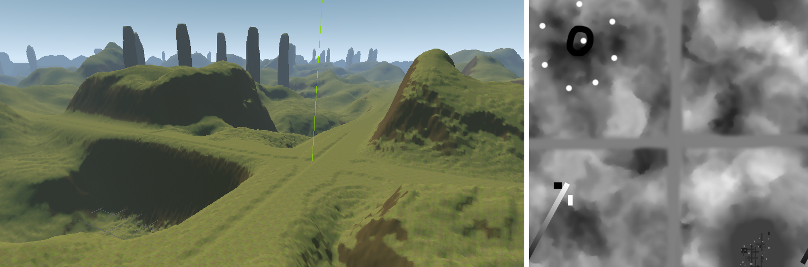

!!! note
    With this generator, an `Image` resource is required. By default, Godot imports image files as `StreamTexture`. You may change this in the Import dock. At time of writing, in Godot 3, this requires an editor restart.

### [Noise2D](api/VoxelGeneratorNoise2D.md)

Generates a heightmap based on fractal noise.

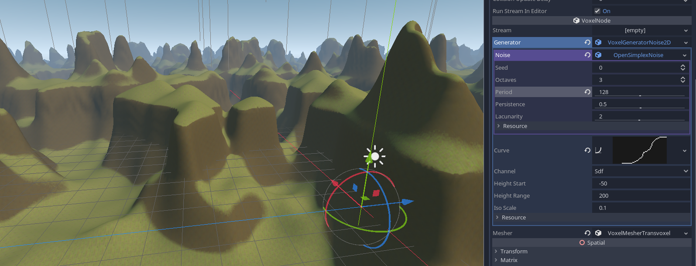

### [Noise (3D)](api/VoxelGeneratorNoise.md)

Generates a blobby terrain with overhangs using 3D fractal noise. A gradient is applied along height so the volume becomes air when going up, and closes down into matter when going down.

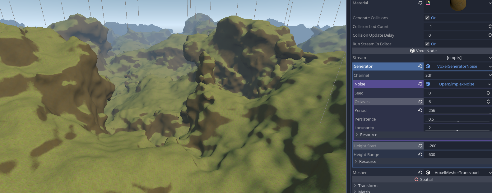


Node-graph generators (VoxelGraphs)
------------------------------------

Basic generators may often not be suited to make a whole game from, but you don't necessarily need to program one. C++ is a very fast language to program a generator but it can be a tedious workflow, especially when prototyping. If you need smooth terrain, a graph-based generator is available, which offers a very customizable approach to make procedural volumes.

!!! warn
    This generator was originally made for smooth terrain, but works with blocky too, to some extent.


### Concept

Voxel graphs allow to represent a 3D density by connecting operation nodes together. It takes 3D coordinates (X, Y, Z), and computes the value of every voxel from them. For example it can do a simple 2D or 3D noise, which can be scaled, deformed, masked using other noises, curves or even images.

A big inspiration of this approach comes again from sculpting of signed-distance-fields (every voxel stores the distance to the nearest surface), which is why the main output node may be an `SdfOutput`. A bunch of nodes are meant to work on SDF as well. However, it is not strictly necessary to respect perfect distances, as long as the result looks correct for a game, so most of the time it's easier to work with approximations.

!!! note
    Voxel graphs are half-way between programming 3D shaders and procedural design. It has similar speed to C++ generators but has only basic instructions, so there are some maths involved. This might get eased a bit in the future when more high-level nodes are added.


### Examples

#### Flat plane

The simplest possible graph with a visible output is a flat plane. The SDF of a flat plane is the distance to sea-level (0), which is `sdf = y`. In other words, the surface appears where voxel values are crossing zero.

Right-click the background of the graph, choose the nodes `InputY` and `SdfOutput`, then connect them together by dragging their ports together.

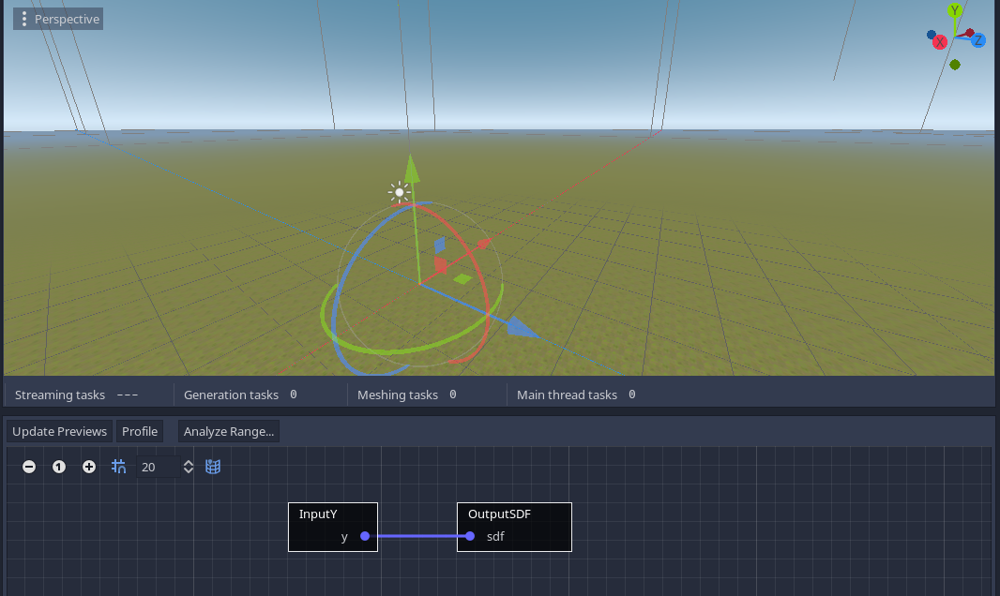

It is possible to decide the height of the plane by subtracting a constant (`sdf = y - height`), so that `sdf == 0` will occur at a higher coordinate. To do this, an extra node must be added:

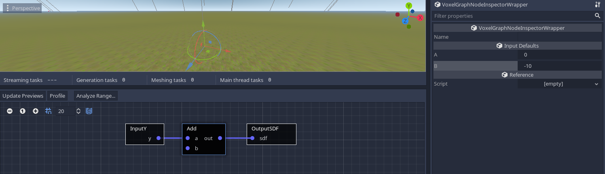

By default, the `Add` node does nothing because its `b` port is not connected to anything. It is possible to give a default value to such port. You can set it by clicking on the node and changing it in the inspector.

(note: I used `Add` with a negative value for `b`, but you can also use a `Subtract` node to get the same result).

#### Noise

A flat plane is simple but a bit boring, so one typical way to generate a terrain is adding good old fractal noise. You can do this in 2D (heightmap) or 3D (volumetric).
The 2D approach is simpler, as we only need to take our previous setup, and add 2D noise to the result. Also, since noise is generated in the range [-1 to 1], we also need a multiplier to make it larger (`sdf = y - height + noise2d(x, y) * noise_multiplier`).

There are several types of noise available, each with their own parameters. At time of writing, `FastNoise2D` noise is the best option. `Noise2D` works too but it is slower and more limited (it uses Godot's `OpenSimplexNoise` class).

!!! note
    After you create this node, a new `FastNoiseLite` resource must be created in its parameters. If that resource is not setup, an error will occur and no voxels will be generated.

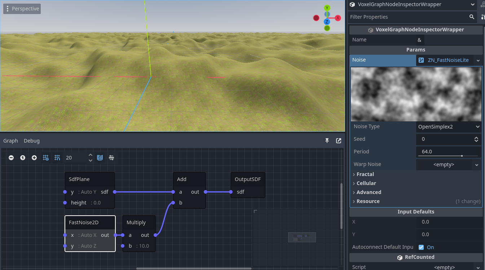

3D noise is more expensive to compute, but is interesting because it actually produces overhangs or even small caves. It is possible to replace 2D noise with 3D noise in the previous setup:

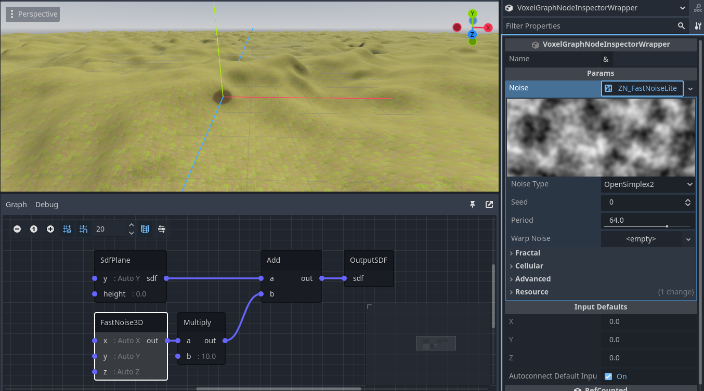

You might notice that despite it being 3D, it still appears to produce a heightmap. That's because the addition of `Y` in the graph is gradually offsetting noise values towards higher and higher values when going towards the sky, which makes the surface fade away quickly. So if we multiply `Y` with a small value, it will increase slower, letting the 3D noise expand more (`sdf = y * height_multiplier - height + noise3d(x, y, z)`):

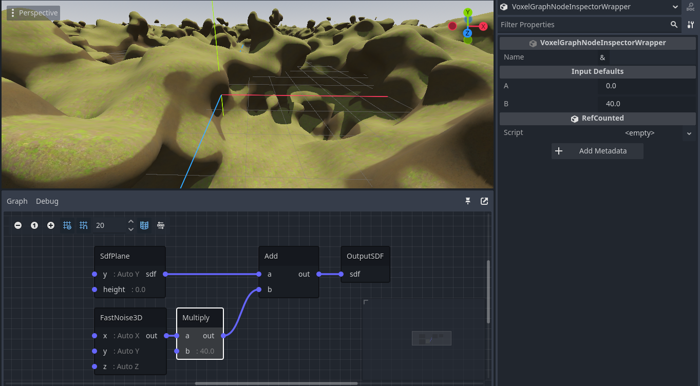

!!! note
    Some nodes have default connections. For example, with 3D noise, if you don't connect inputs, they will automatically assume (X,Y,Z) voxel position by default. If you need a specific constant in an input, this behavior can be opted out by turning off `autoconnect_default_inputs` in the inspector.

#### Planet

We are not actually forced to keep generating the world like a plane. We can go even crazier, and do planets. A good way to begin a planet is to make a sphere with the `SdfSphere` node:

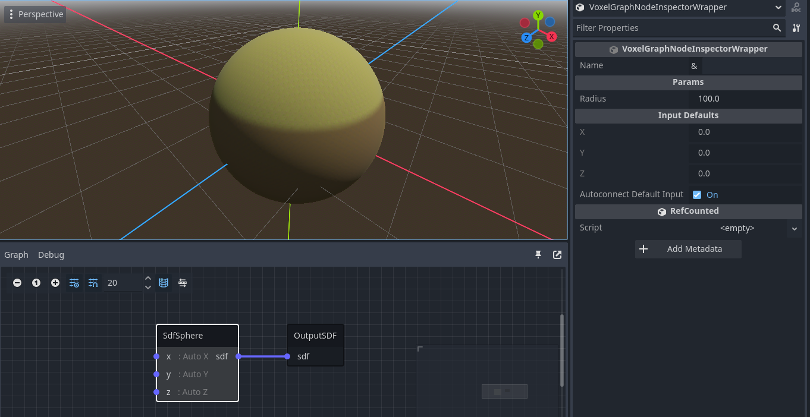

We cannot really use 2D noise here, so we can add 3D noise as well:

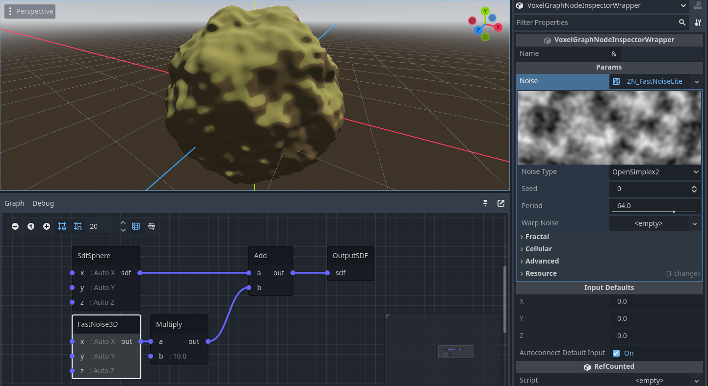

However you might still want a heightmap-like result. One way to do this is to feed the 3D noise normalized coordinates, instead of global ones. Picking a ridged fractal can also give an eroded look, although it requires to negate the noise multiplier node to invert its distance field (if we leave it positive it will look puffed instead of eroded).

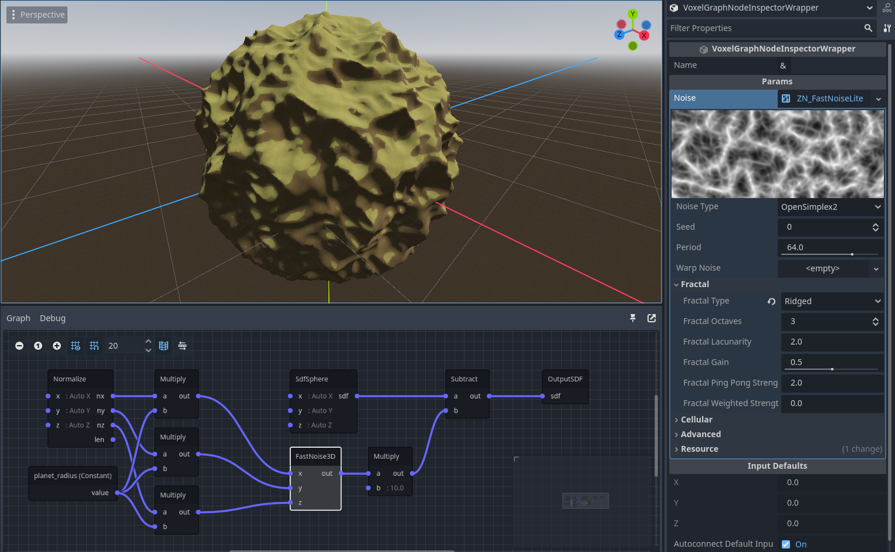

!!! note
    You can obtain a donut-shaped planet if you replace the `SdfSphere` node with a `SdfTorus` node.
    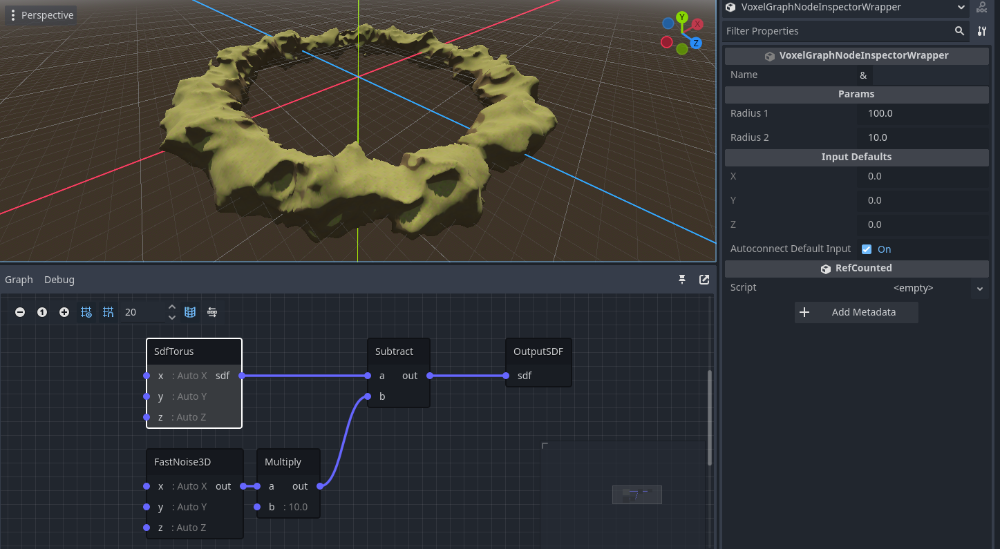


#### Caves

!!! warn
    This section is a bit advanced and lacks details because at the moment there is no built-in "macro" to do this in a user-friendly way, and I kind of came up with it by experimentation

It is possible to generate caves by subtracting noise "worms" from a base SDF terrain. To simplify the approach, let's first look at what 2D noise looks like, with a few octaves:

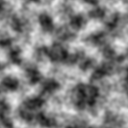

If we multiply that noise by itself (i.e square it), we obtain this:

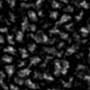

And if we clamp it to highlight values below a threshold close to zero, we can notice a path-like pattern going on:


In 2D (or in 3D when using normalized coordinates) this is the key to produce rivers, or ravines. But the problem with caves is to obtain 3D, round-shaped "worms", not just 2D shapes. So we can cheat a little, by still using 2D noise, but instead we modulate the threshold along the Y axis. We need a parabola-shaped curve for this, which can be obtained with a second-degree polynome like `y^2 - 1`:

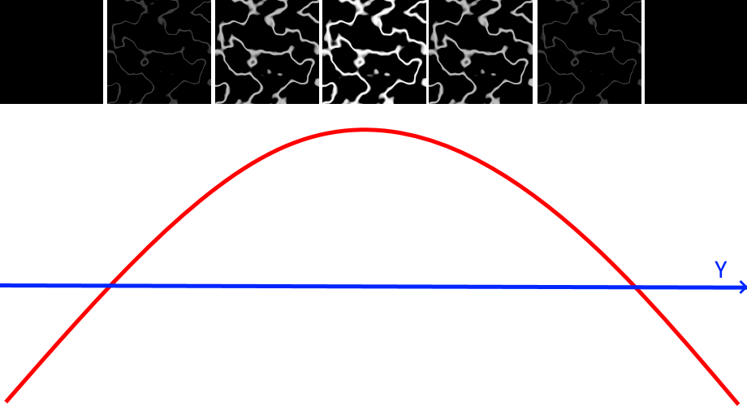

Back to the voxel graph, we may connect directly the cave generation nodes to the output just to preview what they look like, without the rest of the terrain:

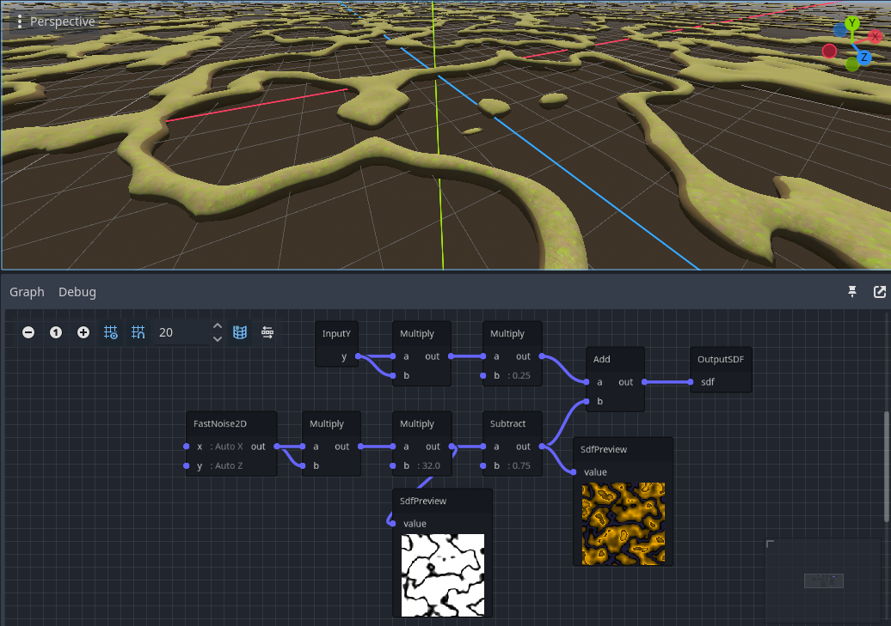

After tweaking noise and other values, we obtain those famous worms, but there are two problems:

- The caves are still flat, they don't go up or down
- They go on endlessly, there are no dead-ends

We can fix the first problem by adding an extra layer of 2D noise to the Y coordinate so it can perturb the caves vertically. Re-using the ground surface noise with an extra multiplier can prove effective sometimes, so we avoid computing extra noise.

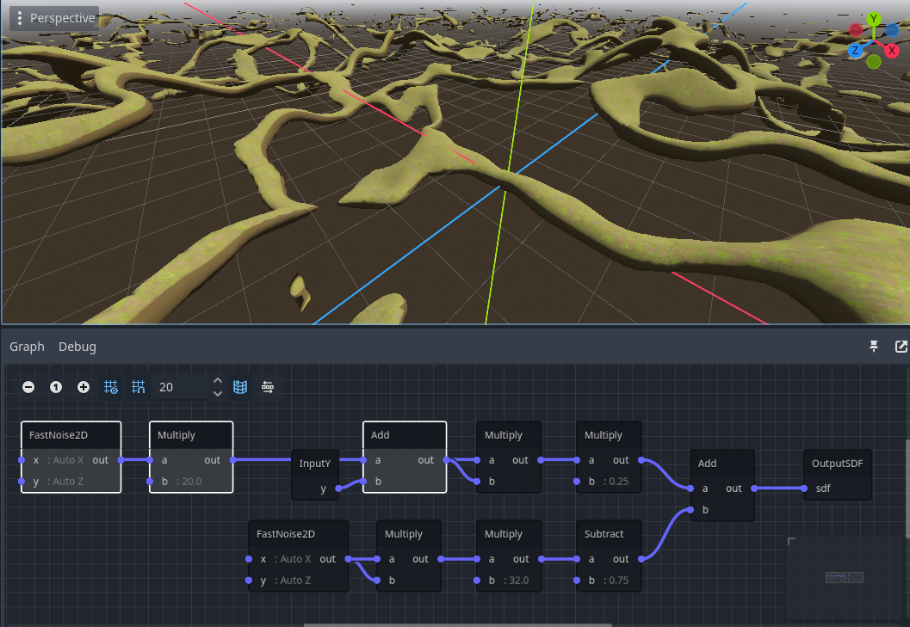

The second problem can also be fixed with yet another layer of low-frequency noise, which can be added to the cave threshold so caves will shrink to become dead-ends on some regions. Again, adding multipliers may change how sharply that transition occurs.

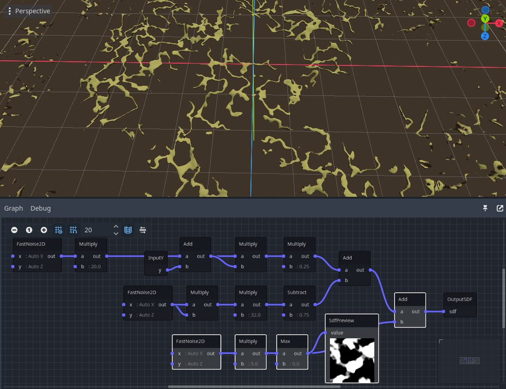

Finally, we can blend our terrain with caves by subtracting them. This can be done with the `SdfSmoothSubtract` node, essentially doing `terrain - caves`.

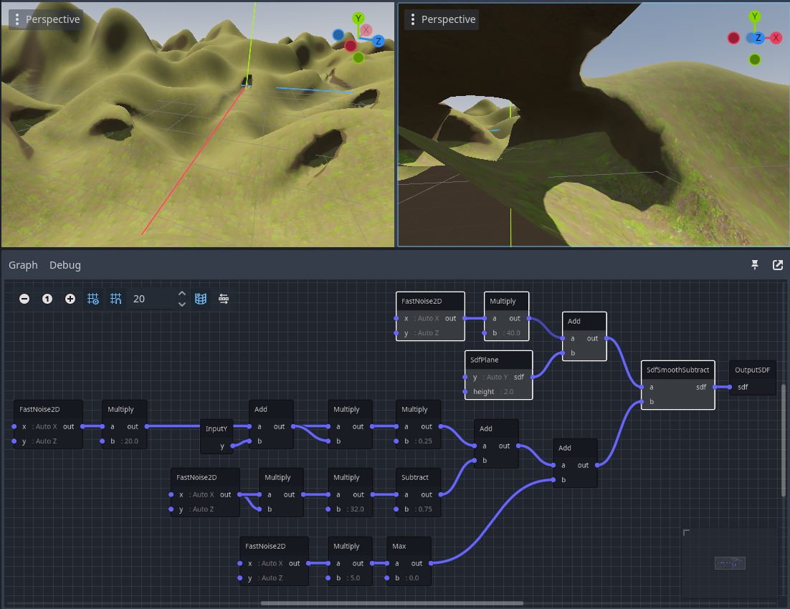

There are likely variants of this to obtain different results.


### Usage with blocky voxels

It is possible to use this generator with `VoxelMesherBlocky` by using an `OutputType` node instead of `OutputSDF`. However, `VoxelMesherBlocky` expects voxels to be IDs, not SDF values.

The simplest example is to pick any existing SDF generator, and replace `OutputSDF` with a `Select` node connected to an `OutputType`. The idea is to choose between the ID of two different voxel types (like air or stone) if the SDF value is above or below a threshold.

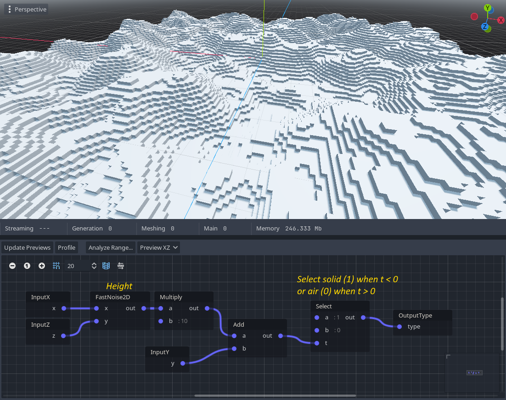

If more variety is needed, `Select` nodes can be chained to combine multiple layers, using different thresholds and sources.

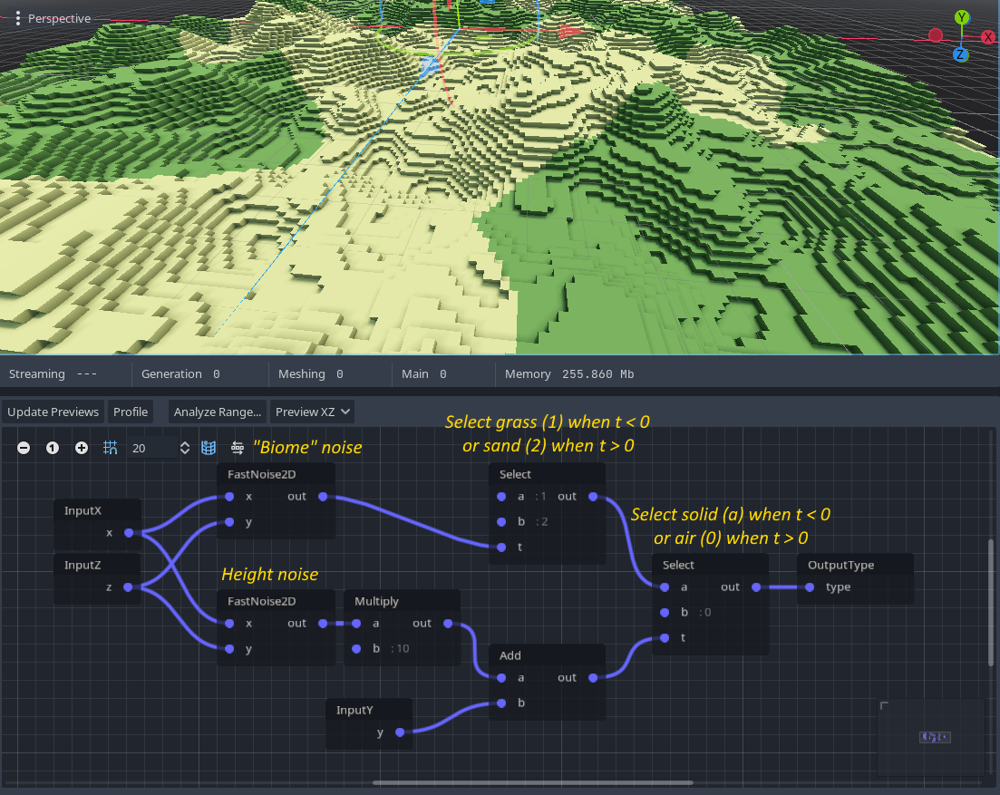

`Select` creates a "cut" between the two possible values, and it may be desirable to have some sort of transition. While this isn't possible with `VoxelMesherBlocky` without a lot of different types for each value of the gradient (usually done with a shader), it is however easy to add a bit of noise to the threshold. This reproduces a similar "dithered" transition, as can be seen in Minecraft between sand and dirt.

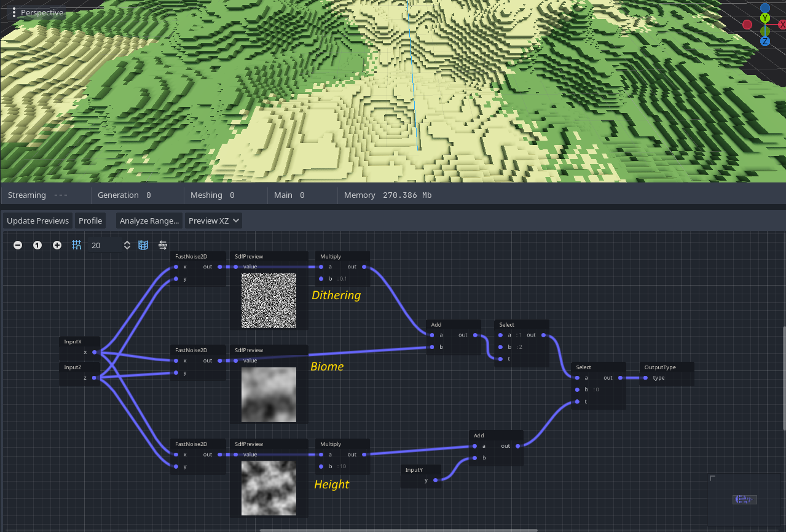

Currently, graph generators only work per voxel. That makes them good to generate base ground and biomes, but it isn't practical to generate structures like trees or villages with it. This may be easier to accomplish using a second pass on the whole block instead, using a custom generator.


### Relays

A special `Relay` node exists to organize long connections between nodes. They do nothing on their own, they just redirect a connection. It also remains possible for a relay to have multiple destinations.

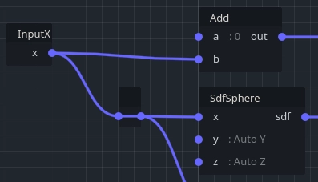


### Performance tuning

This is a more technical section.

This generator uses a number of optimization strategies to make the calculations faster. You may want to fine-tune them in some cases depending on the kind of volume you want to generate. When you get more familiar with the tool it may be useful to know how it works under the hood, notably to troubleshoot generation issues when they occur.

#### Buffer processing

Contrary to many node-based or expression tools existing in Godot so far, voxel graphs are not tailored to run on voxels one by one. The main use case is to process a bunch of them. Indeed, for a 16x16x16 block, there are 4096 voxels to generate. That would mean traversing the entire graph 4096 times, and the cost of doing that individually can exceed the cost of the calculations themselves. Besides, switching constantly between node types to run different operations is not CPU-friendly due to all the jumps required.

So instead, outputs of each node are associated small buffers for a subset of the voxels, say, a 16x16 slice. Then, the graph is traversed once ahead-of-time to obtain a simple list of operations. It is guaranteed that if a node depends on another, the other will have run before.

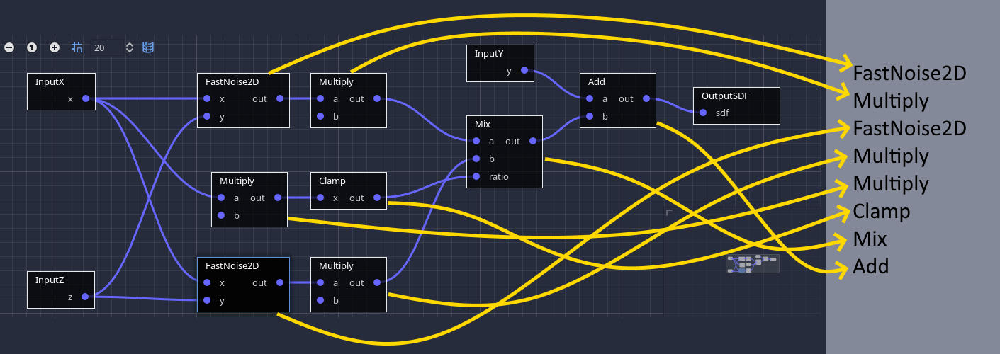

Finally, the generator executes the list, node by node, and each node computes a bunch of voxels at once instead of just one. This ensures that the CPU is almost exclusively used for the operations themselves, providing performance similar to C++, while graph traversal becomes neglibible. It also offers the opportunity to use [SIMD](https://en.wikipedia.org/wiki/SIMD) very easily, which can be even faster than if the code was written in plain C++.

Buffer processing is mostly an internal detail so there are no particular settings on the scripting API.

#### Range analysis

Before processing voxels in a specific region of space (a box), the generator first runs a [range analysis](https://en.wikipedia.org/wiki/Interval_arithmetic) pass. Each node has an alternative implementation using intervals, with the sole purpose of estimating the range of values it will output in the area. It's like a broad-phase before the heavy work.

It is possible to inspect results of this pass in the editor by enabling it with the `Analyse range` button. The analysis will focus on the box specified in the dialog, which will appear as a yellow wireframe in the 3D viewport.


You can also hover the output label of any node to see what range was calculated for it:

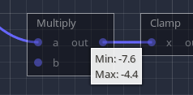

!!! note
    Noise is typically between -1 and 1, but we take it a step further. Ranges are approximated using maximum derivatives, which is how fast noise can vary along a given distance. Each noise algorithm has its own. We calculate noise at the center of the box, and add half of the maximum derivative, positively and negatively. In other words, in the box, we know noise cannot exceed the central value + the maximum variation along extents of the box. At close range, this can successfully detect valleys and hills, without fully computing them.

Results of this pass are used for several optimization techniques described below.

#### SDF clipping

3D volumes represented with meshes to form a terrain have an interesting property: to generate them, we are mostly interested in the areas where voxel values are crossing the isolevel (zero). That means we could completely discard regions of space that are guaranteed to never get near zero, and simplify them to a single value (like "only matter" or "only air"). Doing that in 3 dimensions has tremendous speed implications so it is a major feature of this generator.

Range analysis is used to perform this optimization. In a given area, if the maximum value of SDF is lower than a threshold below zero, then the whole block is skipped and assigned a uniform negative value. The same happens with a threshold above zero.

It is possible to choose that threshold with the `sdf_clip_threshold` property in the inspector. If given an extremely large value like `10000`, it will essentially turn off this optimization.

It is exposed because in some situations, clipping can cause artifacts when the edge of a block is too close from a clipped one. Indeed, clipping blocks cause discontinuities in the distance field.

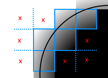

Usually they happen far enough from the surface to be of any concern, but sometimes they can come close if the threshold is too low:

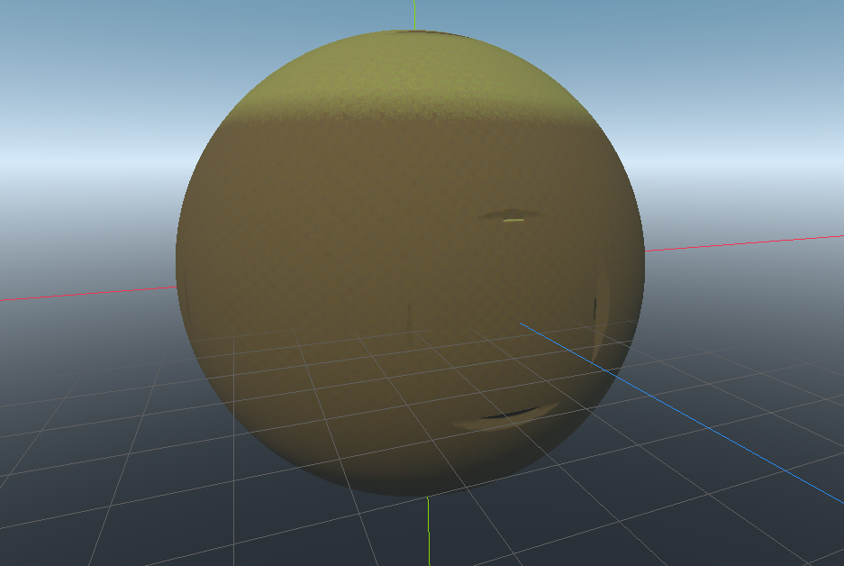

So by default the threshold is above zero and should cover most cases.

It is also possible to instruct the generator to invert clipped blocks, which will make them stand out:

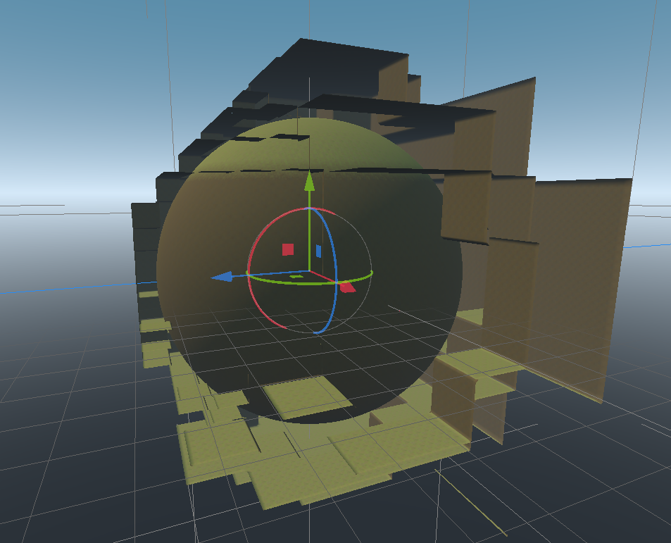


#### Local optimization

Conditionals (`if/else`) are not supported by this voxel graph implementation. The main reason is because of the buffer processing approach. The CPU can churn through buffers very fast, but branching on a per-voxel basis would disrupt it. Besides, range analysis might get a lot more complicated if branching was added. They can exist within nodes, but cannot exist as a graph-level primitive. So the usual approach is to blend things by mixing, adding, subtracting parts of the graph. But when a graph becomes big, even with SDF clipping, performance could be better. Conditionals are often used to optimize locally, so how can we do this without?

Let's consider an example world made of two biomes, each generated with a big node setup, and blended together across the world's X axis.

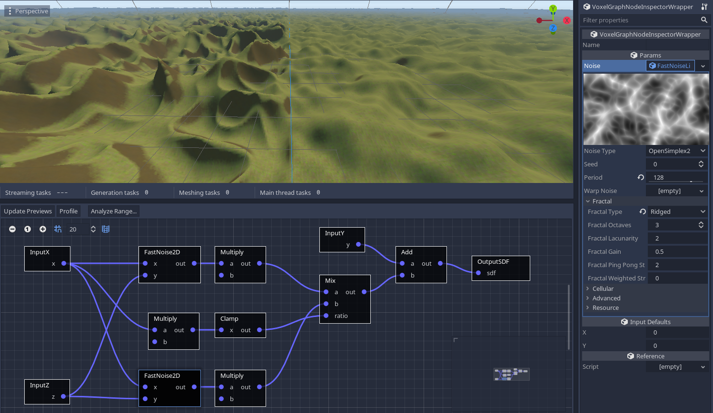

If we don't optimize this, both biomes will constantly get calculated at every point of space close enough to the surface. But if we look at the range analysis we performed earlier, and focus on one of the biomes, we notice that the range of values received by the `Mix` node are such that only one biome is blended. In other words, one of the inputs of `Mix` has no effect on its result, and is therefore ignored there.

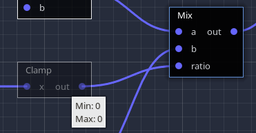

So each biome then only computes its own branch when far away enough from the blending area:


Thanks again to range analysis, the generator is able to detect this locally, and *dynamically skips whole branches of nodes* if they are found to not affect the final result. Therefore, it is not required to add conditionals for this use case, it's done automatically. You can visualize this by turning on the analysis tool, which will grey out nodes that are ignored in the specified area.

Internally, the generator parses the graph locally (using a faster data structure since the graph is compiled) to obtain an alternative list of operations. This list is currently nicknamed an `execution map`, because it maps the full list of operations to a reduced one.

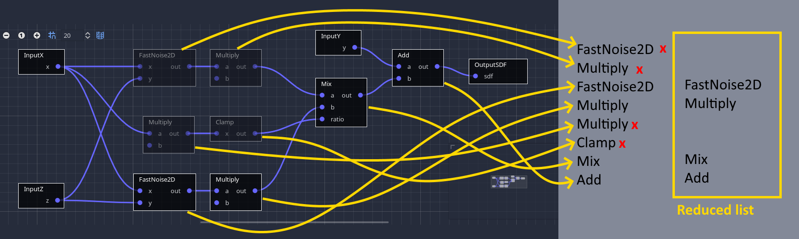

This setting can be toggled in the inspector.

!!! note
    This feature may be more or less precise depending on the range of values parts of the graph are producing. So it is possible that two different graphs providing the same result can run at different speeds. For this reason, analysing ranges can prove useful to understand why parts of the graph are still computed.


#### Subdivision

Previous optimizations are tied to the size of the considered area. The bigger the area, the less precise they will be. For example, with a larger box, it is more likely to find a place where voxels produce a surface. It is also more likely for more biomes or other shapes to appear and blend together. Besides, changing the size of our world chunks isn't a light decision.

So a simple improvement is to tell the generator to further subdivide itself the region of space it works on. Usually a subdivision size of 16x16x16 is ok. 8x8x8 is even more precise, but below that size the cost of iteration will eventually exceed the cost of computations again (see Buffer processing). Subdivision sizes must also divide volume block sizes without remainder. This is mostly to avoid having to deal with buffers of different sizes.


#### XZ caching

When generating voxel-based terrains, despite the attractiveness of overhangs, there can be a large part of your generator only relying on the X and Z coordinates. Typically, generating from 2D noise as a base layer is one of these situations.
When the generator is done with a slice along X and Z, it increases Y and does the slice above. But since 2D noise only depends on X and Z, it would get recomputed again. And noise is expensive.

This situation is similar to the following pseudocode:

```
for z in size_z:
    for x in size_x:
        for y in size_y:
            set_voxel(x, y, z, noise2d(x, z) + y)
```

Typically, to optimize this, you would move out the `noise2d` call into the outer loop, like so:

```
for z in size_z:
    for x in size_x:
        n = noise2d(x, z)
        for y in size_y:
            set_voxel(x, y, z, n + y)
```

This way, the 2D noise is only computed once for each column of voxels along Y, which speeds up generation a lot.

In Voxel Graphs, the same optimization occurs. When the list of operations is computed, they are put in two groups: `XZ` and `XZY`. All operations that only depend on X and Z are put into the `XZ` group, and others go into the `XZY` group.
When generating a block of voxels, the `XZ` group is executed once for the first slice of voxels, and the `XZY` group is executed for every slice, re-using results from the `XZ` group.

This optimization only applies on both X and Z axes. It can be toggled in the inspector.


#### Buffer reduction

The graph attempts to use as few temporary buffers as possible. For example, if you have 10 nodes processing before the output, it won't necessarily allocate 10 unique buffers to store intermediary outputs. Instead, buffers will be re-used for multiple nodes, if that doesn't change the result. Buffers are assigned ahead-of-time, when the graph is compiled. It saves memory, and might improve performance because less data has to be loaded into CPU cache.
This feature is disabled when the graph is compiled in debug mode, as it allows inspecting the state of each output.


Custom generator
-----------------

See [Scripting](scripting.md)


Using `VoxelGeneratorGraph` as a brush
-----------------------------------------

This feature is currently only supported in `VoxelLodTerrain` and smooth voxels.

`VoxelTool` offers simple functions to modify smooth terrain with `do_sphere` for example, but it is also possible to define procedural custom brushes using `VoxelGeneratorGraph`. The same workflow applies to making such a graph, except it can accept an `InputSDF` node, so the signed distance field can be modified, not just generated.

Example of additive `do_sphere` recreated with a graph:

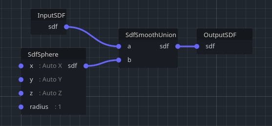

A more complex flattening brush, which both subtracts matter in a sphere and adds matter in a hemisphere to form a ledge (here defaulting to a radius of 30 for better preview, but making unit-sized brushes may be easier to re-use):

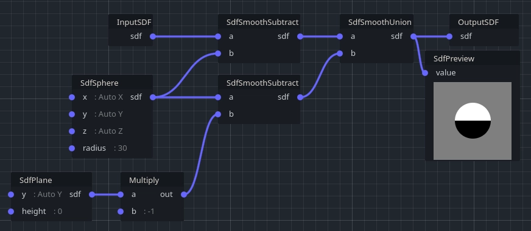

One more detail to consider, is how big the original brush is. Usually voxel generators have no particular bounds, but it matters here because it will be used locally. For example if your make a spherical brush, you might use a `SdfSphere` node with radius `1`. Then, your original size will be `(2,2,2)`. You can then transform that brush (scale, rotate...) when using `do_graph` at the desired position.


Re-usable graphs with `VoxelGraphFunction`
--------------------------------------------

`VoxelGraphFunction` allows to create graphs that can be used inside other graphs. This is a convenient way to re-use and share graphs.

### Creating a function

A `VoxelGraphFunction` can be created in the inspector and edited just like a `VoxelGeneratorGraph`, except it will lack some features only found on the latter. It is recommended to save functions as their own `.tres` files, because this is what allows to pick them up in other graphs.

!!! note
    A `VoxelGraphFunction` cannot contain itself, directly or indirectly. Doing this will result in Godot failing to load it.


### Exposing inputs and outputs

To be usable in other graphs, functions should have inputs and outputs. Inputs can be added to the function by creating nodes `InputX`, `InputY`, `InputZ`, `InputSDF` or `CustomInput`. Outputs can be added by creating nodes `OutputX`, `OutputY`, `OutputZ`, `CustomOutput` etc.

However, an extra step is necessary to expose those inputs and outputs to external users of the function. To expose them, select the graph (or click in the background if opened already), go to the inspector, and click `Edit input/outputs`.

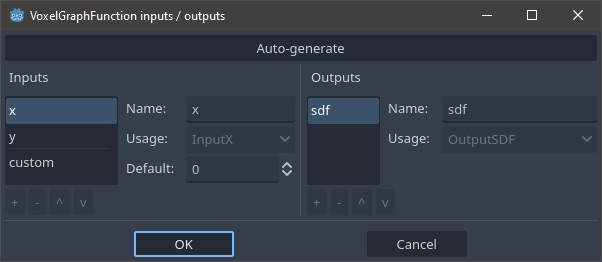

Currently, defining manually exposed inputs and outputs isn't supported, but is planned. You may instead click on `Auto-generate`, which will find nodes automatically and expose them as inputs and outputs. This also defines the order in which they will be exposed.

Non-custom inputs and outputs such as `InputX` or `OutputX` are *special* nodes, and are identified by their type. They are recognized by the engine for specific purposes. You can have multiple nodes with the same type, but they will always refer to the same input of the function.

Custom inputs and outputs *are identified by their name*. If you add 2 `CustomInput` nodes and give them the same name, they will get their data from the same input. It is recommended to give a name to custom input and output nodes. Empty names still count as a name (so multiple `CustomInput` without names will refer to the same unnamed input).

Multiple special inputs or inputs with the same type is not allowed.
Multiple custom inputs or outputs with the same name is not allowed.


### Exposing parameters

Currently parameters cannot be exposed, but it is planned.


### Handling changes

When an existing function changes (new/removed inputs/outputs for example), it is possible that other graphs using it will break. If you try to open them, some of the nodes and connections could be missing.

Currently, you are expected to fix these graphs, and save them. You can also change the offending function so that its inputs, outputs and parameters are what you expect. However if you save a broken graph, you might loose some connections or nodes.


### Debugging

Editor tools such as profiling, output previews or range analysis are currently unsupported inside a `VoxelGraphFunction`. It is also not possible to inspect internal nodes of a function when editing a `VoxelGeneratorGraph`.

It is planned to have these tools available when editing a standalone `VoxelGraphFunction` in the future. This will be done by moving features out of `VoxelGeneratorGraph` so they become more generic.

Inspecting a function "instance" (and sub-instances...) may be desirable, but it is tricky to implement. It could be done as an "Open Inside" feature, to inspect data within the context of the "containing graph". However because functions are fully unpacked and optimized out internally, the engine has to trace back the information to original nodes. Tracing is already present to some degree, but only maps the "top-level" graph to fully-expanded/optimized graph, with no in-between information. This might be worked on further in the future.


VoxelGeneratorGraph nodes
-----------------------------

### Inputs

Node name             | Description
----------------------|----------------------------------
Constant              | Outputs a constant number.
InputX                | Outputs the X coordinate of the current voxel.
InputY                | Outputs the Y coordinate of the current voxel.
InputZ                | Outputs the Z coordinate of the current voxel.
InputSDF              | Outputs the existing signed distance at the current voxel. This may only be used in specific situations, such as using the graph as a procedural brush.
CustomInput           | Outputs values from the custom input having the same name as the node. May be used in `VoxelGraphFunction`. It won't be used in `VoxelGeneratorGraph`.


### Outputs

Node name             | Description
----------------------|----------------------------------
OutputSDF             | Sets the Signed Distance Field value of the current voxel.
OutputSingleTexture   | Sets the texture index of the current voxel. This is an alternative to using `OutputWeight` nodes, if your voxels only have one texture. This is easier to use but does not allow for long gradients. Using this node in combination with `OutputWeight` is not supported.
OutputType            | Sets the TYPE index of the current voxel. This is for use with `VoxelMesherBlocky`. If you use this output, you don't need to use `OutputSDF`.
OutputWeight          | Sets the value of a specific texture weight for the current voxel. The texture is specified as an index with the `layer` parameter. There can only be one output using a given layer index.
CustomOutput          | Sets the value of the custom output having the same name as the node. May be used in `VoxelGraphFunction`. It won't be used in `VoxelGeneratorGraph`.


### Math

Node name             | Description
----------------------|----------------------------------
Abs                   | If `x` is negative, returns `x` as a positive number. Otherwise, returns `x`.
Add                   | Returns the sum of `a` and `b`
Clamp                 | If `x` is lower than `min`, returns `min`. If `x` is higher than `max`, returns `max`. Otherwise, returns `x`.
Distance2D            | Returns the distance between two 2D points `(x0, y0)` and `(x1, y1)`.
Distance3D            | Returns the distance between two 3D points `(x0, y0, z0)` and `(x1, y1, z1)`.
Divide                | Returns the result of `a / b`
Expression            | Evaluates a math expression. Variable names can be written as inputs of the node. Some functions can be used, but they must be supported by the graph in the first place. Available functions: `sin(x)`, `floor(x)`, `abs(x)`, `sqrt(x)`, `fract(x)`, `stepify(x,step)`, `wrap(x,length)`, `min(a,b)`, `max(a,b)`, `clamp(x,min,max)`, `lerp(a,b,ratio)`
Floor                 | Returns the result of `floor(x)`, the nearest integer that is equal or lower to `x`.
Fract                 | Returns the decimal part of `x`. The result is always positive regardless of sign.
Max                   | Returns the highest value between `a` and `b`.
Min                   | Returns the lowest value between `a` and `b`.
Mix                   | Interpolates between `a` and `b`, using parameter value `t`. If `t` is `0`, `a` will be returned. If `t` is `1`, `b` will be returned. If `t` is beyond the `[0..1]` range, the return value will be an extrapolation.
Normalize3D           | Returns the normalized coordinates of the given `(x, y, z)` 3D vector, such that the length of the output vector is 1.
Multiply              | Returns the result of `a * b`
Pow                   | Returns the result of the power function (`x ^ power`). It can be quite slow.
Powi                  | Returns the result of the power function (`x ^ power`), where the exponent is a constant positive integer. Faster than `Pow`.
Remap                 | For an input value `x` in the range `[min0, max0]`, converts linearly into the `[min1, max1]` range. For example, if `x` is `min0`, then `min1` will be returned. If `x` is `max0`, then `max1` will be returned. If `x` is beyond the `[min0, max0]` range, the result will be an extrapolation.
Select                | If `t` is lower than `threshold`, returns `a`. Otherwise, returns `b`. 
Sin                   | Returns the result of `sin(x)`
Smoothstep            | Returns the result of smoothly interpolating the value of `x` between `0` and `1`, based on the where `x` lies with respect to the edges `egde0` and `edge1`. The return value is `0` if `x <= edge0`, and `1` if `x >= edge1`. If `x` lies between from and to, the returned value follows an S-shaped curve that maps `x` between `0` and `1`. This S-shaped curve is the cubic Hermite interpolator, given by `f(y) = 3*y^2 - 2*y^3` where `y = (x-edge0) / (edge1-edge0)`.
Sqrt                  | Returns the square root of `x`.
Stepify               | Snaps `x` to a given step, similar to GDScript's function `stepify`.
Subtract              | Returns the result of `a - b`
Wrap                  | Wraps `x` between `0` and `length`, similar to GDScript's function `wrapf(x, 0, max)`.


### Noise

Node name             | Description
----------------------|----------------------------------
FastNoise2_2D         | Returns computation of 2D SIMD noise at coordinates `(x, y)` using the FastNoise2 library. The `noise` parameter is specified with an instance of the `FastNoise2` resource. This is the fastest noise currently supported.
FastNoise2_3D         | Returns computation of 3D SIMD noise at coordinates `(x, y, z)` using the FastNoise2 library. The `noise` parameter is specified with an instance of the `FastNoise2` resource. This is the fastest noise currently supported.
FastNoise2D           | Returns computation of 2D noise at coordinates `(x, y)` using the FastNoiseLite library. The `noise` parameter is specified with an instance of the `FastNoiseLite` resource.
FastNoise3D           | Returns computation of 3D noise at coordinates `(x, y, z)` using the FastNoiseLite library. The `noise` parameter is specified with an instance of the `FastNoiseLite` resource.
FastNoiseGradient2D   | Warps 2D coordinates `(x, y)` using a noise gradient from the FastNoiseLite library. The `noise` parameter is specified with an instance of the `FastNoiseLiteGradient` resource.
FastNoiseGradient3D   | Warps 3D coordinates `(x, y, z)` using a noise gradient from the FastNoiseLite library. The `noise` parameter is specified with an instance of the `FastNoiseLiteGradient` resource.
Noise2D               | Returns coherent fractal noise at 2D coordinates `(x, y)` using the open simplex algorithm. `noise` uses an instance of Godot's `OpenSimplexNoise` resource. 
Noise3D               | Returns coherent fractal noise at 3D coordinates `(x, y, z)` using the open simplex algorithm. `noise` uses an instance of Godot's `OpenSimplexNoise` resource.
Spots2D               | Cellular noise optimized for "ore patch" generation: divides space into a 2D grid where each cell contains a circular "spot". Returns 1 when the position is inside the spot, 0 otherwise. `jitter` more or less randomizes the position of the spot inside each cell. Limitation: high jitter can make spots clip with cell borders. This is intentional. If you need more generic cellular noise, use another node.
Spots3D               | Cellular noise optimized for "ore patch" generation: divides space into a 3D grid where each cell contains a circular "spot". Returns 1 when the position is inside the spot, 0 otherwise. `jitter` more or less randomizes the position of the spot inside each cell. Limitation: high jitter can make spots clip with cell borders. This is intentional. If you need more generic cellular noise, use another node.


### SDF

Node name             | Description
----------------------|----------------------------------
SdfBox                | Returns the signed distance field of an axis-aligned box centered at the origin, of size `(size_x, size_y, size_z)`, at coordinates `(x, y, z)`.
SdfPlane              | Returns the signed distance field of a plane facing the Y axis located at a given `height`, at coordinate `y`.
SdfPreview            | Debug node, not used in the final result. In the editor, shows a slice of the values emitted from the output it is connected to, according to boundary `[min_value, max_value]`. The slice will be either along the XY plane or the XZ plane, depending on current settings.
SdfSmoothSubtract     | Subtracts signed distance field `b` from `a`, using the same smoothing as with the SmoothUnion node.
SdfSmoothUnion        | Returns the smooth union of two signed distance field values `a` and `b`. Smoothness is controlled with the `smoothness` parameter. Higher smoothness will create a larger "weld" between the shapes formed by the two inputs.
SdfSphere             | Returns the signed distance field of a sphere centered at the origin, of given `radius`, at coordinates `(x, y, z)`.
SdfSphereHeightmap    | Returns an approximation of the signed distance field of a spherical heightmap, at coordinates `(x, y, z)`. The heightmap is an `image` using panoramic projection, similar to those used for environment sky in Godot. The radius of the sphere is specified with `radius`. The heights from the heightmap can be scaled using the `factor` parameter. The image must use an uncompressed format.
SdfTorus              | Returns the signed distance field of a torus centered at the origin, facing the Y axis, at coordinates `(x, y, z)`. The radius of the ring is `radius1`, and its thickness is `radius2`.


### Other

Node name             | Description
----------------------|----------------------------------
Curve                 | Returns the value of a custom `curve` at coordinate `x`, where `x` is in the range `[0..1]`. The `curve` is specified with a `Curve` resource.
Image2D               | Returns the value of the red channel of an `image` at coordinates `(x, y)`, where `x` and `y` are in pixels and the return value is in the range `[0..1]` (or more if the image has an HDR format). If coordinates are outside the image, they will be wrapped around. No filtering is performed. The image must have an uncompressed format.
Function              | Runs a custom function, like a re-usable sub-graph. The first parameter (parameter 0) of this node is a reference to a `VoxelGraphFunction`. Further parameters (starting from 1) are those exposed by the function.


Modifiers
-----------

Modifiers are generators that affect a limited region of the volume. They can stack on top of base generated voxels or other modifiers, and affect the final result. This is a workflow that mostly serves if your world has a finite size, and you want to set up specific shapes of the landscape in a non-destructive way from the editor.

!!! note
    This feature is only implemented with `VoxelLodTerrain` at the moment, and only works to sculpt smooth voxels. It is in early stages so it is quite limited.

Modifiers can be added with nodes as child of the terrain. `VoxelModifierSphere` adds or subtracts a sphere, while `VoxelModifierMesh` adds or subtracts a mesh. For the latter, the mesh must be baked into an SDF volume first, using the `VoxelMeshSDF` resource.

Because modifiers are part of the procedural generation stack, destructive edits will always override them. If a block is edited, modifiers cannot affect it. It is then assumed that such edits would come from players at runtime, and that modifiers don't change.


Caching
---------

Generators are designed to be deterministic: if the same area is generated twice, the result must be the same. This means, ultimately, we only need to store edited voxels (aka "destructive" editing), while non-edited regions can be recomputed on the fly. Even if you want to access one voxel and it happens to be in a non-edited location, then the generator will be called just to obtain that voxel.

However, if a generator is too expensive or not expected to run this way, it may be desirable to store the output in memory so that querying the same area again picks up the cached data.

By default, `VoxelTerrain` caches blocks in memory until they get far from any viewer. `VoxelLodTerrain` does not cache blocks by default. There is no option yet to change that behavior.
It is also possible to tell a `VoxelGenerator` to save its outputs to the current `VoxelStream`, if any is setup. However, these blocks will act as edited ones, so they will behave as if it was changes done destructively.
