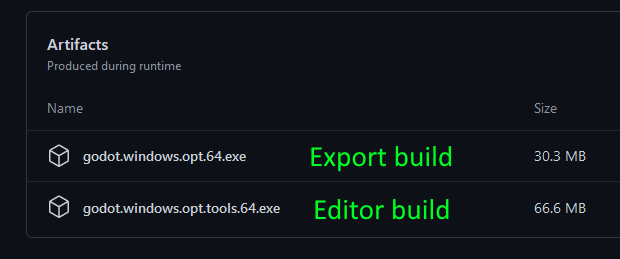

Getting Voxel Tools
=====================

This is a C++ module, which needs to get compiled into Godot Engine.

Precompiled builds
-------------------

### Development builds

- Available on [Github Actions](https://github.com/Zylann/godot_voxel/actions)

These builds correspond to the `master` version depicted in the [changelog](https://github.com/Zylann/godot_voxel/blob/master/CHANGELOG.md).
A new build is made each time commits are pushed to the main branch, but also when other developers make Pull Requests, so careful about which one you pick.

In case there are multiple downloadable artifacts, the editor build will be the one with `opt.tools` in the name (because it is built with optimizations enabled, and includes tools).

### Tokisan builds (old)

- Available on [Tokisan Games website](http://tokisan.com/godot-binaries/).

A long while ago, [Cory Petkovsek](https://github.com/tinmanjuggernaut) made full builds of Godot with the module and some additions of his own, including export templates. However they are now way behind the current version so they miss a lot of recent features and setup differences.

Building yourself
------------------------

These steps will walk you through creating a custom build of Godot with the Voxel Tools module compiled into it.

### Build Godot

1. Download and compile the [Godot source](https://github.com/godotengine/godot) by following [the official guide](https://docs.godotengine.org/en/latest/development/compiling/index.html). If you want to regularly update your build (recommended), clone the repository with Git instead of downloading a zip file.
1. Make sure to select the appropriate branches. If you want to use the latest Voxel Tools, the matching Godot branch is `3.x`. If there is a versioned Voxel Tools branch (e.g. `godot3.1`), that is intended to match the corresponding version of Godot. 
1. Build Godot before adding this or any other modules and make sure it produces an executable.
1. Run the newly built executable found in `godot/bin`. Look under Help/About and confirm that the version string indicates you are running a development version (e.g. `3.2dev.custom_build.ee5ba3e`).

### Add Voxel Tools

1. Download or clone the repository for [Voxel Tools](https://github.com/Zylann/godot_voxel). Use Git to clone the repository if you want to make it easy to update your builds (recommended).
1. Make sure to select the branch that corresponds with Godot's branch.
1. Place the Voxel Tools directory inside your Godot source tree, in the `godot/modules` directory. 
1. Rename the Voxel Tools folder to `voxel`. When correct, the files (e.g. README.md) will be located in `godot/modules/voxel`. **This is important!**
1. Rebuild Godot and make sure it produces an executable.
1. Test that your build has Voxel support:
	1. Run your new Godot build.
	1. Create a new project.
	1. Create a new 3D scene.
	1. Add a new node, search for "Voxel" and see if "VoxelTerrain" appears. If so, you have a successful build. If not, review these instructions and your build logs to see if you missed a step or something failed along the way.

### Updating Your Build

If you cloned Godot and Voxel Tools, you can use git to update your local code.

1. Go to your local Godot source directory `godot` and run `git pull`. It will download all updates from the repository and merge them into your local source.
1. Go to `godot/modules/voxel` and run `git pull`. Git will update Voxel Tools.
1. Rebuild Godot.

!!! note
	Since you are pulling from two development branches, it's probable that on occasion your build won't compile, your project won't open, or your Voxel Tools won't work properly or even crash Godot. To minimize downtime, save your successful builds. Move them out of the build folder and rename them with the version number (e.g. godot-3.2+ee5ba3e.exe). This way, you can continue to use previously working builds until the Godot or Voxel developers fix whatever is broken. It is generally desired by all that code published to repositories will at least build, but stuff happens.
