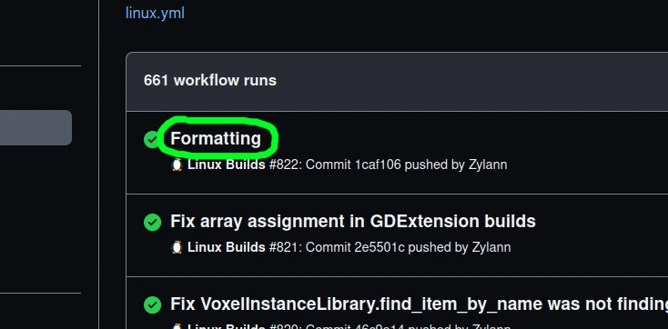
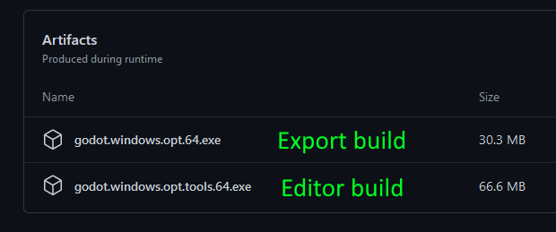
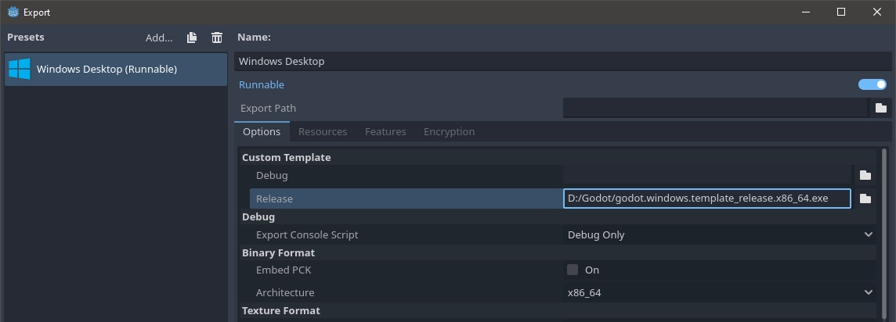

Getting Voxel Tools
=====================

This is a C++ module, which needs to get compiled into Godot Engine.

Precompiled builds
-------------------

### Release builds

Currently there are no builds done "per milestone", we only do development builds of latest versions.

Because the plugin is primarily developped as a module, it comes as a whole custom build of the Godot editor, and might differ a little from the official version.

The engine is massive and targets a lot of platforms, while our module is small in comparison and we don't have dedicated build containers, so not all export templates are available. You can develop your game and test it with the editor on main desktop platforms, but if you want to export it, you may need to compile the templates yourself.

### Development builds

#### For Godot 4

Available on Github Actions, pick your platform:

- [Windows builds](https://github.com/Zylann/godot_voxel/actions/workflows/windows.yml)
- [Linux builds](https://github.com/Zylann/godot_voxel/actions/workflows/linux.yml)
- [Mono builds](https://github.com/Zylann/godot_voxel/actions/workflows/windows.yml) (likely not available, they broke in Godot 4, help is needed to fix them)

Then click on the latest successful build, with a green checkmark:

Then scroll to the bottom, you should see download links:

In case there are multiple downloadable artifacts, the editor build will be the one with `editor` in the name.

These builds correspond to the `master` version depicted in the [changelog](https://github.com/Zylann/godot_voxel/blob/master/CHANGELOG.md).
They are built using Godot's latest stable version branch (for example, `4.0` at time of writing), instead of `master`.
A new build is made each time commits are pushed to the main branch, but also when other developers make Pull Requests, so careful about which one you pick.

!!! note
	You will need a Github account to be able to download development builds. Otherwise, links will not work.

#### For Godot 3 (legacy builds)

On Github actions, you may search for builds occurring with the `godot3.x` branch.

Development of new features on that branch stopped though, so it is possible the downloads expired. In which case you may look for a release or compile yourself.

### Tokisan builds (very old)

- Available on [Tokisan Games website](http://tokisan.com/godot-binaries/).

A long while ago, [Cory Petkovsek](https://github.com/tinmanjuggernaut) made full builds of Godot with the module and some additions of his own, including export templates. However they are now way behind the current version so they miss a lot of recent features and setup differences.

Building yourself
-------------------

These steps will walk you through creating a custom build of Godot with the Voxel Tools module compiled into it.

### Build Godot

1. Download and compile the [Godot source](https://github.com/godotengine/godot) by following [the official guide](https://docs.godotengine.org/en/latest/development/compiling/index.html). If you want to regularly update your build (recommended), clone the repository with Git instead of downloading a zip file.
1. Make sure to select the appropriate branches. If you want the very latest development version, use the `master` branch of Godot. If you want a more stable build following the latest stable release, use the branch of that version (for example `4.0`) or a specific version tag (like `4.0.2-stable`). If you want Godot 3, use Godot's `3.x` branch, and the module's `godot3.x` branch (but is no longer maintained). 
1. Build Godot before adding any other modules and make sure it produces an executable.
1. Run the newly built executable found in `godot/bin`. Look under Help/About and confirm that the version string indicates you are running the version you want (e.g. `3.2dev.custom_build.ee5ba3e`).

### Add Voxel Tools

1. Download or clone the repository for [Voxel Tools](https://github.com/Zylann/godot_voxel). Use Git to clone the repository if you want to make it easy to update your builds (recommended).
1. By default, the `master` branch of the module should work with the latest stable branch of Godot. There are "snapshot" branches of the module, which were created at the time specific Godot versions were released (such as `godot4.0`), but they are not updated.
1. Place the Voxel Tools directory inside your Godot source tree, in the `godot/modules` directory. 
1. Rename the Voxel Tools folder to `voxel`. When correct, the files (e.g. README.md) will be located in `godot/modules/voxel`. **This is important!**
1. Rebuild Godot and make sure it produces an executable.
1. Test that your build has Voxel support:
	1. Run your new Godot build.
	1. Create a new project.
	1. Create a new 3D scene.
	1. Add a new node, search for "Voxel" and see if "VoxelTerrain" appears. If so, you have a successful build. If not, review these instructions and your build logs to see if you missed a step or something failed along the way.

### Updating Your Build

If you cloned Godot and Voxel Tools, you can use git to update your local code.

1. Go to your local Godot source directory `godot` and run `git pull`. It will download all updates from the repository and merge them into your local source.
1. Go to `godot/modules/voxel` and run `git pull`. Git will update Voxel Tools.
1. Rebuild Godot.

!!! note
	Since you are pulling from two projects developped by different people, it's probable that on occasion your build won't compile, your project won't open, or your Voxel Tools won't work properly or even crash Godot. To minimize downtime, save your successful builds. Move them out of the build folder and rename them with the version number (e.g. godot-3.2+ee5ba3e.exe). This way, you can continue to use previously working builds until the Godot or Voxel developers fix whatever is broken. It is generally desired by all that code published to repositories will at least build, but stuff happens.

Export templates
-------------------

### Getting a template

In Godot Engine, exporting your game as an executable for a target platform requires a "template". A template is an optimized build of Godot Engine without the editor stuff. Godot combines your project files with that template and makes the final executable.

If you only download the Godot Editor with the module, it will allow you to develop and test your game, but if you export without any other setup, Godot will attempt to use a vanilla template, which won't have the module. Therefore, it will fail to open some scenes.

As mentionned in earlier sections, there are currently no "official" builds of this module, but you can get template builds at the same place as [latest development versions](#development-builds). Template builds are those with `template` in their name.

If there is no template available for your platform, you may build it yourself. This is the same as building Godot with the module, only with different options. See the [Godot Documentation](https://docs.godotengine.org/en/latest/development/compiling/index.html) for more details, under the "building export templates" category of the platform you target.

### Using a template

Once you have a template build, tell Godot to use it in the Export configurations. Fill in the path to a custom template in the "Custom Template" section:

### GDExtension

In the future, it is hoped that none of this manual work is required. Rather than getting a custom version of the engine, you would download Voxel from the asset library. Developping, testing, exporting would just work without extra setup.

GDExtension is what would make this possible. This module can already [compile with GodotCpp](module_development.md#gdextension) so it can be loaded as a GDExtension library.
Unfortunately, there are still [too many problems](https://github.com/Zylann/godot_voxel/issues/442) for the module to work properly. For the time being, a custom engine build is more reliable.

There are development builds available on [Github Actions](https://github.com/Zylann/godot_voxel/actions/workflows/extension_windows.yml) as we try to keep the module compiling with GodotCpp, however they are completely untested and might crash. Use at your own risk.

