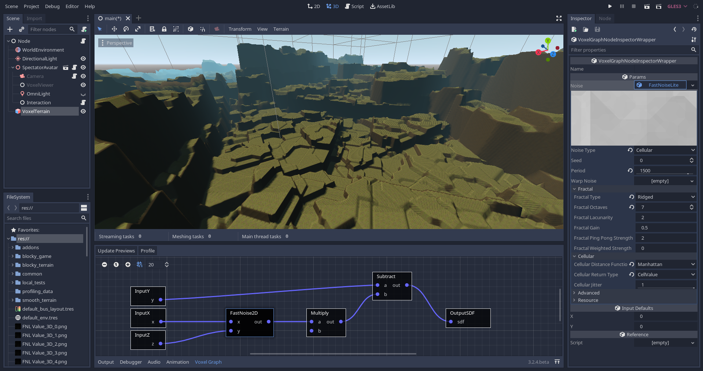

Voxel Tools documentation
============================

Voxel Tools is a C++ module for creating volumetric worlds in [Godot Engine](https://godotengine.org/).  
Explore categories on the left to get started!

- [Github repository](https://github.com/Zylann/godot_voxel)
- [License](https://github.com/Zylann/godot_voxel/blob/master/LICENSE.md)

!!! note
    This module is under development. A lot of features are available and can be used for games, but some other parts still need work and can change, so it's possible some information is not much detailed yet.

