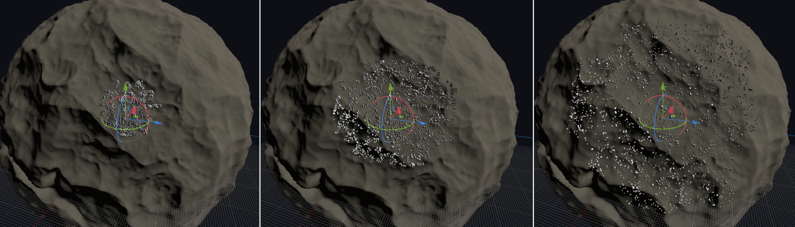

Instancing
=============

The module provides an instancing system with the [VoxelInstancer](api/VoxelInstancer.md) node. This node must be added as child of a voxel terrain. It allows to spawn 3D models on top of the terrain's surface, which can later be removed when modified.

It can spawn two different kinds of objects:

- **Multimesh instances**. They can be extremely numerous, and can optionally have collision.
- **Scene instances**. They use regular scenes, however it is much slower so should be tuned to low numbers.

This system is primarily intented at natural spawning: grass, rocks, trees and other kinds of semi-random foliage. It is not suited for complex man-made structures like houses or villages, although scene instances can be used in some cases, if the available features suit your game.

This feature is currently only available under `VoxelLodTerrain`.


VoxelInstanceLibrary
---------------------

### Library setup

In order to spawn items, `VoxelInstancer` needs a [VoxelInstanceLibrary](api/VoxelInstanceLibrary.md) resource. This resource contains a list of all the items that can be spawned, and how they will be placed.

Select a `VoxelInstancer`. In the inspector, assign a library to the `library` property, or create a new embedded one. Then click on the library resource. Buttons appear at the top of the inspector:


You can add items to the library by clicking the "+" icon, and choose `Add Multimesh item`.

Items created this way come with a default setup, so you should be able to see something appear on top of the voxel surface.

!!! note
    If you are making a planet, you may want to set the `up_mode` of `VoxelInstancer` to `Sphere` mode. This will tell the instancer where the upward direction is, and will align the items according to the local origin of the terrain.


### Block LOD

The range at which items spawn is based on the LOD system of the voxel terrain itself. This is configured in the `lod_index` property of [VoxelInstanceLibraryItem](api/VoxelInstanceLibraryItem.md). For example, choosing `0` will make the item spawn at the closest range, and fade quickly in the distance. Higher indexes will spawn on a larger range, so will also start to appear earlier as the player gets closer. Instances spawn in the same "blocks" as the ground.



Usually landscapes may be composed of multiple layers so that the closer you get, the more details come in. Bigger items use high lod indexes to be seen from far away, while smaller items may use lower indexes.


There is a balance to consider when choosing the appropriate `lod_index`: currently, larger indexes are *much more imprecise*, because they work on top of a lower-resolution mesh. When getting closer, it's possible that such instances are seen floating above ground, or sinking into it. This mostly happens in areas with sharp changes such as ridges, crevices or caves:


To combat this, you can adjust the `offset_along_normal` parameter in the `generator` associated to the item. This depends on the asset, so designing them such that they can have part of their bottom sunk into the ground can give some margin of error.

Sometimes it might not be enough, so this problem still has to be worked out in the future. Possible approaches include:

- Querying the world generator to approximate the surface without using the mesh (not suitable if the ground was edited)
- Gradually snap the instances somehow as higher-resolution data becomes available
- Load edited voxels for the entire world at once so they can be queried even from far distance (takes more memory)

!!! note
    When making grass or other items, it may be a good idea to fade meshes based on distance from the camera using a custom shader, so they won't disappear abruptly. Using a ground texture of similar colors also helps to make it blend.


### Mesh LOD

A secondary LOD system is included, which applies to meshes themselves, to some limited extent. Godot 3 does not have a LOD system (Godot 4 will), so this allows to reduce vertex count over distance from within a set of visible meshes.

To use this, you have to fill the 3 mesh LOD properties on your `VoxelInstanceLibraryItem`:


If only the `mesh` property is set, no LOD will be used.

The distance at which a LOD will be chosen is currently hardcoded, because it depends on the `lod_index` the blocks for that item are loaded into, which in turn depends on the `lod_distance` property of the parent voxel terrain.


If you need fewer LODs, you can assign twice the same mesh. This system is quite rigid because in Godot 4 it might be changed to only have a single slot dedicated to impostor meshes. Indeed, Godot 4 might support LOD on meshes, but it is not planned for the last LODs to become impostors, so this should still be possible to achieve.

!!! note
    Impostor meshes are simple quads that can fake the presence of the real model over far distances. For example, this is a really fast way to render forests from afar, while being able to use detailed trees when coming closer.


### Edition

Editing instances manually in the editor is not supported yet. It is only possible to define where instances spawn by using procedural generation.

It is however possible to remove them from within the game, when digging the ground they spawned on.


### Persistence

It is possible for some items to be persistent. This option can be enabled with the `persistent` property of [VoxelInstanceLibraryItem](api/VoxelInstanceLibraryItem.md). If the parent terrain has a `VoxelStream` supporting it, then instances from edited blocks will be saved into the stream, and won't respawn next time the player gets close to the area. Non-persistent instances will always respawn on each surface where procedural conditions are fulfilled.

The ID of persistent items is important, because it will be used in saved data. If you delete an item and try to load instances from a stream that still contains them, warnings will occur.

At time of writing, only [VoxelStreamSQLite](api/VoxelStreamSQLite.md) supports saving instances.

The save format is described in [this document](specs/instances_format.md).


### Setting up a Multimesh item from a scene

It is possible to setup a Multimesh Item from an existing scene, as an alternative to setting it up in the inspector. The scene will be converted to fit multimesh rendering. One reason you could need this is to setup colliders, because although they are supported, it is not possible to set them in the inspector at the moment. It is also more convenient to design instances in the 3D editor using nodes.

There are two ways of setting up from a scene:

- Assign the `scene` property. This will convert the scene at runtime. The scene will be linked to the item, so it will stay updated if the scene changes.
- Use the `Setup from scene` button on top of the inspector. This does not link the scene, and rather assigns manual properties doing the conversion in the editor. The item will not update if the scene change. If the scene embeds meshes, materials or textures, they might end up being copied into the item's resource file.

The conversion process expects your scene to follow a specific structure:

```
- PhysicsBody (StaticBody, RigidBody...)
	- MeshInstance_LOD0 <-- "LOD" suffixes are optional but allow to specify the 4 LODs if needed
	- MeshInstance_LOD1
	- MeshInstance_LOD2
	- MeshInstance_LOD3
	- CollisionShape1
	- CollisionShape2
	- ...
```

Materials can be setup in two ways:

- `material_override` on the MeshInstance
- Materials on the mesh resource directly

Surface material properties on the `MeshInstance` node are not supported.

### Scene instances

Multimesh items are fast and efficient, but have limitations.

Instancing scenes is supported by adding items of type `VoxelInstanceLibrarySceneItem`. Instead of spawning multimeshes, regular scene instances will be created as child of `VoxelInstancer`. The advantage is the ability to put much more varied behavior on them, such as scripts, sounds, animations, or even further spawning logic or interaction. The only constraint is, the root of the scene must be `Node3D` or derive from it.

This freedom has a high price compared to multimesh instances. Adding many instances can become slow quickly, so the default density of these items is lower when you create them from the editor. It is strongly recommended to not use too complex scenes, because depending on the settings, it can lead to a freeze or crash of Godot if your computer cannot handle too many instances.

!!! warning
    If you add a scene to the library and then try to load that library from that same scene, Godot will crash. This is a cyclic reference and is hard to detect in all cases at the moment.


Procedural generation
-----------------------

### Built-in generator


Items are added with a default built-in generator, so they will already spawn based on procedural rules rather than being painted manually. You can tweak the generator by inspecting the `generator` property of [VoxelInstanceLibraryItem](api/VoxelInstanceLibraryItem.md).

Persistent instances located in a block that was edited in the game will no longer regenerate.

### Custom instance generator

The feature is recent and the API may still change, so this is not available to scripts at the moment.


Streaming events (advanced)
----------------------------

`VoxelInstancer` knows when to spawn things by registering itself to its parent's block events. This is currently not available to the script API of `VoxelLodTerrain`, but may be added in the future.
