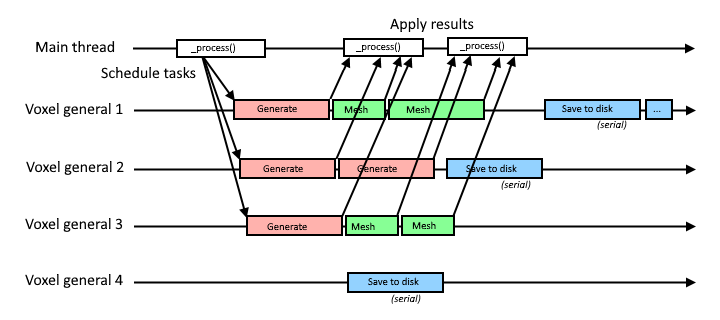
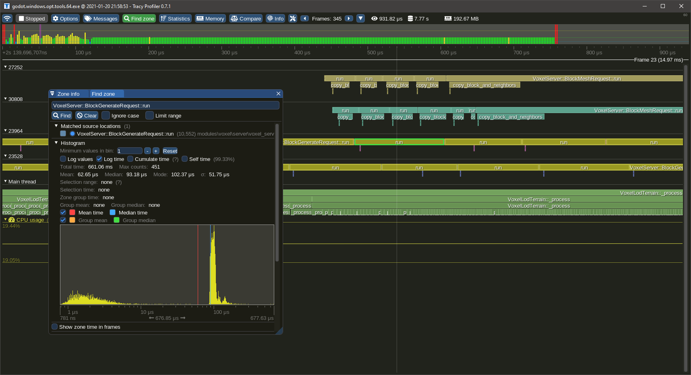

Module development
=====================

This page will give some info about the module's internals.

The source code of the module can be found on [Github](https://github.com/Zylann/godot_voxel).


Contributing
--------------

To contribute to the module, you need to clone the repo using [Git](https://git-scm.com/), and create your branch on Github so you'll be able to make Pull Requests.

### C++ code

It is recommended to read the **Engine Development** section on the official [Godot Documentation](https://docs.godotengine.org/en/stable/). It explains how to compile the engine, setup an IDE and how custom modules are made.

For code guidelines related to Voxel Tools, see [Code Guidelines](#code-guidelines)

### Main documentation

The documentation is written using Markdown, formatted using [Mkdocs](https://www.mkdocs.org/) and made available as a website on [ReadTheDocs](https://readthedocs.org/).

To contribute to the main pages, make your change to `.md` files located under the `doc/docs` folder, and post a PR on Github.

### API documentation

To contribute to the class reference (API), you may edit XML files under `doc/classes` instead, similarly to how it's done for regular Godot modules or core classes.

After an XML file has been changed, it can be converted into its Markdown counterpart by using the `build.py` script in `doc/tools`, using this command:
```
python build.py -a
```

Layers
-------

The module is divided in several layers, each with different dependencies. Because of this, it is possible to use `VoxelMesher`, `VoxelGenerator` or `VoxelStream` standalone, without needing to use a `VoxelTerrain` node for example.

Directory      | Description
-------------- | -------------------------------------------------------------------------------------------------------
edition/       | High-level utilities to access and modify voxels. May depend on voxel nodes.
editor/        | Editor-specific code. May also depend on voxel nodes.
generators/    | Procedural generators. They only depend on voxel storage and math.
meshers/       | Only depends on voxel storage, math and some Godot graphics APIs.
streams/       | Files handling code. Only depends on filesystem and storage.
math/          | Generic math utilities.
util/          | Generic utility functions.
thirdparty/    | Third-party libraries, in source code form. They are compiled statically so Godot remains a single executable.
server/        | Contains VoxelServer. Depends on meshers, streams, storage but not directly on nodes.
storage/       | Storage and memory data structures.
terrain/       | Contains all the nodes. Depends on the rest of the module, except editor-only parts.

<p></p>

Threads
---------

The module uses several background thread pools to process voxels. The number of threads is currently hardcoded, but it is planned to make it detect CPU concurrency automatically, and expose maximum thread counts in Project Settings.



- A single streaming thread is handling files. If a block of voxels cannot be found, it can pass tasks to one of the generation threads.
- One or more generation threads are used for procedural generation. They can pass tasks to the streaming thread if the option to save generated outputs is enabled.
- One or more meshing threads are used to polygonize voxels into meshes.

Threads are managed in [VoxelServer](api/VoxelServer.md).


Code guidelines
-----------------

For the most part, use `clang-format` and follow Godot conventions.

### Syntax

- Class and struct names `PascalCase`
- Constants, enums and macros `CAPSLOCK_CASE`
- Other names `snake_case`
- Globals prefixed with `g_`
- Parameters prefixed with `p_`, but not really enforced so far. Matters for big functions.
- Private and protected fields prefixed with `_`
- Some private functions start with `_`, either to mimic Godot API, or if it's a re-used function that performs no checks
- Enums prefixed by their name. Example: `enum Type { TYPE_ONE, TYPE_TWO }`
- Open braces at the end of line, close them next line
- Never omit braces
- Space between binary operators and control flow: `if (a + b == 42)`
- Indent with tabs
- Use Clang-format to automate most of these rules (the one included in Godot should do it)
- Constructors and destructors go on top
- Bindings go at the bottom. Private wrapper functions can be used to adapt to the script API and are prefixed with `_b_`.
- Avoid long lines. Preferred ruler is 100 characters. Don't fit too many operations on the same line, use locals.

### C++ features

- Don't use `auto` unless the type is impossible to express or a horrible template (like STL ones). IDEs aren't granted (Github reviews and diffs)
- Moderate use of lambdas and functors are fine. Not `std::function`.
- STL is ok if it measurably performs better than Godot alternatives.
- Initialize variables next to declaration
- Avoid using macros to define logic or constants. Prefer `static const`, `constexpr` and `inline` functions.
- Prefer adding `const` to variables that won't change after being initialized
- Don't exploit booleanization. Example: use `if (a == nullptr)` instead of `if (a)`
- If possible, avoid plain arrays like `int a[42]`. Debuggers don't catch overruns on them. Prefer using wrappers such as `FixedArray` and `ArraySlice` (or `std::array` and `std::span` once [this](https://github.com/godotengine/godot/issues/31608) is fixed)
- Use `uint32_t`, `uint16_t`, `uint8_t` in case integer size matters.


### Error handling

- No exceptions
- Check invariants, fail early. Use `CRASH_COND` in debug mode to make sure states are as expected even if they don't cause immediate harm.
- Crashes aren't nice to users, so in those cases use `ERR_FAIL_COND` macros for code that can recover from error

### Performance

In performance-critical areas which run a lot:

- Avoid allocations. Re-use memory with memory pools, `ObjectPool`, fixed-size arrays or use `std::vector` capacity.
- Avoid `virtual`, `Ref<T>`, `String`
- Don't resize `PoolVectors` or `Vector<T>`, or do it in one go if needed
- Careful about what is thread-safe and what isn't. Some major areas of this module work within threads.
- Reduce mutex locking to a minimum, and avoid locking for long periods.
- Use data structures that are fit to the most frequent use over time (will often be either array, vector or hash map).
- Consider statistics if their impact is negligible. It helps users to monitor how well the module performs even in release builds.
- Profile your code, in release mode. This module is Tracy-friendly, see `util/profiling.hpp`.

### Godot API

- Use the most direct APIs for the job. Especially, don't use nodes. See `VisualServer` and `PhysicsServer`.
- Always use `Read` and `Write` when modifying `PoolVector`.
- Only expose a function to the script API if it is safe to use and guaranteed to remain present for a while
- use `memnew`, `memdelete`, `memalloc` and `memfree` so memory usage is counted within Godot monitors
- Don't leave random prints. For verbose mode you may also use `PRINT_VERBOSE()` instead of `print_verbose()`.
- Use `int` as argument for functions exposed to scripts if they don't need to exceed 2^31, even if they are never negative, so errors are clearer if the user makes a mistake


Profile with Tracy
-------------------

This module contains macros to profile specific code sections. By default, these macros expand to [Tracy Profiler](https://github.com/wolfpld/tracy) zones. It allows to check how long code takes to run, and displays it in a timeline.



### How to use profiler scopes

A profiling scope bounds a section of code. It takes the time before, the time after, and records it into a timeline. In C++ we can use RAII to automatically close a section when we exit a function or block, so usually a single macro is needed at the beginning of the profiled zone.

The macros are profiler-agnostic, so if you want to use another profiler it is possible to change them.

You need to include `utility/profiling.h` to access the macros.

To profile a whole function:
```cpp
void some_function() {
    VOXEL_PROFILE_SCOPE();
    //...
}
```

To profile part of a function:
```cpp
void some_function() {
    // Some code...

    // Could be an `if`, `for`, `while`, or a simple block as here
    {
        VOXEL_PROFILE_SCOPE();
        // Profiled code...
    }

    //...
}
```

By default scopes take the name of the function, or file and a line number, but you can give a name explicitely using `VOXEL_PROFILE_SCOPE_NAMED("Hello")`. Only compile-time strings are supported, don't use `String` or `std::string`.

### Adding Tracy to Godot

To add Tracy support, clone it under `thirdparty/tracy` (Godot's `thirdparty` folder, not the voxel module), and add the following lines in `core/SCsub`:

```python
# tracy library
env.Append(CPPDEFINES="TRACY_ENABLE")
env_thirdparty.Append(CPPDEFINES="TRACY_ENABLE")
env_thirdparty.add_source_files(env.core_sources, ["#thirdparty/tracy/TracyClient.cpp"])
```

Once you are done profiling, don't forget to remove these lines, otherwise profiling data will accumulate in memory without being retrieved.

!!! note
    Tracy has a concept of frame mark, which is usually provided by the application, to tell the profiler when each frame begins. Godot does not provide profiling macros natively, so the frame mark was hacked into `VoxelServer` process function. This allows to see frames of the main thread in the timeline, but they will be offset from their real beginning.

This way of integrating Tracy was based on this [commit by vblanco](https://github.com/vblanco20-1/godot/commit/2c5613abb8c9fdb5c4bfe3b52fdb665a91b43579)
