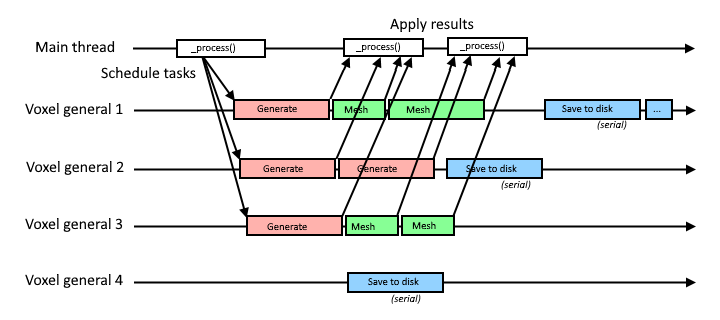
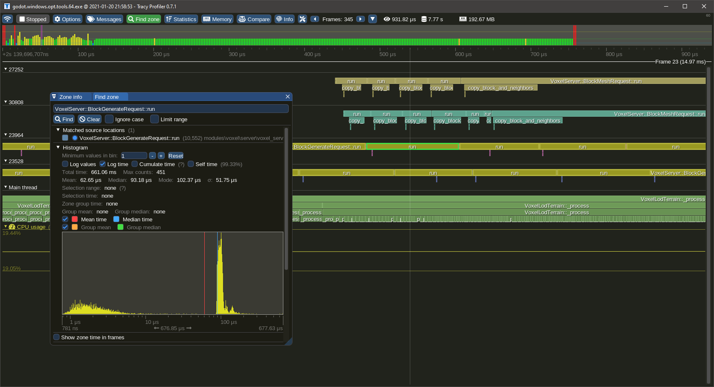

Module development
=====================

This page will give some info about the module's internals.

The source code of the module can be found on [Github](https://github.com/Zylann/godot_voxel).


Contributing
--------------

To contribute to the module, you need to clone the repo using [Git](https://git-scm.com/), and create your branch on Github so you'll be able to make Pull Requests.

### C++ code

It is recommended to read the **Engine Development** section on the official [Godot Documentation](https://docs.godotengine.org/en/stable/). It explains how to compile the engine, setup an IDE and how custom modules are made.

For code guidelines related to Voxel Tools, see [Code Guidelines](#code-guidelines)

### Main documentation

The documentation is written using Markdown, formatted using [Mkdocs](https://www.mkdocs.org/) and made available as a website on [ReadTheDocs](https://readthedocs.org/).

To contribute to the main pages, make your change to `.md` files located under the `doc/docs` folder, and post a PR on Github.

### API documentation

To contribute to the class reference (API), you may edit XML files under `doc/classes` instead, similarly to how it's done for regular Godot modules or core classes.

After an XML file has been changed, it can be converted into its Markdown counterpart by using the `build.py` script in `doc/tools`, using this command:
```
python build.py -a
```

Layers
-------

### Main layers

This module has 3 main layers:

- Voxel: the voxel engine. Wrapped into `zylann::voxel::` namespace.
- Util: library of functions, helpers and data structures, which does not depend on Voxel. Wrapped into `zylann::` namespace.
- Thirdparty: third-party libraries.

### Folders

The module is divided in several folders, each with different dependencies. Because of this, it is possible to use `VoxelMesher`, `VoxelGenerator` or `VoxelStream` standalone, without needing to use a `VoxelTerrain` node for example.

Directory      | Description
-------------- | -------------------------------------------------------------------------------------------------------
constants/     | Constants and lookup tables used throughout the engine.
doc/           | Contains documentation
edition/       | High-level utilities to access and modify voxels. May depend on voxel nodes.
editor/        | Editor-specific code. May also depend on voxel nodes.
engine/        | Contains task management. Depends on meshers, streams, storage but not directly on nodes.
generators/    | Procedural generators. They only depend on voxel storage and math.
meshers/       | Only depends on voxel storage, math and some Godot graphics APIs.
misc/          | Various scripts and configuration files, stored here to avoid cluttering the main folder.
modifiers/     | Files related to the modifiers feature.
shaders/       | Shaders used internally by the engine, both in text form and formatted C++ form.
storage/       | Storage and memory data structures.
streams/       | Files handling code. Only depends on filesystem and storage.
terrain/       | Contains all the nodes. Depends on the rest of the module, except editor-only parts.
tests/         | Contains tests. These run when Godot starts if enabled in the build script.
thirdparty/    | Third-party libraries, in source code form. They are compiled statically so Godot remains a single executable.
util/          | Generic utility functions and structures. They don't depend on voxel stuff.

<p></p>

### Code

In addition to layers reflected by the folder structure, there is an implicit distinction between Godot and this module: if a piece of code does not need to depend on Godot, then it will tend to not depend on Godot.

For example, the *implementation* of Transvoxel has very little dependencies on Godot. Indeed, it doesn't care what a resource is, doesn't need Variant, doesnt need bindings, doesn't need to use OOP etc. That's why the *mesher resource* does not contain the *logic*, but instead acts as a "bridge" between the algorithm and its usage within Godot.

Same for `VoxelBuffer`: this class is actually not a full-fledged Godot object. It is much lighter than that, because it can have thousands of instances, or even supports being allocated on the stack and moved. It is exposed as a wrapper object instead for the few cases where scripters have to interact with it.


Tests
-------

Tests are not mandatory, but if there is time to make new ones, it's good to have.

The module recently includes a `tests/` folder, which contains unit tests. At time of writing, there are very few of them, and I still don't write new ones often. As a game developer, writing unit tests for everything isn't part of my habits, but I recognize that for a module like this one, it is always better to have some if a feature can be easily tested. It even helped fix a few bugs already. 

No test framework is used at the moment, instead they just run by either printing an error when they fail or not. In Godot 4 the Doctest framework is used, so we may see if we can migrate to that later.


Threads
---------

The module uses several background threads to process voxels. The number of threads can be adjusted in Project Settings.



There is one pool of threads. This pool can be given many tasks and distributes them to all its threads. So the more threads are available, the quicker large amounts of tasks get done. Tasks are also sorted by priority, so for example updating a mesh near a player will run before generating a voxel block 300 meters away.

Some tasks are scheduled in a "serial" group, which means only one of them will run at a time (although any thread can run them). This is to avoid clogging up all the threads with waiting tasks if they all lock a shared resource. This is used for I/O such as loading and saving to disk.

Threads are managed in [VoxelEngine](api/VoxelEngine.md).

Note: this task system does not account for "frames". Tasks can run at any time for less or more than one frame of the main thread.


Code guidelines
-----------------

For the most part, use `clang-format` and follow Godot conventions.

### Syntax

- Class and struct names `PascalCase`
- Constants, enums and macros `CAPSLOCK_CASE`
- Other names `snake_case`
- Globals prefixed with `g_`
- Statics prefixed with `s_`
- Thread-locals prefixed with `tls_`
- Parameters prefixed with `p_`, but not really enforced so far. Matters for big functions.
- Private and protected fields prefixed with `_`
- Some private functions start with `_`, either to mimic Godot API, or if it's a re-used function that performs no checks
- Signal handler functions are prefixed with `_on_` and should never be called manually
- Enums prefixed by their name. Example: `enum Type { TYPE_ONE, TYPE_TWO }`
- Open braces at the end of line, close them next line
- Never omit braces
- Space between binary operators and control flow: `if (a + b == 42)`
- Indent with tabs
- Private wrapper functions can be used to adapt to the script API and are prefixed with `_b_`.
- Use Clang-format to automate most of these rules (there should be a file included at the root of the C++ project)
- Prefer comments with `//` only
- Some virtual functions from wrapper classes are prefixed with `_zn_` to encapsulate signature differences when compiling as a module or as a GDExtension.

### File structure

- Use `.h` for headers and `.cpp` for implementation files.
- File names use `snake_case`.
- Constructors and destructors go on top
- Public API goes on top, private stuff goes below
- Bindings go at the bottom.
- Avoid long lines. Preferred maximum line length is 120 characters. Don't fit too many operations on the same line, use locals.
- Defining types or functions in `.cpp` may be better for compilation times than in header if they are internal.

### C++ features

- Don't use `auto` unless the type is impossible to express or a long template (like STL ones). IDEs aren't granted (Github reviews and diffs)
- Moderate use of lambdas and functors are fine. Not `std::function`.
- Lambda captures should be defined explicitely (try to reduce usage of `[=]` or `[&]`)
- STL is ok if it measurably performs better than Godot alternatives.
- Initialize variables next to declaration
- Avoid using macros to define logic or constants. Prefer `static const`, `constexpr` and `inline` functions.
- Prefer adding `const` to variables that won't change after being initialized (function arguments are spared for now as it would make signatures very long)
- Don't exploit booleanization when an explicit alternative exists. Example: use `if (a == nullptr)` instead of `if (!a)`
- If possible, avoid plain arrays like `int a[42]`. Debuggers don't catch overruns on them. Prefer using wrappers such as `FixedArray` and `Span` (or `std::array` and `std::span` once [this](https://github.com/godotengine/godot/issues/31608) is fixed)
- Use `uint32_t`, `uint16_t`, `uint8_t` in case integer size matters.
- If possible, use forward declarations in headers instead of including files
- Don't do `using namespace` in headers (Except with `godot::`, but that's only to help supporting GDExtension using the same codebase, since Godot core does not have this namespace).
- `mutable` must ONLY be used for thread synchronization primitives. Do not use it with "cache data" to make getters `const`, as it can be misleading in multi-threaded context.
- No use of exceptions

### Error handling

- Exceptions are not used.
- Check invariants, fail early. Use `CRASH_COND` or `ZN_ASSERT` in debug mode to make sure states are as expected even if they don't cause immediate harm.
- Crashes aren't nice to users, so in user-facing code (scripting) use `ERR_FAIL_COND` or `ZN_ASSERT_RETURN` macros for code that can recover from error, or to prevent hitting internal assertions
- Macros prefixed with `ZN_` are Godot-agnostic and may be used for portability in areas that don't depend on Godot too much.

### Performance

In performance-critical areas which run a lot:

- Avoid allocations. Re-use memory with memory pools, `ObjectPool`, fixed-size arrays or use `std::vector` capacity.
- Avoid `virtual`, `Ref<T>`, `String`
- Don't resize `PoolVectors` or `Vector<T>`, or do it in one go if needed
- Careful about what is thread-safe and what isn't. Some major areas of this module work within threads.
- Reduce mutex locking to a minimum, and avoid locking for long periods.
- Use data structures that are fit to the most frequent use over time (will often be either array, vector or hash map).
- Consider statistics if their impact is negligible. It helps users to monitor how well the module performs even in release builds.
- Profile your code, in release mode. This module is Tracy-friendly, see `util/profiling.hpp`.
- Care about alignment when making data structures. For exmaple, pack fields smaller than 4 bytes so they use space better

### Godot API

- In areas where performance matters, use the most direct APIs for the job. Especially, don't use nodes. See `RenderingServer` and `PhysicsServer`.
- Only expose a function to the script API if it is safe to use and guaranteed to remain present for a while
- When possible, use `memnew`, `memdelete`, `memalloc` and `memfree` so memory usage is counted within Godot monitors
- Don't leave random prints. For verbose mode you may also use `ZN_PRINT_VERBOSE()` instead of `print_verbose()`.
- Use `int` as argument for functions exposed to scripts if they don't need to exceed 2^31, even if they are never negative, so errors are clearer if the user makes a mistake
- If possible, keep Godot usage to a minimum, to make the code more portable, and sometimes faster for future GDExtension. Some areas use custom equivalents defined in `util/`.

### Namespaces

The intented namespaces are `zylann::` as main, and `zylann::voxel::` for voxel-related stuff. There may be others for different parts of the module.

Registered classes are also namespaced to prevent conflicts. These do not appear in Godot's ClassDB, so voxel-related classes are also prefixed `Voxel`. Other more generic classes are prefixed `ZN_`.

If a registered class needs the same name as an internal one, it can be placed into a `::gd` sub-namespace. On the other hand, internal classes can also be suffixed `Internal`.

### Version control

- Prefer separating commits with logic changes and commits with code formatting
- When doing a PR, prefer to squash WIP commits


Debugging
----------

### Command line arguments

When you start Godot, by default it starts the project manager. When you choose a project from there, it will relaunch itself, but that breaks the debugger's connection. So it is recommended to use command line arguments to directly start Godot in the project and mode you want.

First, make sure Godot is launched within the working directory of your project.

- To debug the game, launch Godot with no argument, and it will start from the main scene.
- To debug a specific scene of the project, launch Godot with the relative path to the scene as command line argument
- To debug the editor, add the `-e` argument.

Example of options setup in in VSCode `launch.json` on Windows:

```json
{
    "version": "0.2.0",
    "configurations": [
        {
            "name": "(Windows) Launch",
            "type": "cppvsdbg", // For MSVC
            //"type": "cppdbg", // For GDB
            "request": "launch",
            "program": "${workspaceFolder}/bin/godot.windows.editor.dev.x86_64.exe", // Dev build (old target=debug)
            //"program": "${workspaceFolder}/bin/godot.windows.editor.x86_64.exe", // Non-dev build (old target=release_debug)
            "args": [
                "-v", // Verbose output
                
                //"-e", // Editor mode
                
                //"--debug-collisions",
                
                // Run a specific scene
                //"local_tests/sqlite/test_sqlite.tscn",
                //"local_tests/texturing/test_textured_terrain.tscn"
                //"local_tests/texturing/test_texturing.tscn"
            ],
            "stopAtEntry": false,
            "cwd": "D:/PROJETS/INFO/GODOT/Games/SolarSystem/Project",
            "environment": [],
            "visualizerFile": "${workspaceFolder}/modules/voxel/misc/voxel.natvis"
        }
    ]
}
```

### Breakpoint on error

It is recommended to use a debugger to have better information when errors or crashes occur. It may be useful to open `core/error/error_macros.cpp` (in Godot 4.x) and leave a breakpoint in `_err_print_error`, so that every time an error occurs, the debugger will break in there, providing you with the live call stack and variable states to inspect.

If you debug the editor, Godot tends to print a lot more errors for things that aren't critical, such as making temporary mistakes in the script editor, or trying to index a resource file in the explorer dock and failing for whatever reason. In this case you may either need clean dedicated test projects, or place breakpoints after launch.

### Debug print

Godot:

```cpp
#include <core/string/print_string.h>

print_line(String("Hello {0}, my age is {1}").format(varray(name, age)));
```

Non-Godot:

```cpp
#include "util/log.h"
#include "util/string_funcs.h"

println(format("Hello {}, my age is {}", name, age));
```

### Pretty printing

Godot and the voxel module both use their own container types, in addition to STL's ones. Debuggers often aren't able to inspect them. For example, Godot's `Vector<T>` class is similar to `std::vector<T>` but debuggers are unable to let you inspect what's in them.

To fix this, it is usually possible to provide your debugger a file listing special patterns to inspect these types in a more user-friendly way.

In VSCode, the cpp-tools extension supports Natvis files. Godot comes with such a file in `platform/windows/godot.natvis`. To get pretty printing for Godot types, in your `launch.json` file, add the following line:
```json
            "visualizerFile": "${workspaceFolder}/platform/windows/godot.natvis"
```

Unfortunately, only one file can be provided at the moment. [An issue is open](https://github.com/Microsoft/vscode-cpptools/issues/925) to request support for multiple files.
That means if you also want pretty-printing for structures of the voxel module, you have to replace the natvis path with the following:
```json
            "visualizerFile": "${workspaceFolder}/modules/voxel/misc/voxel.natvis"
```


Profile with Tracy
-------------------

This module contains macros to profile specific code sections. By default, these macros expand to [Tracy Profiler](https://github.com/wolfpld/tracy) zones. It allows to check how long code takes to run, and displays it in a timeline.

It was tested with Tracy 0.7.8.



Alternative profilers are also mentionned in the [Godot docs](https://docs.godotengine.org/en/latest/contributing/development/debugging/using_cpp_profilers.html). They profile everything and appear to be based on CPU sampling, while Tracy is an instrumenting profiler providing specific, live results on a timeline.

### How to use profiler scopes

A profiling scope bounds a section of code. It takes the time before, the time after, and records it into a timeline. In C++ we can use RAII to automatically close a section when we exit a function or block, so usually a single macro is needed at the beginning of the profiled zone.

The macros are profiler-agnostic, so if you want to use another profiler it is possible to change them.

You need to include `util/profiling.h` to access the macros.

To profile a whole function:
```cpp
void some_function() {
    ZN_PROFILE_SCOPE();
    //...
}
```

To profile part of a function:
```cpp
void some_function() {
    // Some code...

    // Could be an `if`, `for`, `while`, or a simple block as here
    {
        ZN_PROFILE_SCOPE();
        // Profiled code...
    }

    //...
}
```

By default scopes take the name of the function, or file and a line number, but you can give a name explicitely using `ZN_PROFILE_SCOPE_NAMED("Hello")`. Only compile-time strings are supported, don't use `String` or `std::string`.

It is also possible to plot numeric values so they are displayed in the timeline too:

```cpp
void process_every_frame() {
    // Some code...

    ZN_PROFILE_PLOT("Bunnies", bunnies.size());
}
```

### Adding Tracy to Godot

To add Tracy support, clone it under `thirdparty/tracy` (Godot's `thirdparty` folder, not the voxel module). Then in `modules/voxel/SCsub`, add the following lines:

```python
# tracy library
env.Append(CPPDEFINES="TRACY_ENABLE")
env_voxel.Append(CPPDEFINES="TRACY_ENABLE")
voxel_files += ["#thirdparty/tracy/TracyClient.cpp"]
```

Those lines might already be there, if so just uncomment them.

Once you are done profiling, don't forget to remove these lines, otherwise profiling data will accumulate in memory without being retrieved.

!!! note
    Tracy has a concept of frame mark, which is usually provided by the application, to tell the profiler when each frame begins. Godot does not provide profiling macros natively, so the frame mark was hacked into `VoxelEngine` process function. This allows to see frames of the main thread in the timeline, but they will be offset from their real beginning.

This way of integrating Tracy was based on this [commit by vblanco](https://github.com/vblanco20-1/godot/commit/2c5613abb8c9fdb5c4bfe3b52fdb665a91b43579)


Preprocessor macros
---------------------

The module has a few preprocessor macros that can be defined in order to turn off parts of the code getting compiled.
Some can be specified through SCons command line parameters.

- `MESHOPTIMIZER_ZYLANN_NEVER_COLLAPSE_BORDERS`: this one must be defined to fix an issue with `MeshOptimizer`. See [https://github.com/zeux/meshoptimizer/issues/311](https://github.com/zeux/meshoptimizer/issues/311)
- `MESHOPTIMIZER_ZYLANN_WRAP_LIBRARY_IN_NAMESPACE`: this one must be defined to prevent conflict with Godot's own version of MeshOptimizer. See [https://github.com/zeux/meshoptimizer/issues/311#issuecomment-955750624](https://github.com/zeux/meshoptimizer/issues/311#issuecomment-955750624)
- `VOXEL_ENABLE_FAST_NOISE_2`: if defined, the module will compile with integrated support for SIMD noise using FastNoise2. It is optional in case it causes problem on some compilers or platforms. SCons parameter: `voxel_fast_noise_2=yes`
- `VOXEL_RUN_TESTS`: If `True`, tests will be compiled and run on startup to verify if some features of the engine still work correctly. It is off by default in production builds. This is mostly for debug builds when doing C++ development on the module. SCons parameter: `voxel_tests=yes`
- `ZN_GODOT`: must be defined when compiling this project as a module.
- `ZN_GODOT_EXTENSION`: must be defined when compiling this project as a GDExtension.


GDExtension
-------------

!!! warn
    This feature is under development and is not ready for production. It has bugs and can crash the engine. Check the [issue tracker](https://github.com/Zylann/godot_voxel/issues/333) for work in progress.

This module can compile as a GDExtension library. This allows to distribute it as a library file (`.dll`, `.so`...) without having to recompile Godot Engine. TODO: Godot's documentation doesn't seem to contain information about GDExtension yet. For now, you can check [this old news](https://godotengine.org/article/introducing-gd-extensions) and the [GodotCpp repository](https://github.com/godotengine/godot-cpp).

To compile the library:
- Download a copy of [GodotCpp](https://github.com/godotengine/godot-cpp)
- In the voxel module's root directory, write the path to GodotCpp at the beginning of the `SConstruct` script.
- Open the same kind of console you would use to compile Godot, change directory to the voxel module's root folder, and run SCons there. It will use the `SConstruct` file instead of `SCsub`. The library will be saved under a `bin/` folder.

Example of build command on Windows (unoptimized debug build for use in editor):
```
scons platform=windows target=debug -j4
```

Example of `voxel.gdextension` file for Godot to detect the library (Windows 64-bits only):
```
[configuration]

entry_symbol = "voxel_library_init"

[libraries]

windows.debug.x86_64 = "res://addons/zylann.voxel/bin/libvoxel.windows.tools.debug.x86_64.dll"
```

There are a number of issues to address before this target can be usable. The module wasn't tested at all at the moment. Check the [issue tracker](https://github.com/Zylann/godot_voxel/issues/333) for work in progress.

