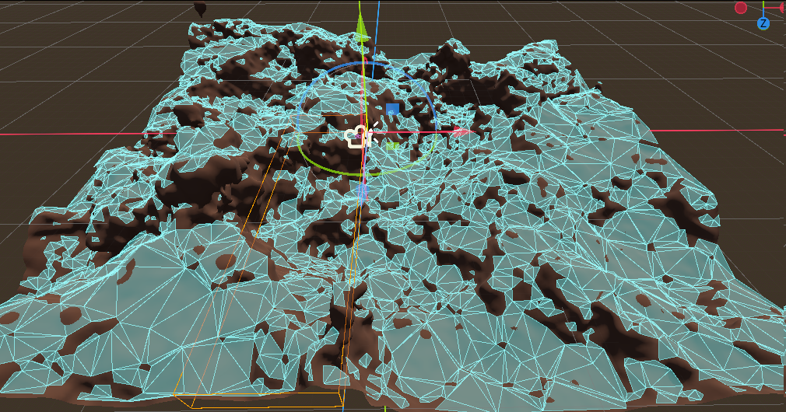

Navigation
=============

AI navigation can be implemented in different ways, but currently there is no general solution for dynamic voxel terrain.

!!! warning
    Most of what is described on this page is experimental. You may either try one of the approaches described, modify it, or roll your own.

Grid-based pathfinding
-------------------------

Voxels can be interpreted as a grid to do pathfinding on directly. This may be suitable for blocky voxels.
You can implement your own logic this way, or you can use [VoxelAStarGrid3D](api/VoxelAStarGrid3D.md). This has a relatively limited range and only works well with "character" agents that are 1x2 voxels in size.

Waypoint-based pathfinding
----------------------------

You can use Godot's `AStar3D` class to dyamically/progressively scatter loose waypoints through the world using a script, and connect them up. Doing raycasts or shape casts can help determining if a location is walkable or not. Agents may then complete this information by steering based on their immediate surroundings.
This might be one of the cheapest options, though it is probably less accurate depending on how it's implemented.

Navmesh-based navigation
----------------------------

Godot's general-purpose 3D [navigation system](https://docs.godotengine.org/en/stable/tutorials/navigation/navigation_introduction_3d.html) requires the use of `NavigationMesh` and `NavigationRegion3D`. However, there is currently no support for it out of the box.

A particular challenge in building navmeshes for voxel terrain, is the fact it can't be tweaked and baked perfectly like most terrains that are created by developers in the editor. Navmeshes are sensitive to the source geometry thrown at them. Voxel terrain is streamed, can be modified by players, and could have the most unforgiving variations of shapes in any direction, so it is a hard requirement for navigation to not break in-game. Even just the most basic noise-based terrain [can raise errors in Godot's baking process](https://github.com/godotengine/godot/issues/85548#issuecomment-2021774612), and produce navmeshes that can be expensive to traverse. In addition, any edit or streaming event requires to constantly re-bake navmeshes to match the areas players are in. Obstacles on top of the terrain must also be taken into account, as well as the fact agents have a size that could cross chunks. Multiple agent sizes also require multiple navmeshes.

On top of this, Godot's navigation system has limitations that make it difficult to bake navmeshes at runtime while avoiding CPU stutters. The baking process can be threaded relatively easily by conforming to strict scene parsing rules (the scene tree is not thread-safe). However, Godot still runs a lot of logic after that *on the main thread*, and that logic can badly affect framerate on a large scale.
It is also hard to support planets because it assumes the world is flat.

The `navigation` branch of the module attempts to implement a dynamic navmesh system, however it has performance issues and isn't ready for production.
At time of writing, it is not actively developped (subject to change, eventually). You may check it out and tweak it for your needs if you want to use it.

See also [issue 610](https://github.com/Zylann/godot_voxel/issues/610).
