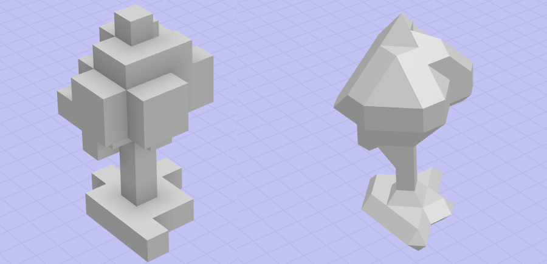
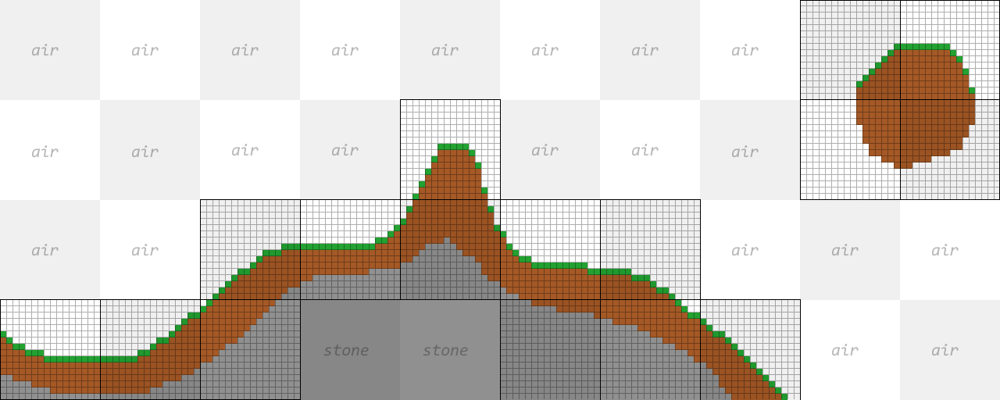
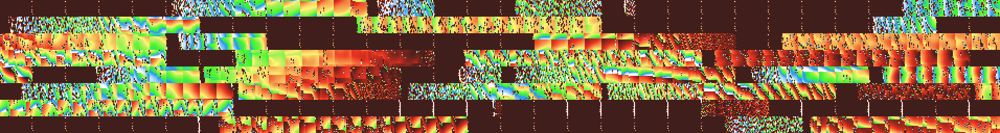
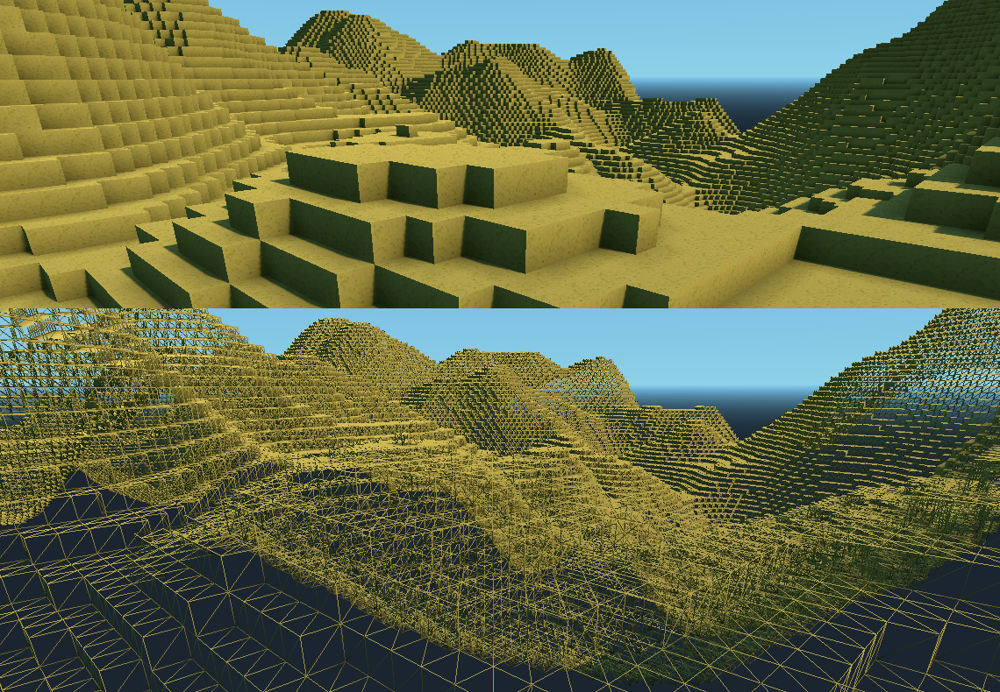

Overview
===========

This section explains the main concepts used in this voxel engine and which parts implement them.

What voxels are
------------------

"Voxel" is short for "volumetric picture element", similar to "pixel" which means "picture element". They compose volumes, as opposed to simple 2D images, which allows to make 3D terrains or models that 3 dimensions. Instead of representing solely the surface of objects like classic polygon-based models do, they also represent the insides as well, in every point of space.

In this engine, a voxel is a specific point in space holding some values. Those values can be:

- The type of the voxel
- Its density (or Signed Distance)
- Its color
- Its material
- Etc...

Voxels can be obtained by either deciding their values manually on a grid, or by defining procedural rules to generate them from anywhere, like fractal noise or Signed-Distance-Field formulas.

!!! note
    Although this engine started as a way to generate terrains, it is not the only thing you can do with it. Because of this, you will often find the word "volume" instead of "terrain" in this documentation, to designate objects composed of voxels.

Generating voxels
------------------

Voxels span 3 dimensions, so contrary to images, storing them can take up way more memory as volumes get bigger. This is why it important to think about procedural sources of voxels, because they don't cost any memory and can be accessed at any resolution.

This task is implemented by resources deriving [VoxelGenerator](api/VoxelGenerator.md). Their goal is to generate voxel data, either at a specific point in space, or in a whole defined volume. There are endless possible recipes to generate models, terrains or planets, which we won't detail in this section. 

Types of generators include:

- [VoxelGeneratorNoise2D](api/VoxelGeneratorNoise2D.md): generates a heightmap using 2D fractal noise
- [VoxelGeneratorNoise](api/VoxelGeneratorNoise.md): generates a "spongy" world using 3D noise to form large caves and overhangs, modified so that most of the terrain is downwards and becomes only air above some altitude
- [VoxelGeneratorFlat](api/VoxelGeneratorFlat.md): generates a simple flat plane.
- [VoxelGeneratorGraph](api/VoxelGeneratorGraph.md): allows to combine all sorts of operations using a graph (like a 3D VisualShader) to produce the volume with more flexibility than the other simple generators
- [VoxelGeneratorScript](api/VoxelGeneratorScript.md): allows to implement the generation logic with a script. Will likely be slower than the other options, unless you use C# or GDNative.
- And some others

Storing voxels
---------------

Even if it needs lots of memory, we still have to store voxel data at some point. This is important for passing voxels around, storing player edits which cannot be reproduced with a generator, or saving terrains to disk.

The core class for doing this is [VoxelBuffer](api/VoxelBuffer.md). This is a simple grid data structure with configurable format. You might not have to use this class often, but its storage concept is useful to know in order to use other APIs like [VoxelTool](api/VoxelTool.md). Voxels can hold various kinds of values, so this object uses multiple channels, each of them being one type of information:

- `TYPE`: The type of voxel, mainly used to associate the voxel with a type of model like in Minecraft. This is very similar to tile IDs seen in tilemaps or gridmaps.
- `SDF`: The Signed Distance Field value, used for smooth voxels. It tells how far from the surface the voxel is. This can be understood like a density of matter, where values towards `-1` means "matter", and values towards `1` means "air".
- `COLOR`: Color information. It can either be compressed RGBA, or an index into a palette of colors.
- And others.

The engine uses the first channels, while others are unused for now. Each channel can also use a configurable bit depth: 8, 16, 32 or 64 bits. This allows to tune quality and memory usage depending on your needs.
Finally, a simple optimization is applied so that if a channel is filled with the same value, it won't allocate memory and instead store just that value. This way, areas such as the sky don't take up memory.

!!! warning
    There is a class called [Voxel](api/Voxel.md), but it is actually only used for blocky meshing. It is not a general-purpose voxel value, and will be renamed in the future to avoid confusion.

Saving voxels to disk
-----------------------

When players make edits to the world or when you want to sculpt a terrain in the editor and keep your changes saved, it becomes necessary to save voxels to disk.

This module implements this functionality with [VoxelStream](api/VoxelStream.md). Similarly to generators, a stream allows to request blocks of voxels so that it's not necessary to load the entire thing at once. But also, it allows to send back blocks of voxels to save them.
This block-based approach is especially useful if the world is very large. In contrast, smaller volumes might just be loaded all at once. Subclasses may implement it in various ways, often using compressed files.

Turning voxels into meshes
----------------------------

Today's graphics cards are getting more and more powerful, but in average, polygons (meshes) remain the fastest way to render 3D models. So we are not really going to directly draw voxels. Instead, we have to convert them into polygons, which will then be rendered. To do this, this engine uses a resource called [VoxelMesher](api/VoxelMesher.md).

There are several ways to produce polygons from voxel data, and the engine provides types of meshers to do it:

- [VoxelMesherCubes](api/VoxelMesherCubes.md): the color of voxels is used to produce colored cubes. This is the simplest way to polygonize voxels.
- [VoxelMesherBlocky](api/VoxelMesherBlocky.md): the type of voxels is used to batch together meshes corresponding to that type. This can also use cubes, but any shape will do if custom meshes are provided. This is a similar technique as the one used in Minecraft, and has a wide range of options.
- [VoxelMesherTransvoxel](api/VoxelMesherTransvoxel.md): instead of making cubes, this one uses the SDF value to produce a smooth surface, based on the [Transvoxel](https://transvoxel.org/) algorithm. It can also produce transition meshes, which is useful to stitch together two meshes of different level of detail.
- [VoxelMesherDMC](api/VoxelMesherDMC.md): variant using dual marching cubes to produce a smooth surface, [as explained in these articles](https://www.volume-gfx.com/volume-rendering/). However this implementation is no longer maintained.

Putting it together with nodes
-------------------------------

So far, we could consider that there are enough tools to use voxels within games. It's a bit more work to take it from there, though.

Turning a bunch of voxels into a mesh is ok for a model or a small piece of land, however it won't scale well with large editable terrains. It gets more tricky if that terrain needs to have a large view distance. Very often, the proposed solution is to split it into chunks, eventually using variable level of detail, and properly update parts of that terrain when they are modified by players. This is what the `VoxelTerrain*` nodes do, by putting together the tools seen before, and using threads to run heavy operations in the background.

!!! note
    In this engine, "Chunks" are actually called "Blocks". They typically represent cubes of 16x16x16 voxels. Some options are specified in blocks, rather than spatial units.

There are two main types of terrains supported by the engine:

- [VoxelTerrain](api/VoxelTerrain.md): this one uses a simple grid of blocks, and takes care of loading and unloading blocks as the viewer moves around. Its view distance is limited in similar ways to Minecraft, so it is better used with blocky voxels or moderate-size smooth volumes.

- [VoxelLodTerrain](api/VoxelLodTerrain.md): this one uses an octree of blocks. Contrary to a simple grid, this allows to store voxels at multiple levels of detail, allowing to render much larger distances. It only supports smooth voxels though, and has different limitations compared to the other.

Both kinds of terrains can be edited in real time, and only the edited parts will be re-meshed dynamically. A helper class [VoxelTool](api/VoxelTool.md) is exposed to the script API to simplify the process of editing voxels, which can be obtained by using `get_voxel_tool()` methods. It allows to set single voxels, dig around or blend simple shapes such as spheres or boxes. The same concept of channels seen earlier is available on this API, so depending on the type of mesher you are using, you may want to edit either `TYPE`, `SDF` or `COLOR` channels.

Finally, for these terrains to load, it is required to place at least one [VoxelViewer](api/VoxelViewer.md) node in the world. These may be placed typically as child of the player, or the main `Camera`. They tell the voxel engine where to load voxels, how far, and give priority to mesh updates happening near them.

