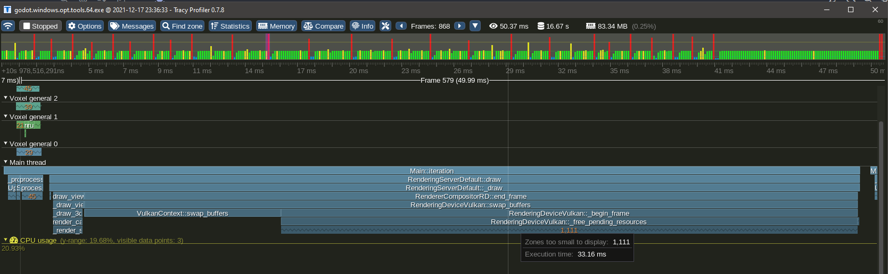

Performance
================

This section discusses performance-related topics, such as making the voxel engine run fast.

Threads
-----------

### Thread count

This module uses threads to speed up heavy operations and avoid stalls.

Depending on how many threads your CPU can run at the same time, the optimal number of threads can vary. This may also differ for players running your game.
The module automatically determines the number of threads to use at runtime, based on how many concurrent threads the CPU supports.

You can change how many threads are allocated in your Project Settings, in the `Voxel` section. The automatic calculation will be based on the following properties:

Parameter name                              | Type    | Description
--------------------------------------------|---------|-----------------------------------------------------------------
`voxel/threads/count/minimum`               | `int`   | Minimum amount of threads
`voxel/threads/count/margin_below_maximum`  | `int`   | How many threads below max concurrent count should be considered maximum. `0` means the maximum concurrent count will be the maximum. `1` means the maximum concurrent count minus 1 will be the maximum.
`voxel/threads/count/ratio_over_maximum`    | `float` | Portion of max concurrent threads to attempt using, between 0 and 1. For example, `0.5` will attempt to use half of them. The result will be clamped using the other options.

Several notes:

- It is recommended to not use all available threads for voxel stuff. Games use more for other things, and players may even do something else in background (such as music, YouTube playlist or voice chat).
- It is not possible to use zero threads. The module is designed to use threads at the moment.
- You can check at runtime how many theads are allocated with a script and using `VoxelEngine.get_stats()`. It is also printed if `debug/settings/stdout/verbose_stdout` is enabled in project settings (or `-v` in command line).
- Changing these settings requires an editor restart (or game restart) to take effect.

### Main thread timeout

Some tasks still have to run on the main thread, and sometimes their total time can exceed the duration of a frame, if we were to add all the remaining things that have to be processed.

To mitigate this, the module has an option to stop processing these tasks beyond a certain amount of milliseconds, and continue them over next frames. In `ProjectSettings`, look for `voxel/threads/main/time_budget_ms`.

Rendering
----------

Terrains are rendered with many unique meshes. That can amount for a lot of draw calls and work for the engine to cull. It is possible to reduce the number of blocks in several ways:

- Reduce view distance
- Reduce LOD distance, if you use `VoxelLodTerrain`
- Increase mesh block size: they default to 16, but it can be set to 32 instead. This reduces the number of draw calls, but may increase the time it takes to modify voxels.

Slow mesh updates issue with OpenGL
------------------------------------

### Issue

Godot 3.x is using OpenGL, and there is an issue which currently degrades performance of this voxel engine a lot. Framerate is not necessarily bad, but the speed at which voxel terrain updates is very low, compared to what it should be. So far the issue has been seen on Windows, on both Intel or nVidia cards.

Note: Godot 4.x will have an OpenGL renderer, but this issue has not been tested here yet.

### Workarounds

Note: you don't have to do them all at once, picking just one of them can improve the situation.

- Increase `voxel/threads/main/time_budget_ms` to a value higher than frame time (by default it is about 8 ms, which is half of a frame). However this can slowdown FPS while meshes are updated.
- Or turn on `debug/settings/stdout/verbose_stdout` in project settings. This internally enables an OpenGL debugging extension, which for some reason fixes the expected timing of OpenGL calls. It's the most effective fix regarding framerate, but has drawbacks because it prints a lot, and was intented as a debugging feature.
- Or turn off `display/window/vsync/use_vsync` in project settings. Not as effective and eats more resources, but improves performance.
- Or turn on `display/window/vsync/vsync_via_compositor` in project settings. Not as effective but can improve performance in windowed mode.

### Explanation

The engine relies a lot on uploading many meshes at runtime, and this cannot be threaded efficiently in Godot 3.x so far. So instead, meshes are uploaded in the main thread, until part of the frame time elapsed. Beyond that time, the engine stops and continues next frame. This is intented to smooth out the load and avoid stutters *caused by the task CPU-side*. Other tasks that cannot be threaded are also put into the same queue, like creating colliders.

Unfortunately, the first call to OpenGL during the frame appears to take a whopping 15 milliseconds *on the CPU*. This happens no matter how heavy the call is. The voxel engine detects that, and immediately stops uploading meshes, thinking it has done too much. As a result, typically only one mesh ends up being uploaded each frame, which is ridiculously low. We could lift the time limit, but if it were to continue running tasks, it would start stuttering due to overshooting the 16ms limit of the frame.

When one workaround is used, like enabling `verbose_stdout`, this slowdown completely disappears. Instead, the "delay" moves at the end of the frame. This has been linked to a debugging OpenGL extension getting turned on.
For more information, see [Godot issue #52801](https://github.com/godotengine/godot/issues/52801).

Slowdown when moving fast with Vulkan
--------------------------------------

### Issue

If you move fast while near a terrain with a lot of chunks (mesh size 16 and high LOD detail), the renderer can cause noticeable slowdowns. This is because Godot4's Vulkan allocator is much slower to destroy mesh buffers than Godot 3 was, and it does that on the main thread. When you move fast, a lot of meshes get created in front of the camera, and a lot get destroyed behind the camera at the same time. Creation is cheap, destruction is expensive.

This was observed by profiling with Tracy in a `release_debug` build (typical mode used for official optimized builds):

Lots of buffers get freed on the main thread at the end of the frame, and it can take a while, causing a CPU spike.
On the other hand, there is no such issue when the same amount of meshes is allocated.
This issue also was not noticeable in Godot 3.

This problem reproduces specifically when a lot of small meshes are destroyed (small as in 16x16 pieces of terrain, variable size), while a lot of them (thousands) already exist at the same time. Note, some of them are not necessarily visible.

### Workarounds

It is not possible for the module to just "pool the meshes", because when new meshes need to be created, the API requires to create new buffers anyways and drops the old ones (AFAIK). It is also not possible to use a thread on our side because the work is deferred to the end of the frame, not on the call site.

A mitigation is in place to smooth the spikes by spreading the amount of destroyed meshes over time, but the slowdown is still noticeable.

The only workarounds involve limiting the game:

- Increase mesh block size to 32 to reduce their number, at the expense of edition cost
- Limit the speed at which the player can move when close to voxels
- Reduce LOD distance so less blocks have to be destroyed, at the expense of quality

Access to voxels
-----------------

This section explains in more detail how multithreading is implemented with voxel storage, and what are the implications when you access and modify voxels.

### The problem

Up to version `godot3.2.3` of the module, reading and writing to voxels did not care about multithreading. It was possible to access them without locking, because all the threaded operations using them (saving and meshing) were given copies of the voxels, made on the main thread.

This made things simple, however it causes several issues.

- If threads are unable to consume tasks faster than they are issued, copies of voxel data will keep accumulating rapidly and make the game run out of memory.
- Copying blocks and their neighbors takes time and is potentially wasteful because it's not guaranteed to be used.
- It assumes the threaded task will only need to access a specific block at a fixed LOD, which is not always the case in other voxel engines (such as UE4 Voxel Plugin by Phyronnaz). For example, Transvoxel running on a big block may attempt to access higher-resolution blocks to better approximate the isosurface, which is not possible with the current approach.

### Internal changes

The old design starts to change in version `godot3.2.4`. Now, copies aren't made preemptively on the main thread anymore, and are done in the actual threaded task instead. This means accessing voxels now require to lock the data during each transaction, to make sure each thread gets consistent data.
Locking is required **if you access voxels which are part of a multithreaded volume**, like a terrain present in the scene tree. You don't need to if you know the data is not used by any other thread, like inside generators, custom streams, known copies or other storage not owned by an active component of the voxel engine.

The locking strategy is implemented on each `VoxelBuffer`, using `RWLock`. Such locks are read-write-locks, also known as shared mutexes. As described earlier, it is optional, so *none of VoxelBuffer methods actually use that lock*, it's up to you. If you only need to read voxels, lock for *read*. If you also need to modify voxels, lock for *write*. Multiple threads can then read the same block, but only one can modify it at once. If a thread wants to modify the block while it is already locked for *read*, the thread will be blocked until all other threads finished reading it. This can cause stutter if done too often on the main thread, so if it becomes a problem, a possible solution is to lock for *read*, copy the block and then modify it (Copy-on-Write).

At time of writing, there are no threaded tasks needing a write access to voxels.
It is possible that more changes happen in the future, in particular with nodes supporting LOD.

### Editing voxels efficiently

This matters for scripters.

If you use `VoxelTool`, all locking mechanisms are handled for you automatically. However, you must be aware that it doesn't come for free: if you want to access voxels randomly and modify them randomly, you will pretty much get the worst overhead. If you want to access a well-defined region and you know where to read, and where to write ahead of time, then optimizing becomes possible.

For example, *on a terrain node*, `VoxelTool.get_voxel` or `set_voxel` are the simplest, yet the slowest way to modify voxels. This is not only because of locking, but also because the engine has to go all the way through several data structures to access the voxel. This is perfectly fine for small isolated edits, like the player digging or building piece by piece. 

If you want to excavate whole chunks or generating structures, try to use specialized bulk functions instead, such as `do_sphere()`, `do_box()`, `raycast` or `paste()`. These will be more efficient because they can cache data structures on the way and perform locking in the best way they can.

If your changes depend on a lot of pre-existing voxels, you can use `copy()` to extract a chunk of voxels into a `VoxelBuffer` so you can read them very fast without locking. You can even choose to do your changes on that same buffer, and finally use `paste()` when you're done.
