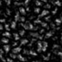
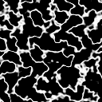
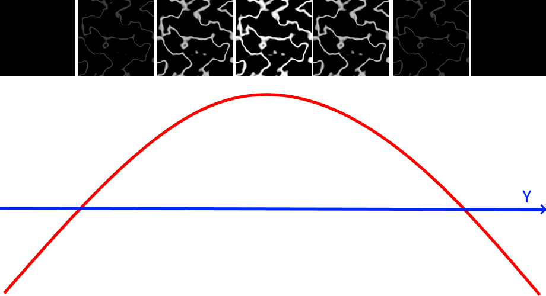
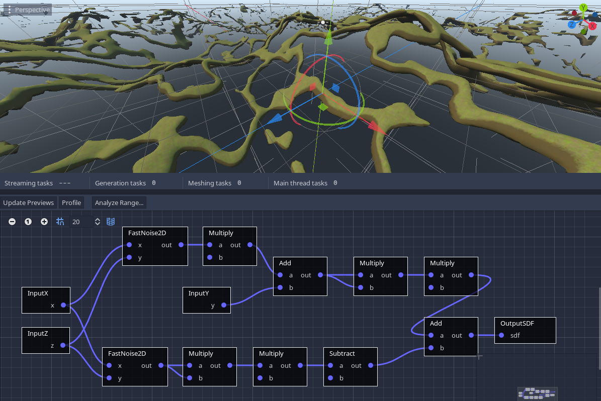

Procedural generation
==========================

This section describes techniques involved in procedural generation of terrains. Some are experimental and may be adjusted. Articles will either use graphs or scripts, and can be more advanced than other sections of the documentation, so you should first get familiar with the API.


Caves with graph generator
---------------------------------

It is possible to generate caves by subtracting noise "worms" from a base SDF terrain. To simplify the approach, let's first look at what 2D noise looks like, with a few octaves:


If we multiply that noise by itself (i.e square it), we obtain this:



And if we clamp it to highlight values below a threshold close to zero, we can notice a path-like pattern going on:



In 2D (or in 3D when using normalized coordinates) this is the key to produce rivers, or ravines. But the problem with caves is to obtain 3D, round-shaped "worms", not just 2D shapes. So we can cheat a little, by still using 2D noise, but instead we modulate the threshold along the Y axis. We need a parabola-shaped curve for this, which can be obtained with a second-degree polynome like `y^2 - 1`:



Back to the voxel graph, we may connect directly the cave generation nodes to the output just to preview what they look like, without the rest of the terrain:


After tweaking noise and other values, we obtain those famous worms, but there are two problems:

- The caves are still flat, they don't go up or down
- They go on endlessly, there are no dead-ends

We can fix the first problem by adding an extra layer of 2D noise to the Y coordinate so it can perturb the caves vertically. Re-using the ground surface noise with an extra multiplier can prove effective sometimes, so we avoid computing extra noise.



The second problem can also be fixed with yet another layer of low-frequency noise, which can be added to the cave threshold so caves will shrink to become dead-ends on some regions. Again, adding multipliers may change how sharply that transition occurs.


Finally, we can blend our terrain with caves by subtracting them. This can be done with the `SdfSmoothSubtract` node, essentially doing `terrain - caves`.


There are likely variants of this to obtain different results.


Handling block boundaries with voxel structures
---------------------------------------------------

In Minecraft-style terrain, a very common problem that arises once base terrain is generated, is how to plant trees in it, because such structures would be voxels too.
In that specific case, there are a number of caveats when doing that with generators, which mainly revolve about the fact they process chunks one by one, and not the entire world at once.

There are several ways to deal with this:

- Exploit procedural determinism to "guess" where trees would grow in neighbor chunks, without having to generate entire neighbor chunks
- Split generation in multiple passes and provide access to neighbor chunks that have gone through previous passes

The following describes the first method, which does not involve accessing neighbors at all, and allows to generate trees in a terrain where the base height is both deterministic and easy to compute (2D noise heightmap for example).

If you want to use the second method, you may check [multipass generators](generators.md#multi-pass-generation-with-voxelgeneratormultipasscb).

### Deterministic approach

#### Finding where trees should grow in (X, Z)

The first thing to do is to figure out, in the current block, where should trees grow. For simplicity, we will consider it as a 2D problem, where trees can grow at specific (X, Z) positions (since Y is up). For that, we need to find positions of voxels just above ground, and do so in a deterministic manner, so that the same seed will produce the same results.

But how to make it deterministic? We can use the seed of a `RandomNumberGenerator` instance. But if we give it the seed of the world, every block will have trees at the same position in them. What we really need, is a seed that is unique per block. We can achieve that by using a hash of the 2D coordinates of the block:

```gdscript
var block_position := Vector3i(
    origin_in_voxels.x >> 4,
    origin_in_voxels.y >> 4,
    origin_in_voxels.z >> 4) # floored division by 16

var rng := RandomNumberGenerator.new()
rng.seed = global_seed + hash(Vector2i(block_position.x, block_position.z))
```

And now we can generate how many trees are in the block, and where:

```gdscript
var block_size := out_buffer.get_size()
var tree_count := rng.randi_range(0, 2)
var tree_positions := []
tree_positions.resize(tree_count)
for i in tree_count:
    var tree_pos := Vector3i(
        rng.randi_range(0, block_size.x), 0, # We leave Y for later
        rng.randi_range(0, block_size.z))
    # Note, those positions are local to the block
    tree_positions[i] = tree_pos
```

#### Finding the altitude (Y)

But we still need to calculate the altitude from which the tree will grow (the Y coordinate). One issue is that the engine generates cubic blocks, so when generating a given 16x16x16 voxel, you can't access what's below, you only know what's inside the area of the block.

However, if base terrain is generated using 2D heightmap noise, then we can calculate how high terrain is at any (x, z) coordinate by computing the height function again, wherever we need.
Assuming we already have such function as `func get_height(x: float, y: float) -> float`, we can complete the Y coordinate like so:

```gdscript
for i in len(tree_positions):
    var tree_pos_local : Vector3i = tree_positions[i]
    # Use world coordinates for this
    var tree_pos_global := tree_pos_local + origin_in_voxels
    tree_pos_global.y := get_height(tree_pos_global.x, tree_pos_global.z)
    # And bring back to local
    tree_pos_local = tree_pos_global - origin_in_voxels
    # And store back into the array
    tree_positions[i] = tree_pos_local
```

#### Placing the tree

Now we should be able to place the tree, but what if positions we found are outside the block? We can't set voxels at these positions.

What we can do, is to first determine how big the tree will be. Once we know its bounding box, we can place voxels, but only those intersecting our block.

To determine how big the tree is, it sounds like we have to generate the tree first, and then determine its bounding box in voxels. We can do that in a separate blank buffer with large enough size, or using a `Dictionary` of `Vector3i` keys and `int` values. But at the end, it is preferable to store the result in an optimized `VoxelBuffer` of the right size.

We won't describe how to generate the tree itself here, it's not really the point of this article and can be different with plenty of factors. But it could just be a vertical bar of trunk voxels, with a sphere of leaves on top.
It is possible to optimize this step by pre-generating (or making by hand) a bunch of trees ahead of time and store them in a list, so all tree bounds are known and no need to spend time generating them in detail.

We can pack tree data into a class:

```gdscript
class TreeInfo:
    # Position of the tree relative to our current block
    var instance_position := Vector3i()
    # Buffer storing only the tree, like a model, so it can later be pasted in the world
    var voxels : VoxelBuffer
    # Position of the base of the tree, within the VoxelBuffer containing the model of the tree
    var trunk_base_position := Vector3i()
```

So we can have a list of trees instead of just their positions:

```gdscript
var trees : Array[TreeInfo] = []
for tree_pos in tree_positions:
    var tree : TreeInfo = generate_tree(rng)
    tree.position = tree_pos
    trees.append(tree)
```

We may wrap this logic in a function `func generate_trees_for_block(block_position: Vector3i) -> Array[TreeInfo]`, because it may be useful later.

Once we know the bounds of each tree, we can check if they intersect with the current block. If they do, we can use the `paste_masked` method to plant just the tree, without replacing solid voxels with empty ones from the tree's `VoxelBuffer`:

```gdscript
# AABB of our current block, in local coordinates
var block_aabb := AABB(Vector3(), block_size.get_size() + Vector3i(1, 1, 1))

var voxel_tool := out_buffer.get_voxel_tool()

# Paste intersecting trees
for tree in trees:
    var lower_corner_pos := tree.instance_position - tree.trunk_base_position
    var tree_aabb := AABB(lower_corner_pos, tree.voxels.get_size() + Vector3(1,1,1))
    
    if tree_aabb.intersects(block_aabb):
        voxel_tool.paste_masked(lower_corner_pos, tree.voxels, 
            # Which channel we want to paste
            1 << VoxelBuffer.CHANNEL_TYPE,
            # Masking 0, since 0 is considered air
            VoxelBuffer.CHANNEL_TYPE, 0)
```

#### Fixing overlaps

Now trees should appear in the world, but when they overlap block borders, they will be cutoff. The reason is that each block is unaware of its neighbors, they generate only trees that originate inside them in the X and Z axes, and only affect voxels in themselves, since they can't modify their neighbors.


We could decide to clamp their position so that they never overlap, but that might not be acceptable, given how "aligned" they will look in the game.

We can workaround this by applying the same reasoning we did to obtain their altitude. Instead of just considering trees in the current block, we can also check trees that would generate in neighbor blocks, since we can re-run the function to get them deterministically from a given block position. Then all we have to do is keep only those intersecting our block. Each block will then generate with neighbor trees in the right locations.


Note that it means each block will recalculate the locations of its own trees and neighbor trees, so trees in a given block will be calculated more than once during generation of the world. That also means `generate_tree` will be called more than once too. But if we cache generated tree models ahead of time (before the game starts), this process will be a lot cheaper.

```gdscript
var trees : Array[TreeInfo] = []

# Get trees that originate from the current block and its neighbors
for nz in range(-1, 2):
    for nx in range(-1, 2):
        var trees_in_block := generate_trees_for_block(block_position + Vector3i(nx, 0, nz))
        trees.append_array(trees_in_block)

# Paste intersecting trees
for tree in trees:
    # Earlier code for pasting trees
    # ...
```

This method has been implemented [in this demo](https://github.com/Zylann/voxelgame/blob/2fa552abfdf52c688bbec27edd676018a31373e0/project/blocky_game/generator/generator.gd#L144), although the code is a bit different.

This approach is also used in Voronoi noise (also known as cellular noise in FastNoiseLite) to produce seamless cells.

#### Limitations

Of course this method has its limitations: if our terrain is more than just a heightmap, includes floating islands, complex carvings or 3D noise structures, it can make the process of finding altitude more complicated. At worse, generating neighbor columns of voxels or entire blocks would become necessary just to find the highest voxel, which would make it too slow.

To counter this, you can check [multipass generators](generators.md#multi-pass-generation-with-voxelgeneratormultipasscb).


