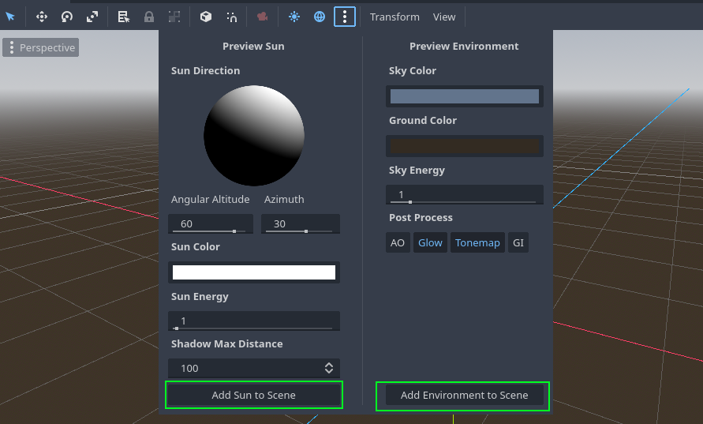
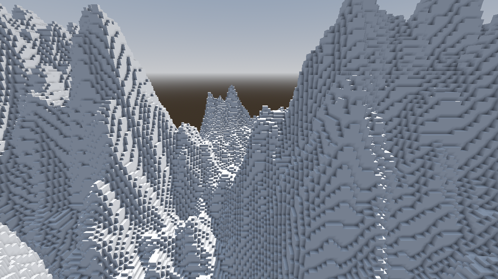
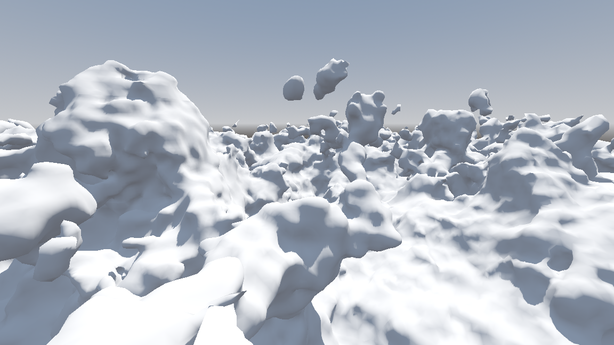

Quick start
==============

Demo projects
------------------

Now that your Godot Engine has voxel support built in, you can either download one of the demos and start playing around with them:

- [Zylann's basic demos](https://github.com/Zylann/voxelgame)
- [Zylann's solar system demo](https://github.com/Zylann/solar_system_demo)
- [TinmanJuggernaut's fps_demo](https://github.com/tinmanjuggernaut/voxelgame)

Videos
--------

You can watch some of the video tutorials available (they might come out of date!):

- [Voxel Terrain Tutorial with Godot's voxel tools module using the Smooth Transvoxel method (by Aknakos)](https://www.youtube.com/watch?v=YDHkTJ6Na9U) (17 Jun 2021)
- [How To Make Voxel Terrains In Godot (by Tokisan Games)](https://www.youtube.com/watch?v=zfzmcbR1H_0) (4 Nov 2019)
- [Godot Voxel Tools (by Gamesfromscratch)](https://www.youtube.com/watch?v=WxZK_Yg5kU0) (25 Jul 2020)

Short recipes
---------------

The following sections contain basic quick start instructions to get voxel terrains running.
For more in-depth information, see the rest of the documentation.

Before each example, you may do the following:

- Create a new project and a new 3D scene. Give it some light by adding a `DirectionalLight` node, and orientate it so it shines approximately downwards. You can enable `Shadows` too.

### Blocky heightmap terrain using `VoxelTerrain`

1) Add a `VoxelTerrain` node, and adjust the following settings in the inspector:
	
1.1) Under the `materials` section, create a new `StandardMaterial3D` in the first slot. Click that material, and in the "Vertex Color" category, enable "Use as Albedo" (`vertex_color_as_albedo`). This will give the blocks better shading.

1.2) Click on the `Generator` property: create a new `VoxelGeneratorNoise2D`. Then click on it and set its `Channel` parameter to `TYPE`. Also make sure the `noise` property is assigned to a noise resource.

1.3) Click on the `Mesher` property: create a new `VoxelMesherBlocky`. In the `library` property, create a new `VoxelBlockyLibrary`. In the `models` property, create a new item of type `VoxelBlockyModelEmpty` (this will be "air"). Create another item of type `VoxelBlockyModelCube` (this will be a solid cube).

1.4) Select the terrain node again, and in the `Terrain` menu on top of the viewport, click `Re-generate`. At this point you should start to see a terrain made of cubes appear in the editor viewport.

2) The terrain is not setup to appear in-game yet. Add a `Camera3D` node, and elevate it so it's above the terrain. You may also want to angle it a bit downward to see more of the landscape.

3) Add a `VoxelViewer` node under the camera. When the game runs, this node will tell the voxel engine where to generate voxels, as the camera moves around.

4) Make sure your scene contains an environment and a light, so you can see the terrain in-game (by default the default lighting you see in editor will not apply in game, leaving everything unlit and grey). 

5) Play the scene: you should see the terrain appear!

You can modify the shape of the terrain by changing noise parameters under the generator. 

`VoxelMesherBlocky` allows to specify way more than just white cubes: you can define multiple models, with varying textures, materials and shapes, in order to compose a world like you would see in Minecraft for example.

### Large smooth heightmap with overhangs using `VoxelLODTerrain`

1) Add a `VoxelLodTerrain` node, and adjust the following settings in the inspector:

1.1) `Generator`: create a new `VoxelGeneratorNoise`. Then click on it and set its `Channel` parameter to `SDF`. Also make sure the `noise` property is assigned to a noise resource.

1.2) `Mesher`: create a new `VoxelMesherTransvoxel`.

2) At this point you should start to see a smooth, spongy terrain appear in the editor viewport. You might need to look around and zoom out a bit. If you can't see anything, you can force a reload by reopening the scene, or using the menu `Terrain -> Re-generate`.

3) The terrain is not setup to appear in-game yet. Add a `Camera3D` node, and elevate it so it's above the terrain. You may also want to angle it a bit downward to see more of the landscape.

4) Add a `VoxelViewer` node under the camera. When the game runs, this node will tell the voxel engine where to generate voxels, as the camera moves around.

5) Make sure your scene contains an environment and a light, so you can see the terrain in-game (by default the default lighting you see in editor will not apply in game, leaving everything unlit and grey). 

6) Play the scene: you should see the terrain appear!

You can modify the shape of the terrain by changing noise parameters under the generator. 

Painting textures from voxel data is possible, but it's also common to use procedural texturing using a shader.

Is Voxel tools for you?
--------------------------

It's easy to think a project needs voxels, but they are less needed than it sounds. Also, just because there is a 3D grid somewhere in a game doesn't necessarily mean this module is appropriate. This module is more fit to certain cases than others, and will not necessarily focus on every kind of technology or feature using voxels.

Here are some reasons why you might not need it:

- "I need a procedurally generated world": if you don't need overhangs you can go with a heightmap approach. Heightmaps are faster and easier to work with.

- "I need destructible models": voxels in this module are "blobby" or "blocky", they can't represent every possible shape. If you need something precise, you could try more specialized alternatives like CSG nodes or precomputed destruction.

- "I need a terrain with overhangs and caves": do you need it to be editable by players? If not, then you can model the terrain in any 3D modeller and optimize it up-front. You can mix heightmaps + 3D models. You might rely on voxels to make the authoring process easier, but in the exported game you will only need the meshes and static colliders.

- "I need to make a planet": you can make more efficient planets by stitching 6 spherified heightmaps together. Take a cube where each face is a heightmap, then puff that cube to turn it into a sphere.

- "I want to make Minecraft but free and with my own blocks": Minecraft is a lot more than voxels. While the module can replicate basic functionalities, it is more general than this at the moment, so it doesn't provide a lot of features found in Minecraft out of the box. Alternatively, you could create a mod with [Minetest](https://www.minetest.net/), which is a more specialized engine.

- "GridMap sucks": how large do you want your grid to be? How complex are your models? This module's blocky mesher is geared towards very large grids with simple geometry, so it has its own restrictions.
