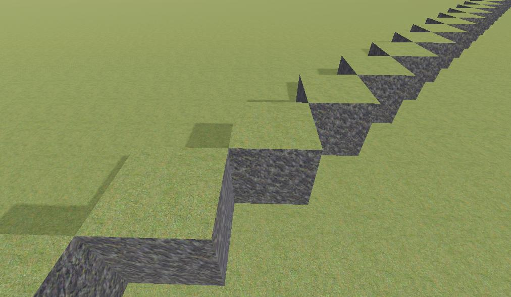

Scripting
=============

This page shows some examples in how to use the scripting API.


Editing the terrain
----------------------

### Using [VoxelTool](api/VoxelTool.md)

`VoxelTool` is a simplified API to access and modify voxel data. It is possible to obtain one from any class storing voxels, using the `get_voxel_tool()` function. That function will return a `VoxelTool` tied to the volume you got it from.

See [VoxelTool](api/VoxelTool.md) for available functions. Note, depending on which class you get it from, subclasses of `VoxelTool` may have more specialized functions.

It is possible to store a reference to `VoxelTool` in a member variable, in case you want to access voxels from the same volume many times. It is more efficient, because every call to `get_voxel_tool()` creates a new instance of it.

Before you start modifying voxels, make sure you access the right channel.

```gdscript
# If you use VoxelMesherBlocky
voxel_tool.channel = VoxelBuffer.CHANNEL_TYPE
```

```gdscript
# If you use VoxelMesherTransvoxel
voxel_tool.channel = VoxelBuffer.CHANNEL_SDF
```

```gdscript
# If you use VoxelMesherCubes
voxel_tool.channel = VoxelBuffer.CHANNEL_COLOR
```

### Boundary limitation

When a terrain is streaming blocks in and out, it is not possible to edit past loaded borders. Either you will get an error, or nothing will happen.
You can test if the area you want to access or edit is available by calling `VoxelTool.is_area_editable()`.


### LOD limitation

Similarly to bounds limitation, when you use LOD with `VoxelLodTerrain`, it is not possible to access or edit voxels beyond the first LOD level. Past this level, voxel data is no longer available at full resolution.


### Editing performance

In general, editing voxels one by one is the slowest. It is ok for actually getting only a few, but if you plan to modify larger areas at once, you may prefer functions that do this in bulk, or copy/paste buffers.

See [Access to voxels and multithreading](performance.md)


Custom generator
------------------

You can provide your own voxel generator by extending `VoxelGeneratorScript` in either GDScript, C# or C++.

!!! note
    custom generators can also be created without scripts, using [VoxelGeneratorGraph](generators.md)

### Example

Here is how to make a bare bones generator usable with a blocky terrain. Make sure you use `VoxelMesherBlocky` as mesher.

Create a standalone script `my_generator.gd` with the following contents:

```gdscript
extends VoxelGeneratorScript

const channel : int = VoxelBuffer.CHANNEL_TYPE

func _get_used_channels_mask() -> int:
    return 1 << channel
 
func _generate_block(buffer : VoxelBuffer, origin : Vector3i, lod : int) -> void:
	if lod != 0:
        return
	if origin.y < 0:
        buffer.fill(1, channel)
	if origin.x == origin.z and origin.y < 1:
        buffer.fill(1, channel)
```

In your terrain scene, add another script to a node, which will setup your generator when the game starts. Code might differ a bit depending on how you structure your scene.

```gdscript
const MyGenerator = preload("my_generator.gd")

# Get the terrain
var terrain = $VoxelTerrain

func _ready():
	terrain.generator = MyGenerator.new()
```

Make sure to have a `VoxelViewer` node in the scene under the camera, and you should see this:



Though `VoxelBuffer.fill()` is probably not what you want to use, the above is a quick example. Generate_block generally gives you a block of 16x16x16 cubes to fill all at once, so you may also use `VoxelBuffer.set_voxel()` to specify each one individually. You can change the channel to `VoxelBuffer.CHANNEL_SDF` to get smooth voxels using another mesher such as `VoxelMesherTransvoxel`.


### Thread-safety

Generators are invoked from multiple threads. Make sure your code is thread-safe.

If your generator uses resources or exports parameters that you want to change while it might be running, you should make sure they are read-only or copied per thread, so if the resource is modified from outside or another thread it won't disrupt the generator.

You can use `Mutex` to enforce single-thread access to variables, but use it with caution because otherwise you could end up limiting performance to one thread (while the other waits for the lock to be released). Using Read-Write locks and thread-locals are good options, unfortunately the Godot script API does not provide this.

Careful about lazy-initialization, it can cause crashes if two threads run it at the same time. `Curve` is one of the resources doing that: if you call `interpolate_baked()` and it wasn't baked yet, it will be baked at the very last moment. Here is an example of working around this:

```gdscript
extends VoxelGeneratorScript

const MountainsCurve : Curve = preload("moutains_curve.tres")

# This is called when the generator is created
func _init():
    # Call `bake()` to be sure it doesn't happen later inside `generate_block()`.
    MountainsCurve.bake()

# ...
```

A similar story occurs with `Image`. It needs to be locked before you can access pixels, but calling `lock()` and `unlock()` itself is not thread-safe. One approach to solve this is to `lock()` the image in `_init()` and leave it locked for the whole lifetime of the generator. This assumes of course that the image is never accessed from outside:

```gdscript
extends VoxelGeneratorScript

var image : Image

# This is called when the generator is created
func _init():
    image = Image.new()
    image.load("some_heightmap.png")
    image.lock()

func generate_block(buffer : VoxelBuffer, origin : Vector3i, lod : int) -> void:
    # ... use image.get_pixel() freely ...
    # ... but DO NOT use image.set_pixel() ...

func _notification(what: int):
    if what == NOTIFICATION_PREDELETE:
        # Called when the script is destroyed.
        # I don't know if it's really required, but unlock for correctness.
        image.unlock()

# ...
```

Image.lock() won't be required anymore in Godot 4.


Custom stream
---------------

Making a custom stream works similarly to a custom generator.

You have to extend the class `VoxelStreamScript` and override the methods `_load_block` and `_save_block`.
See 

TODO Script example of a custom stream


