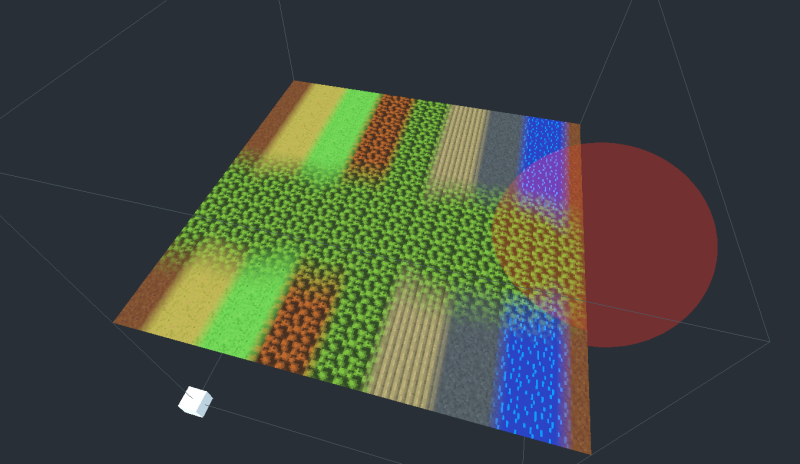
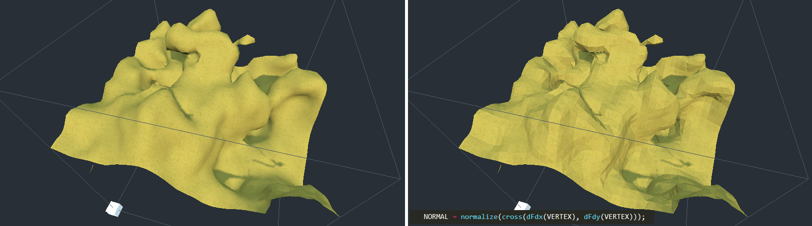
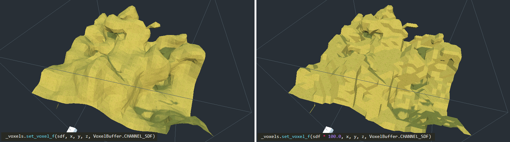

Smooth terrains
===================

It is possible to work with smooth-looking terrains, using signed distance fields and `VoxelMesherTransvoxel`.


Signed distance fields
-------------------------

### Concept

TODO 

### Scaled values

TODO 


Transvoxel
-----------

### Definition

Transvoxel is an extension of Marching Cubes that can be used to create smooth meshes from voxel data. The advantage of this algorithm is to integrate stitching of different levels of details without causing cracks, so it can be used to render very large landscapes.

For more information, visit [https://transvoxel.org/](https://transvoxel.org/).


### Smooth stitches in vertex shader

Transvoxel uses special meshes to stitch blocks of different level of detail. However the seams may still be visible as occasional sharp little steps. To smooth this out a bit, meshes produced by `VoxelMesherTransvoxel` contain extra information in their `COLOR` attribute, telling how to move vertices to smooth those steps, and make room for them in the regular part of the mesh.

Create and setup a `ShaderMaterial` on your terrain, and integrate this snippet to it:

```glsl
// This is recognized and assigned automatically by the voxel engine
uniform int u_transition_mask;

vec3 get_transvoxel_position(vec3 vertex_pos, vec4 vertex_col) {
	int border_mask = int(vertex_col.a);
	int cell_border_mask = border_mask & 63; // Which sides the cell is touching
	int vertex_border_mask = (border_mask >> 6) & 63; // Which sides the vertex is touching

	// If the vertex is near a side where there is a low-resolution neighbor,
	// move it to secondary position
	int m = u_transition_mask & (cell_border_mask & 63);
	float t = float(m != 0);

	// If the vertex lies on one or more sides, and at least one side has no low-resolution neighbor,
	// don't move the vertex.
	t *= float((vertex_border_mask & ~u_transition_mask) == 0);

	// Position to use when border mask matches
	vec3 secondary_position = vertex_col.rgb;
	return mix(vertex_pos, secondary_position, t);
}

void vertex() {
	VERTEX = get_transvoxel_position(VERTEX, COLOR);
    //...
}
```

Research issue which led to this code: [Issue #2](https://github.com/Zylann/godot_voxel/issues/2)


Texturing
-----------

Texturing a voxel surface can be more difficult than classic 3D meshes, because the geometry isn't known in advance, and can have almost any shape. So in this section we'll review ways to solve UV-mapping, procedural techniques and blending textures from voxel data.

### Triplanar mapping

Classic UV-mapping cannot be used on smooth voxel surfaces, because of the arbitrary shapes it can contain. In fact, smooth meshers don't provide any proper UV. So instead, we can use triplanar mapping.

The method involves projecting the texture on to the part of object that directly faces the X-axis. Then projecting it on the sides that directly face the Y-axis. Then again for the Z-axis. The edges of these projections are then blended together with a specified sharpness.

Look at how the brick textures are blended together on the top right sphere.


Read about [triplanar mapping in Godot](https://docs.godotengine.org/en/latest/tutorials/3d/spatial_material.html?highlight=triplanar%20#triplanar-mapping).

It is also possible to choose a different texture for the 3 axes.

Here's a shader that supports two materials, such as grass on the top and rock on the sides, each with triplanar mapped albedo, normal and AO maps, then blended together based on if their normal faces the upward direction or the sides.

You can find a working example in the [fps demo](https://github.com/tinmanjuggernaut/voxelgame), or see the [shader](https://github.com/tinmanjuggernaut/voxelgame/blob/master/project/fps_demo/materials/triplanar.shader) itself. 

In the shader parameters, add your two albedo maps, and optionally normal, and AO maps. Then play with the `AB Mix 1` and `AB Mix 2` sliders to adjust how the top and sides blend together. The other settings should be self explanatory. The screenshot below also has a little bit of fog and far DOF added.


### Procedural texturing

Voxel data is heavy, so if texturing rules of your game are simple enough to be determined from a shader and don't impact gameplay, you won't need to define any extra data in the voxels. For example, you can check the normal of a terrain surface to blend between a grass and rock texture, and use snow above a certain height.


### 4-blend over 16 textures

#### Voxel data

If you want textures to come from voxel data, `VoxelMesherTransvoxel` has a `texture_mode` property which can be set to `TEXTURES_BLEND_4_OVER_16`. This mode allows up to 16 textures and blends only the 4 most used ones per voxel. It expects voxel data in the `INDICES` and `WEIGHTS` channels, encoded into 16-bit depth values. There are 4 weights and 4 indices per voxel, each using 4 bits. It is very tight and does not allow for long gradients, but should be enough for most cases.

```
          1st byte    2nd byte
INDICES:  aaaa bbbb   cccc dddd
WEIGHTS:  aaaa bbbb   cccc dddd
```

By default, these channels default to indices `(0,1,2,3)` and weights `(1,0,0,0)`, meaning voxels always start with texture `0`.

The feature is recent and will need further work or changes in this area.
At the moment, indices and weights are mostly applied manually. It is possible to set them directly with `VoxelTool.set_voxel` but it is up to you to pack them properly. One easy way to paint is to use `VoxelTool.do_sphere()`:

```gdscript
# Paints texture 2 in a sphere area (does not create matter)
voxel_tool.set_mode(VoxelTool.MODE_TEXTURE_PAINT)
voxel_tool.set_texture_index(2)
voxel_tool.set_texture_opacity(1.0)
voxel_tool.do_sphere(hit_position, radius)
```

It is also possible to generate this in `VoxelGeneratorGraph` using special outputs, but it still requires a bit of math to produce valid data.

#### Mesh data

The mesher will include texturing information in the `UV` attribute of vertices. It has nothing to do with texture coordinates, it's just being repurposed. Contrary to voxel values, the packed information will have 8 bits of precision:

- `UV.x` will contain 4 indices, encoded as 4 bytes, which can be obtained by reinterpreting the float number as an integer and using bit-shifting operators.
- `UV.y` will contain 4 weights, again encoded as 4 bytes.

Each index tell which texture needs to be used, and each weight respectively tells how much of that texture should be blended. It is essentially the same as a classic color splatmap, except textures can vary. One minor downside is that you cannot blend more than 4 textures per voxel, so if this happens, it might cause artifacts. But in practice, it is assumed this case is so infrequent it can be ignored.


#### Shader

Here is the shader code you will need:

```glsl
// Textures should preferably be in a TextureArray, so looking them up is cheap
uniform sampler2DArray u_texture_array : hint_albedo;

// We'll need to pass data from the vertex shader to the fragment shader
varying vec4 v_indices;
varying vec4 v_weights;
varying vec3 v_normal;

// We'll use a utility function to decode components.
// It returns 4 values in the range [0..255].
vec4 decode_8bit_vec4(float v) {
	uint i = floatBitsToUint(v);
	return vec4(
		float(i & uint(0xff)),
		float((i >> uint(8)) & uint(0xff)),
		float((i >> uint(16)) & uint(0xff)),
		float((i >> uint(24)) & uint(0xff)));
}

// A voxel mesh can have overhangs in any direction,
// so we may have to use triplanar mapping functions.
vec3 get_triplanar_blend(vec3 world_normal) {
	vec3 blending = abs(world_normal);
	blending = normalize(max(blending, vec3(0.00001))); // Force weights to sum to 1.0
	float b = blending.x + blending.y + blending.z;
	return blending / vec3(b, b, b);
}

vec4 texture_array_triplanar(sampler2DArray tex, vec3 world_pos, vec3 blend, float i) {
	vec4 xaxis = texture(tex, vec3(world_pos.yz, i));
	vec4 yaxis = texture(tex, vec3(world_pos.xz, i));
	vec4 zaxis = texture(tex, vec3(world_pos.xy, i));
	// blend the results of the 3 planar projections.
	return xaxis * blend.x + yaxis * blend.y + zaxis * blend.z;
}

void vertex() {
	// Indices are integer values so we can decode them as-is
	v_indices = decode_8bit_vec4(UV.x);

	// Weights must be in [0..1] so we divide them
	v_weights = decode_8bit_vec4(UV.y) / 255.0;

	v_normal = NORMAL;

	//...
}

void fragment() {
	// Define a texture scale for convenience.
	// We can use an array instead if different scales per index is needed.
	float uv_scale = 0.5;

	// Sample the 4 blending textures, all with triplanar mapping.
	// We can re-use the same triplanar blending factors for all of them so separating that part
	// of the function improves performance a little.
	vec3 blending = get_triplanar_blend(v_normal);
	vec3 col0 = texture_array_triplanar(u_texture_array, v_pos * uv_scale, blending, v_indices.x).rgb;
	vec3 col1 = texture_array_triplanar(u_texture_array, v_pos * uv_scale, blending, v_indices.y).rgb;
	vec3 col2 = texture_array_triplanar(u_texture_array, v_pos * uv_scale, blending, v_indices.z).rgb;
	vec3 col3 = texture_array_triplanar(u_texture_array, v_pos * uv_scale, blending, v_indices.w).rgb;

	// Get weights and make sure they are normalized.
	// We may add a tiny safety margin so we can afford some degree of error.
	vec4 weights = v_weights;
	weights /= (weights.x + weights.y + weights.z + weights.w + 0.00001);

	// Calculate albedo
	vec3 col = 
		col0 * weights.r + 
		col1 * weights.g + 
		col2 * weights.b + 
		col3 * weights.a;

	ALBEDO = col;

	//...
}
```



!!! note
	If you only need 4 textures, then you can leave indices to their default values (which contains `0,1,2,3`) and only use weights. When using `VoxelTool`, you may only use texture indices 0, 1, 2 or 3. Texture arrays are less relevant in this case.


### Recommended Reading

- [SpatialMaterial](https://docs.godotengine.org/en/stable/classes/class_spatialmaterial.html) - demonstrates many of the shader options available in Godot.
- [Shading Index](https://docs.godotengine.org/en/stable/tutorials/shading/index.html) - tutorials and the shader language API
- Shader API Reference - some of the most frequently accessed references
	- [Shading Language](https://docs.godotengine.org/en/stable/tutorials/shading/shading_reference/shading_language.html)
	- [SpatialShader](https://docs.godotengine.org/en/stable/tutorials/shading/shading_reference/spatial_shader.html)


Shading
---------

By default smooth voxels also produce smooth meshes by sharing vertices. This also contributes to meshes being smaller in memory.

### Low-poly / flat-shaded look

It is currently not possible to make the mesher produce vertices with split flat triangles, but you can use this in your fragment shader:

```glsl
NORMAL = normalize(cross(dFdx(VERTEX), dFdy(VERTEX)));
```



### Blocky look

It is also possible to give a "blocky" look to "smooth" voxels:



This can be done by saturating SDF values in the voxel generator: they have to be always -1 or 1, without transition values. Since values are clamped when using `set_voxel_f`, multiplying by a large number also works. Built-in basic generators might not have this option, but you can do it if you use your own generator script or `VoxelGeneratorGraph`.

You may also make shading hard-edged in your shader for better results.


### Special uniforms

If you use a `ShaderMaterial` on a voxel node, the module may exploit some uniform (shader parameter) names to provide extra information.

Parameter name             | Type     | Description
---------------------------|----------|-----------------------
`u_lod_fade`               | `vec2`   | Information for progressive fading between levels of detail. Only available with `VoxelLodTerrain`. See [Lod fading](#lod-fading-experimental)
`u_block_local_transform`  | `mat4`   | Transform of the rendered block, local to the whole volume, as they may be rendered with multiple meshes. Useful if the volume is moving, to fix triplanar mapping. Only available with `VoxelLodTerrain` at the moment.


Level of detail (LOD)
-----------------------

`VoxelLodTerrain` implements dynamic level of detail for smooth terrain.

### Description

TODO

### LOD fading (experimental)

LOD changes can introduce some mild "popping" in the landscape, which might be a bit disturbing. One way to attenuate this problem is to fade meshes when they switch from two different levels of details. When a "parent" mesh subdivides into higher-resolution "child" meshes, they can be both rendered at the same time for a brief period of time, while the parent fades out and the children fade in, and vice-versa.
This trick requires you to use a `ShaderMaterial` on `VoxelLodTerrain`, as the rendering part needs an extra bit of code inside the fragment shader.

`VoxelLodTerrain` has a property `lod_fade_duration`, expressed in seconds. By default it is `0`, which makes it inactive. Setting it to a small value like `0.25` will enable it.

In your shader, add the following uniform:

```glsl
// This is recognized and assigned automatically by the voxel node
uniform vec2 u_lod_fade;
```

Add also this function (unless you have it already):

```glsl
float get_hash(vec2 c) {
	return fract(sin(dot(c.xy, vec2(12.9898,78.233))) * 43758.5453);
}
```

And *at the end* of `fragment()`, add this:

```glsl
// Discard pixels progressively.
// It has to be last to workaround https://github.com/godotengine/godot/issues/34966
float h = get_hash(SCREEN_UV);
if (u_lod_fade.y > 0.5) {
	// Fade in
	if (u_lod_fade.x < h) {
		discard;
	}
} else {
	// Fade out
	if (u_lod_fade.x > h) {
		discard;
	}
}
```

Note: this is an example of implementation. There might be more optimized ways to do it.

This will discard such that pixels of the two meshes will be complementary without overlap. `discard` is used so the mesh can remain rendered in the same pass (usually the opaque pass).

This technique is still imperfect because of several limitations:

- Transition meshes used to stitch blocks of different LOD are currently not faded. Doing so requires much more work, and in fact, the way these meshes are handled in the first place could be simplified if Godot allowed more fine-grained access to `ArrayMesh`, like switching to another index buffer without re-uploading the entire mesh.
- Shadow maps still create self-shadowing. While both meshes are rendered to cross-fade, one of them will eventually project shadows on the other. This creates a lot of noisy patches. Turning off shadows from one of them does not fix the other, and turning shadows off completely will make shadows pop. I haven't found a solution yet. See https://github.com/godotengine/godot-proposals/issues/692#issuecomment-782331429

