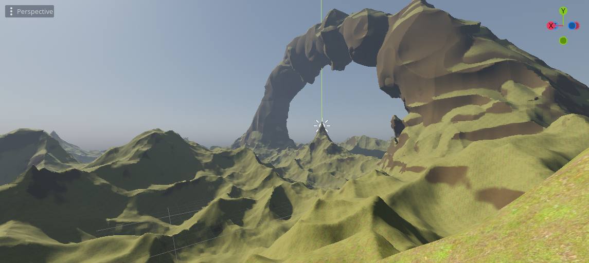

Smooth terrains
===================

It is possible to work with smooth-looking terrains, using signed distance fields and `VoxelMesherTransvoxel`.


Signed distance fields
-------------------------

### Concept

In order to represent smooth terrain, using a grid with points being either 0 or 1 is not enough. Such a grid is good for polygonizing blocky surfaces, but not curves. It could be averaged or blurred somehow, but this would be expensive.

For any point in space, a signed distance field (SDF) is a distance to the closest surface. It is "signed" because if the point is below a surface ("inside of something"), that distance becomes negative. That means the surface is defined by all the points for which the SDF is 0. That `0` is usually called the `isolevel`.

SDF is commonly used in raymarching shaders as a way to define volumes. It is also used in the Transvoxel algorithm (a variant of Marching Cubes), which is implemented by this engine. So instead of discrete values, voxels store a sort of smooth "gradient" of distances.


### Technical explanation

Voxels use SDF in 3D, so to help visualizing it, we'll have a look at 2D examples.
If we were to represent a sphere with blocky voxels, we would apply the following pseudo-code to every voxel:

```
if distance(center, position) < radius:
	voxel = 1
else:
	voxel = 0
```

Which gives the following:


Each voxel has binary values, either 1 or 0. But that gives no information about how the transition occurs between "matter" and "air", so if we were to render this using Transvoxel, the result would be:


It is kinda blocky. Now, we might indeed want this result (see section about shaders). But if we dont, we will need to change the code. In fact, if we walk back one step, the answer is already there:

```
voxel = distance(origin, position) - radius
```

This is the signed distance of a sphere. Here shown normalized, so voxels close to `0` are grey:


Every voxel now contains a slowly changing gradient, so when Transvoxel marches through all cells to find the surface, it will see much more precise variations than just `0` or `1`, which allows it to produce smooth polygons.


### Scaling and clamping

This engine allows to edit voxels and save them. Storing true SDF can be expensive for games. For example, because it is a *distance*, if a player builds a small tower on the ground, we would have to keep voxels up to date far away in the sky, just because the tower made the ground slightly closer to them. So in practice, it is not required to deal with exact SDF. We only need something that's good enough, so the gradients can vary at different speeds and modifications can stay "local".

Voxels far away in the sky are actually not interesting for us. The surface is what we really need. So we can clamp distances, such that voxels far enough from the surface will have the same value. And if a whole chunk has the same value, it can be optimized out as "uniform".

So the sphere SDF we've seen earlier would actually look like this in the data:


Over multiple chunks, all regions without a gradient will take very little space in memory.

To save further memory, this engine does not store SDF using 32-bit `float` numbers (not by default). Instead, it uses either 8-bit or 16-bit integers, which are interpreted as fixed-point decimal numbers between -1 and 1. Anything lower or higher is clamped. That means the distance we want to store has to be scaled to best exploit this interval.

In practice, it means before storing SDF in a `VoxelBuffer`, we scale it by `0.1`, or lower when using 16-bit. The lower the scale, the longer the gradient will span before it gets clamped, but the more memory will be used to store that variation. It should not be too low either, because 16-bit cannot represent variations that are too small. This scale may need to be tweaked if you use a lot of LOD levels, because if voxels are seen from very far away, the gradient will need to extend for long enough to remain smooth.

For more information about SDF and other domains where they are used, you can check out some of these videos:

- [Glyphs, shapes, fonts, signed distance fields. (Martin Donald)](https://www.youtube.com/watch?v=1b5hIMqz_wM)
- [Coding Adventure: Marching Cubes (Sebastian Lague)](https://www.youtube.com/watch?v=M3iI2l0ltbE)
- [Painting a Cartoon Girl using Mathematics (Inigo Quilez)](https://www.youtube.com/watch?v=8--5LwHRhjk)
- [Code for a bunch of SDF functions and operations (Inigo Quilez)](https://iquilezles.org/articles/distfunctions/)


Transvoxel
-----------

### Definition

Transvoxel is an extension of Marching Cubes that can be used to create smooth meshes from voxel data. The advantage of this algorithm is to integrate stitching of different levels of details without causing cracks, so it can be used to render very large landscapes.

For more information, visit [https://transvoxel.org/](https://transvoxel.org/).


### Smooth stitches in vertex shader

Transvoxel uses special meshes to stitch blocks of different level of detail. However the seams may still be visible as occasional sharp little steps. To smooth this out a bit, meshes produced by `VoxelMesherTransvoxel` contain extra information in their `CUSTOM0` attribute, telling how to move vertices to smooth those steps, and make room for them in the regular part of the mesh.

Create and setup a `ShaderMaterial` on your terrain, and integrate this snippet to it:

```glsl
// This is recognized and assigned automatically by the voxel engine
uniform int u_transition_mask;

float get_transvoxel_secondary_factor(int idata) {
	int cell_border_mask = idata & 63; // Which sides the cell is touching
	int vertex_border_mask = (idata >> 8) & 63; // Which sides the vertex is touching
	// If the vertex is near a side where there is a low-resolution neighbor,
	// move it to secondary position
	int m = u_transition_mask & cell_border_mask;
	float t = float(m != 0);
	// If the vertex lies on one or more sides, and at least one side has no low-resolution neighbor,
	// don't move the vertex.
	t *= float((vertex_border_mask & ~u_transition_mask) == 0);
	return t;
}

vec3 get_transvoxel_position(vec3 vertex_pos, vec4 fdata) {
	int idata = floatBitsToInt(fdata.a);

	// Move vertices to smooth transitions
	float secondary_factor = get_transvoxel_secondary_factor(idata);
	vec3 secondary_position = fdata.xyz;
	vec3 pos = mix(vertex_pos, secondary_position, secondary_factor);

	// If the mesh combines transitions and the vertex belongs to a transition,
	// when that transition isn't active we change the position of the vertices so
	// all triangles will be degenerate and won't be visible.
	// This is an alternative to rendering them separately,
	// which has less draw calls and less mesh resources to create in Godot.
	// Ideally I would tweak the index buffer like LOD does but Godot does not
	// expose anything to use it that way.
	int itransition = (idata >> 16) & 0xff; // Is the vertex on a transition mesh?
	float transition_cull = float(itransition == 0 || (itransition & u_transition_mask) != 0);
	pos *= transition_cull;

	return pos;
}

void vertex() {
	VERTEX = get_transvoxel_position(VERTEX, CUSTOM0);
    //...
}
```

Research issue which led to this code: [Issue #2](https://github.com/Zylann/godot_voxel/issues/2)


Texturing
-----------

Texturing a voxel surface can be more difficult than classic 3D meshes, because the geometry isn't known in advance, and can have almost any shape. So in this section we'll review ways to solve UV-mapping, procedural techniques and blending textures from voxel data.

### Triplanar mapping

Classic UV-mapping cannot be used on smooth voxel surfaces, because of the arbitrary shapes it can contain. In fact, smooth meshers don't provide any proper UV. So instead, we can use triplanar mapping.

The method involves projecting the texture on to the part of object that directly faces the X-axis. Then projecting it on the sides that directly face the Y-axis. Then again for the Z-axis. The edges of these projections are then blended together with a specified sharpness.

Look at how the brick textures are blended together on the top right sphere.


Read about [triplanar mapping in Godot](https://docs.godotengine.org/en/latest/tutorials/3d/standard_material_3d.html#triplanar-mapping).

It is also possible to choose a different texture for the 3 axes.

Here's a shader that supports two materials, such as grass on the top and rock on the sides, each with triplanar mapped albedo, normal and AO maps, then blended together based on if their normal faces the upward direction or the sides.

You can find a working example in the [demo](https://github.com/Zylann/voxelgame), or see the [shader](https://github.com/Zylann/voxelgame/blob/godot4/project/smooth_terrain/transvoxel_terrain.gdshader) itself (triplanar functions defined here https://github.com/Zylann/voxelgame/blob/godot4/project/smooth_terrain/shaders/triplanar.gdshaderinc). 

In the shader parameters, add your two albedo maps, and optionally normal, and AO maps. Then play with the `AB Mix 1` and `AB Mix 2` sliders to adjust how the top and sides blend together. The other settings should be self explanatory. The screenshot below also has a little bit of fog and far DOF added.


### Procedural texturing

Voxel data is heavy, so if texturing rules of your game are simple enough to be determined from a shader and don't impact gameplay, you won't need to define any extra data in the voxels. For example, you can check the normal of a terrain surface to blend between a grass and rock texture, and use snow above a certain height.


### 4-blend over 16 textures

#### Voxel data

If you want textures to come from voxel data, `VoxelMesherTransvoxel` has a `texture_mode` property which can be set to `TEXTURES_BLEND_4_OVER_16`. This mode allows up to 16 textures and blends only the 4 most used ones per voxel. It expects voxel data in the `INDICES` and `WEIGHTS` channels, encoded into 16-bit depth values. There are 4 weights and 4 indices per voxel, each using 4 bits. It is very tight and does not allow for long gradients, but should be enough for most cases.

```
          1st byte    2nd byte
INDICES:  aaaa bbbb   cccc dddd
WEIGHTS:  aaaa bbbb   cccc dddd
```

By default, these channels default to indices `(0,1,2,3)` and weights `(1,0,0,0)`, meaning voxels always start with texture `0`.

The feature is recent and will need further work or changes in this area.
At the moment, indices and weights are mostly applied manually. It is possible to set them directly with `VoxelTool.set_voxel` but it is up to you to pack them properly. One easy way to paint is to use `VoxelTool.do_sphere()`:

```gdscript
# Paints texture 2 in a sphere area (does not create matter)
voxel_tool.set_mode(VoxelTool.MODE_TEXTURE_PAINT)
voxel_tool.set_texture_index(2)
voxel_tool.set_texture_opacity(1.0)
voxel_tool.do_sphere(hit_position, radius)
```

It is also possible to generate this in `VoxelGeneratorGraph` using special outputs, but it still requires a bit of math to produce valid data.

#### Mesh data

The mesher will include texturing information in the `CUSTOM1` attribute of vertices. Contrary to voxel values, the packed information will have 8 bits of precision:

- `CUSTOM1.x` will contain 4 indices, encoded as 4 bytes, which can be obtained by reinterpreting the float number as an integer and using bit-shifting operators.
- `CUSTOM1.y` will contain 4 weights, again encoded as 4 bytes.

Each index tell which texture needs to be used, and each weight respectively tells how much of that texture should be blended. It is essentially the same as a classic color splatmap, except textures can vary. One minor downside is that you cannot blend more than 4 textures per voxel, so if this happens, it might cause artifacts. But in practice, it is assumed this case is so infrequent it can be ignored.


#### Shader

Here is the shader code you will need:

```glsl
shader_type spatial;

// Textures should preferably be in a TextureArray, so looking them up is cheap
uniform sampler2DArray u_texture_array : source_color;

// We'll need to pass data from the vertex shader to the fragment shader
varying vec4 v_indices;
varying vec4 v_weights;
varying vec3 v_normal;
varying vec3 v_pos;

// We'll use a utility function to decode components.
// It returns 4 values in the range [0..255].
vec4 decode_8bit_vec4(float v) {
	uint i = floatBitsToUint(v);
	return vec4(
		float(i & uint(0xff)),
		float((i >> uint(8)) & uint(0xff)),
		float((i >> uint(16)) & uint(0xff)),
		float((i >> uint(24)) & uint(0xff)));
}

// A voxel mesh can have overhangs in any direction,
// so we may have to use triplanar mapping functions.
vec3 get_triplanar_blend(vec3 world_normal) {
	vec3 blending = abs(world_normal);
	blending = normalize(max(blending, vec3(0.00001))); // Force weights to sum to 1.0
	float b = blending.x + blending.y + blending.z;
	return blending / vec3(b, b, b);
}

vec4 texture_array_triplanar(sampler2DArray tex, vec3 world_pos, vec3 blend, float i) {
	vec4 xaxis = texture(tex, vec3(world_pos.yz, i));
	vec4 yaxis = texture(tex, vec3(world_pos.xz, i));
	vec4 zaxis = texture(tex, vec3(world_pos.xy, i));
	// blend the results of the 3 planar projections.
	return xaxis * blend.x + yaxis * blend.y + zaxis * blend.z;
}

void vertex() {
	// Indices are integer values so we can decode them as-is
	v_indices = decode_8bit_vec4(CUSTOM1.x);

	// Weights must be in [0..1] so we divide them
	v_weights = decode_8bit_vec4(CUSTOM1.y) / 255.0;

	v_pos = VERTEX;
	v_normal = NORMAL;

	//...
}

void fragment() {
	// Define a texture scale for convenience.
	// We can use an array instead if different scales per index is needed.
	float uv_scale = 0.5;

	// Sample the 4 blending textures, all with triplanar mapping.
	// We can re-use the same triplanar blending factors for all of them so separating that part
	// of the function improves performance a little.
	vec3 blending = get_triplanar_blend(v_normal);
	vec3 col0 = texture_array_triplanar(u_texture_array, v_pos * uv_scale, blending, v_indices.x).rgb;
	vec3 col1 = texture_array_triplanar(u_texture_array, v_pos * uv_scale, blending, v_indices.y).rgb;
	vec3 col2 = texture_array_triplanar(u_texture_array, v_pos * uv_scale, blending, v_indices.z).rgb;
	vec3 col3 = texture_array_triplanar(u_texture_array, v_pos * uv_scale, blending, v_indices.w).rgb;

	// Get weights and make sure they are normalized.
	// We may add a tiny safety margin so we can afford some degree of error.
	vec4 weights = v_weights;
	weights /= (weights.x + weights.y + weights.z + weights.w + 0.00001);

	// Calculate albedo
	vec3 col = 
		col0 * weights.r + 
		col1 * weights.g + 
		col2 * weights.b + 
		col3 * weights.a;

	ALBEDO = col;

	//...
}
```


!!! note
	If you only need 4 textures, then you can leave indices to their default values (which contains `0,1,2,3`) and only use weights. When using `VoxelTool`, you may only use texture indices 0, 1, 2 or 3. Texture arrays are less relevant in this case.


### Recommended Reading

- [SpatialMaterial](https://docs.godotengine.org/en/stable/classes/class_spatialmaterial.html) - demonstrates many of the shader options available in Godot.
- [Shading Index](https://docs.godotengine.org/en/stable/tutorials/shading/index.html) - tutorials and the shader language API
- Shader API Reference - some of the most frequently accessed references
	- [Shading Language](https://docs.godotengine.org/en/stable/tutorials/shading/shading_reference/shading_language.html)
	- [SpatialShader](https://docs.godotengine.org/en/stable/tutorials/shading/shading_reference/spatial_shader.html)


Shading
---------

By default smooth voxels also produce smooth meshes by sharing vertices. This also contributes to meshes being smaller in memory.

### Low-poly / flat-shaded look

It is currently not possible to make the mesher produce vertices with split flat triangles, but you can use this in your fragment shader.

When using Vulkan:
```glsl
NORMAL = normalize(cross(dFdy(VERTEX), dFdx(VERTEX)));
```
When using OpenGL:
```glsl
NORMAL = normalize(cross(dFdx(VERTEX), dFdy(VERTEX)));
```


### Blocky look

It is also possible to give a "blocky" look to "smooth" voxels:


This can be done by saturating SDF values in the voxel generator: they have to be always -1 or 1, without transition values. Since values are clamped when using `set_voxel_f`, multiplying by a large number also works. Built-in basic generators might not have this option, but you can do it if you use your own generator script or `VoxelGeneratorGraph`.

You may also make shading hard-edged in your shader for better results.


Shader API reference
----------------------

If you use a `ShaderMaterial` on a voxel node, the module may exploit some uniform (shader parameter) names to provide extra information. Some are necessary for features to work.

Parameter name                          | Type         | Description
----------------------------------------|--------------|------------------------------
`u_lod_fade`                            | `vec2`       | Information for progressive fading between levels of detail. Only available with `VoxelLodTerrain`. See [Lod fading](#lod-fading-experimental)
`u_block_local_transform`               | `mat4`       | Transform of the rendered block, local to the whole volume, as they may be rendered with multiple meshes. Useful if the volume is moving, to fix triplanar mapping. Only available with `VoxelLodTerrain` at the moment.
`u_voxel_cell_lookup`                   | `usampler2D` | 3D `RG8` texture where each pixel contains a cell index packed in bytes of `R` and part of `G` (`r + ((g & 0x3f) << 8)`), and an axis index in 2 bits of `G` (`g >> 6`). The position to use for indexing this texture is relative to the origin of the mesh. The texture is 2D and square, so coordinates may be computed knowing the size of the mesh in voxels. Will only be assigned in meshes using detail texturing of [normalmaps](#distance-normals).
`u_voxel_normalmap_atlas`               | `sampler2D`  | Texture atlas where each tile contains a model-space normalmap (it is not relative to surface, unlike common normalmaps). Coordinates may be computed from `u_voxel_cell_lookup` and `u_voxel_virtual_texture_tile_size`. UV orientation is similar to triplanar mapping, but the axes are known from the information in `u_voxel_cell_lookup`. Will only be assigned in meshes using detail texturing of [normalmaps](#distance-normals).
`u_voxel_virtual_texture_tile_size`     | `int`        | Resolution in pixels of each tile in `u_voxel_normalmap_atlas`.
`u_voxel_cell_size`                     | `float`      | Size of one cubic cell in the mesh, in model space units. Will be > 0 in voxel meshes having [normalmaps](#distance-normals).
`u_voxel_block_size`                    | `int`        | Size of the cubic block of voxels that the mesh represents, in voxels.
`u_voxel_virtual_texture_fade`          | `float`      | When LOD fading is enabled, this will be a value between 0 and 1 for how much to mix in detail textures such as `u_voxel_normalmap_atlas`. They take time to update so this allows them to appear smoothly. The value is 1 if fading is not enabled, or 0 if the mesh has no detail textures.
`u_voxel_virtual_texture_offset_scale`  | `vec4`       | Used in LOD terrains where normalmaps are enabled. Contains a transformation to apply when sampling `u_voxel_cell_lookup` and `u_voxel_normalmap_atlas`. `x`, `y` and `z` contain an offset, and `w` contain a scale. This is relevant when textures for the current mesh aren't ready yet, so it falls back on a parent LOD: parent meshes are larger, so we need to sample a sub-region.
`u_transition_mask`                     | `int`        | When using `VoxelMesherTransvoxel`, this is a bitmask storing informations about neighboring meshes of different levels of detail. If one of the 6 sides of the mesh has a lower-resolution neighbor, the corresponding bit will be `1`. Side indices are in order `-X`, `X`, `-Y`, `Y`, `-Z`, `Z`. See [smooth stitches in vertex shaders](#smooth-stitches-in-vertex-shader).


Level of detail (LOD)
-----------------------

`VoxelLodTerrain` implements dynamic level of detail for smooth terrain.

### Description

LOD (Level Of Detail) is a technique used to change the amount of geometry dymamically, such that meshes close to the viewer have high definition, while meshes far from the viewer are simplified down. This aims at improving performance.


!!! note
	Careful: in this engine, `LOD` *levels* are frequently represented with numbers from `0` to `N-1`, where `N` is the number of LODs. `0` is the *highest level of detail*, while LOD `1`, `2` etc up to `N-1` are *lower levels of detail*.


When going from LOD `i` to `i+1`, voxels and blocks double in size, covering more space. However resolution of blocks doesn't change, so detail density is lower and consumes less resources.


### Octrees

LOD is implemented using a *grid of octrees*. Each octree may then be subdivided into chunks of variable size, where the smallest size will be LOD 0.

Subdivision occurs as the viewer gets closer. The threshold upon which it happens is controlled with the `lod_distance` property. It represents how far LOD 0 will spread around the viewer. It also affects how far other LODs will go, so it controls quality overall.

Similarly to `VoxelTerrain`, as the viewer moves around, octrees are loaded in front and those getting too far are unloaded. This allows to keep support for "infinite" terrain, without having to setup a single octree with unnecessary depth levels.

In the editor, gizmos are showing the *grid of octrees*. Block bounds can be shown by checking the `Terrain -> Show octree nodes` menu.

The size of the grid around the viewer depends on two factors:

- The `view_distance` parameter of `VoxelLodTerrain`
- The `view_distance` parameter on `VoxelViewer`.


### Number of LODs

Increasing the number of LODs allows the terrain to have larger octrees, which in turns allows to increase view distance. It does not actually make `LOD0` sharper, it goes the other way around (if you expected otherwise, maybe you need to tweak your generator to produce larger shapes, reduce voxel size or change the scales of your game which might be too small).
You might notice the grid of octrees changes size if you change LOD count: this is because it rounds to the current `view_distance`.

Reducing the number of LODs reduces the size of octrees, however it also means there will be much more of them to fill the grid up to `view_distance`. Make sure to keep a good sweetspot between LOD count and `view_distance` so that the density of octrees is not too high.

If you are not making an infinite terrain, you may give it fixed bounds with the `bounds` property, as well as a very large view distance so it stays in view.
`bounds` will be rounded to octree size: for example, with 4 LODs and mesh block size of 16, LOD0 blocks will be 16, LOD1 will be 32, LOD2 will be 64... and LOD3 (the biggest) will be 128. Since the current implementation keeps at minimum 8 octrees around the origin, optimal bounds for this setup would be 256.


Following the same logic, fixed bounds of 512 is optimal with 5 LODs, 1024 is optimal with 6 LODs and so on.
This is based on mesh block size of `16`, so if you set it to `32`, you may set one less LOD since meshes are twice as big.

For information about LOD behavior in the editor, see [Camera options in editor](editor.md#camera-options).


### Voxel size

Currently, the size of voxels is fixed to 1 space unit. It might be possible in a future version to change it. For now, a workaround is to scale down the node. However, make sure it is a uniform scale, and careful not to scale too low otherwise it might blow up.

`scale` from Node3D must not be confused with the concept of *size*. If you change `scale`, *it will also scale the voxel grid*, view distances, all the dimensions you might have set in generators, and of course it will apply to child nodes as well. The result will *look the same*, just bigger, no more details. So if you want something larger *with more details as a result*, it is recommended to change these sizes instead of scaling everything.
For example, if your generator contains a sphere and Perlin noise, you may change the radius of the sphere and the frequency/period of the noise instead of scaling the node. Doing it this way preserve the size of voxels and so it preserves accuracy.

Godot also allows you to scale non-uniformly, but it's not recommended (might cause collision issues too).


### Full load mode

LOD applies both to meshes and to voxel data, keeping memory usage relatively constant. Depending on your settings, distant voxels will not load full-resolution data. Only full-resolution voxels can be edited, so that means you can only modify terrain in a limited distance around the viewer.

If this limitation isn't suitable for your game, a workaround is to enable `full_load_mode`. This will load all edited chunks present in the `stream` (if any), such that all the data is available and can be edited anywhere without wait. Non-edited chunks will cause the generator to be queried on the fly instead of being cached. Because data streaming won't take place, keep in mind more memory will be used the more edited chunks the terrain contains.


### LOD fading

LOD changes can introduce some mild "popping" in the landscape, which might be a bit disturbing. One way to attenuate this problem is to fade meshes when they switch from two different levels of details. When a "parent" mesh subdivides into higher-resolution "child" meshes, they can be both rendered at the same time for a brief period of time, while the parent fades out and the children fade in, and vice-versa.
This trick requires you to use a `ShaderMaterial` on `VoxelLodTerrain`, as the rendering part needs an extra bit of code inside the fragment shader.

`VoxelLodTerrain` has a property `lod_fade_duration`, expressed in seconds. By default it is `0`, which makes it inactive. Setting it to a small value like `0.25` will enable it.

In your shader, add the following uniform:

```glsl
// This is recognized and assigned automatically by the voxel node
uniform vec2 u_lod_fade;
```

Add also this function (unless you have it already):

```glsl
float get_hash(vec2 c) {
	return fract(sin(dot(c.xy, vec2(12.9898,78.233))) * 43758.5453);
}
```

And *at the end* of `fragment()`, add this:

```glsl
// Discard pixels progressively.
// It has to be last to workaround https://github.com/godotengine/godot/issues/34966
float h = get_hash(SCREEN_UV);
if (u_lod_fade.y > 0.5) {
	// Fade in
	if (u_lod_fade.x < h) {
		discard;
	}
} else {
	// Fade out
	if (u_lod_fade.x > h) {
		discard;
	}
}
```

Note: this is an example of implementation. There might be more optimized ways to do it.

This will discard such that pixels of the two meshes will be complementary without overlap. `discard` is used so the mesh can remain rendered in the same pass (usually the opaque pass).

This technique has some limitations:

- Shadow maps still create self-shadowing in cases the faded meshes are far enough from each other. While both meshes are rendered to cross-fade, one of them will eventually project shadows on the other. This creates a lot of noisy patches. Turning off shadows from one of them does not fix the other, and turning shadows off will make them pop. I haven't found a solution yet. See https://github.com/godotengine/godot-proposals/issues/692#issuecomment-782331429


### Detail rendering

LOD decimates geometric details quite fast in the distance. It can be tuned up, but it quickly gets very expensive to generate and render a lot of polygons. An alternative is to generate normalmaps instead for medium/far meshes, to give the illusion of detail on otherwise flat polygons.

This engine contains an implementation of such a technique adapted to voxel meshes (thanks to [Victor Careil](https://twitter.com/phyronnaz/status/1544005424495607809) for the insight!), so it can work even with overhangs.

Here is a landscape without the feature:


With the feature:



The number of polygons is the same:


This can be turned on in the inspector when using `VoxelLodTerrain`. The cost is slower mesh generation and more memory usage to store normalmap textures.

This feature is only available in `VoxelLodTerrain`. It also works best with data streaming turned off (`full_load_mode_enabled`), because being able to see all details from far away requires to not unload edited blocks. It will still use the generator if data streaming is on, but you won't see edited regions.

Despite improving detail at lower cost than geometry, detail rendering is significantly more expensive than generating regular blocks. Several ways to optimize it are:

- Tweak tile sizes and LOD levels. The bigger tiles are, the higher the quality, but the more expensive it gets. Also the feature is usually not doing much if used at LODs 0 and 1, so usually a good default is to begin at LOD 2, with minimum tile size 4 and maximum 16.
- Use a simplified version of the `VoxelGenerator`. It is possible to override the generator that will be used to compute normalmaps, with `VoxelLodTerrain.set_normalmap_generator_override`. A typical use case is when the generator can produce caves. Caves don't have enough impact on surface visuals, so they could be ignored beyond a certain LOD level.
- Use SIMD noise. Noise is often the biggest bottleneck. In general, SIMD noise such as `FastNoise2` will perform better.

#### Shader 

Rendering these normals requires special shader code in your terrain material.

```glsl
// NOTE: this is not a full shader code, just the part of it required for this feature

// TODO Godot is not binding integer samplers properly.
// See https://github.com/godotengine/godot/issues/57841
// TODO Workaround using float texelFetch doesnt't work either...
// See https://github.com/godotengine/godot/issues/31732
//uniform usampler2D u_voxel_cell_lookup;
uniform sampler2D u_voxel_cell_lookup : filter_nearest;

uniform sampler2D u_voxel_normalmap_atlas;
uniform int u_voxel_virtual_texture_tile_size;
uniform float u_voxel_cell_size;
uniform int u_voxel_block_size;
// This is used when falling back on a detail texture from a parent mesh.
// The texture will cover a larger cube, so we use this information
// to query only inside a sub-region.
// (x, y, z) is offset, (w) is scale.
uniform vec4 u_voxel_virtual_texture_offset_scale;

varying vec3 v_vertex_pos_model;


vec2 pad_uv(vec2 uv, float amount) {
	return uv * (1.0 - 2.0 * amount) + vec2(amount);
}

// https://knarkowicz.wordpress.com/2014/04/16/octahedron-normal-vector-encoding/
vec3 octahedron_decode(vec2 f) {
	f = f * 2.0 - 1.0;
	// https://twitter.com/Stubbesaurus/status/937994790553227264
	vec3 n = vec3(f.x, f.y, 1.0 - abs(f.x) - abs(f.y));
	float t = clamp(-n.z, 0.0, 1.0);
	// GLSL didn't accept the vector version of this. Any impact?
	n.x += n.x >= 0.0 ? -t : t;
	n.y += n.y >= 0.0 ? -t : t;
	return /*f == vec2(0.0) ? vec3(0.0) : */normalize(n);
}

vec3 get_voxel_normal_model() {
	float cell_size = u_voxel_cell_size;
	int block_size = u_voxel_block_size;
	int normalmap_tile_size = u_voxel_virtual_texture_tile_size;
	
	vec3 cell_posf = vertex_pos_model / cell_size;
	cell_posf = cell_posf * u_voxel_virtual_texture_offset_scale.w + u_voxel_virtual_texture_offset_scale.xyz;
	ivec3 cell_pos = ivec3(floor(cell_posf));
	vec3 cell_fract = fract(cell_posf);
	
	int cell_index = cell_pos.x + cell_pos.y * block_size + cell_pos.z * block_size * block_size;
	int lookup_sqri = int(ceil(sqrt(float(block_size * block_size * block_size))));
	ivec2 lookup_pos = ivec2(cell_index % lookup_sqri, cell_index / lookup_sqri);
	//uvec3 lookup_value = texelFetch(u_voxel_cell_lookup, lookup_pos, 0).rgb;
	//vec3 lookup_valuef = texelFetch(u_voxel_cell_lookup, lookup_pos, 0).rgb;
	vec2 lookup_valuef = texture(u_voxel_cell_lookup, (vec2(lookup_pos) + vec2(0.5)) / float(lookup_sqri)).rg;
	ivec2 lookup_value = ivec2(round(lookup_valuef * 255.0));
	int tile_index = lookup_value.r | ((lookup_value.g & 0x3f) << 8);
	int tile_direction = lookup_value.g >> 6;
	
	vec3 tile_texcoord = vec3(0.0, 0.0, float(tile_index));
	// TODO Could do it non-branching with weighted addition
	switch(tile_direction) {
		case 0:
			tile_texcoord.xy = cell_fract.zy;
			break;
		case 1:
			tile_texcoord.xy = cell_fract.xz;
			break;
		case 2:
			tile_texcoord.xy = cell_fract.xy;
			break;
	}
	float padding = 0.5 / normalmap_tile_size;
	tile_texcoord.xy = pad_uv(tile_texcoord.xy, padding);

	ivec2 atlas_size = textureSize(u_voxel_normalmap_atlas, 0);
	int tiles_per_row = atlas_size.x / normalmap_tile_size;
	ivec2 tile_pos_pixels = ivec2(tile_index % tiles_per_row, tile_index / tiles_per_row) * normalmap_tile_size;
	vec2 atlas_texcoord = (vec2(tile_pos_pixels) + float(normalmap_tile_size) * tile_texcoord) / vec2(atlas_size);
	vec3 encoded_normal = texture(u_voxel_normalmap_atlas, atlas_texcoord).rgb;

	// You may switch between these two snippets depending on if you use octahedral compression or not
	// 1) XYZ
	vec3 tile_normal_model = 2.0 * encoded_normal - vec3(1.0);
	// 2) Octahedral
	// vec3 tile_normal_model = octahedron_decode(encoded_normal.rg);

	return tile_normal_model;
}

vec3 get_voxel_normal_view(vec3 geometry_normal_view, mat4 model_to_view) {
	if (u_voxel_cell_size == 0.0) {
		// Detail texture not available in this mesh
		return geometry_normal_view;
	}
	vec3 debug;
	vec3 tile_normal_model = get_voxel_normal_model(debug);
	vec3 tile_normal_view = (model_to_view * vec4(tile_normal_model, 0.0)).xyz;
	// In some edge cases the normal can be invalid (length close to zero), causing black artifacts.
	// Workaround this by falling back on the geometry normal.
	vec3 normal = mix(geometry_normal_view, tile_normal_view, dot(tile_normal_view, tile_normal_view));
	return normal;
}

void vertex() {
	// [...]

	// Note, if you use Transvoxel, this may be placed after modifications to `VERTEX`
	v_vertex_pos_model = VERTEX;

	// [...]
}

void fragment() {
	// [...]

	NORMAL = get_voxel_normal_view(NORMAL, VIEW_MATRIX * MODEL_MATRIX);

	// [...]
}
```

#### Details on the technique

Normal-mapping usually requires texture coordinates (UVs). However, smooth voxel meshes aren't trivial to UV-map at runtime. Some methods exist to generate UV-maps on completely arbitrary meshes, but they are too expensive for realtime, or inappropriate for seamless chunked terrain. So instead, we can use something similar to "virtual texturing".

The mesh is first subdivided into a grid of cells (we can use Transvoxel cells, which are ready to use). In each cell, we pick an axis-aligned projection working best with triangles of the cell using the average of their normals. A tile can then be generated by projecting its pixels on triangles, evaluating a normal from voxel data, and storing it in an atlas (a TextureArray could be used, but it has more limited number of layers). A shader can then read the atlas using a lookup texture to find the tile. The lookup texture is a 3D texture that tells for each "cell" where is the tile in the atlas (but it can be stored as a 2D texture).


To generate pixels of each tile, we need to access SDF data from two sources:

- The procedural generator
- Edited voxels at LOD 0

A classic method is used to obtain normals: on the desired position, we take 4 samples offset by a small step, compute their difference, and normalize the result. It's known as "forward differences" (see [Inigo Quilez's article about SDF normals](https://iquilezles.org/articles/normalsSDF/)).

Since every mesh will have its own textures, another technique that comes in handy is [Octahedral Compression](https://knarkowicz.wordpress.com/2014/04/16/octahedron-normal-vector-encoding/). These normals are world-space, and encoding them in a texture naively would require 3 bytes per pixel (for X, Y, Z). With octahedral compression, we trade off a bit of quality for a much smaller size of 2 bytes per pixels.


#### Rendering on the GPU

This feature is very expensive, so it is possible to run it on the graphics card if it supports Vulkan. This is enabled by checking `run on GPU` in the terrain's inspector.

Limitations:

- GPU normalmaps currently don't support edited voxels. Edited areas will fallback using the CPU.
- The generator you're using must support a shader variant using GLSL. `VoxelGeneratorGraph` is the only one supporting it at the moment. Some of its nodes don't have support for it.
