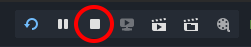

Streams
========

`VoxelStream` allows to save and load voxel data to a file or a directory structure, using various kinds of implementations. They don't hold voxel data in memory, they are just an access point.

Stream types
----------------

A few different types are available, each with slightly different features.

`VoxelStreamSQLite` is the most featured one, and uses a single SQLite database file. It can save both voxel data and [instancing](instancing.md) data.

`VoxelStreamRegionFiles` is an older one, which works similarly to Minecraft's region system. It saves under multiple files in a folder. It only supports voxel data.

`VoxelStreamScript` is a custom stream that may be implemented using a script. See [Scripting](scripting.md#custom-stream).

There is currently no stream implementation using an existing file format (like `.vox` for example), mainly because the current API expects the ability to load data in chunks compatible with the engine's format.

Using streams for savegames
----------------------------

Streams were created initially to serve as a database for saves. Games using voxel technology for terrain are often persistent, so there has to be a place on disk where to save the changes, and reload them back.

The engine can handle near-unlimited terrain size, so there are often situations where loading the entire world in memory is not possible. For that reason, streams are built in such a way they provide data block by block (or "chunks").
Only blocks near the player will be loaded in memory. When the player moves, blocks far away will get unloaded/saved, while blocks getting closer will be loaded.

By default, only modified blocks are saved. However, if the generator you use is too expensive to re-run on demand, it can be configured such that every new block will always get saved. This is the case in Minecraft.

When voxels are edited, modified blocks are not saved immediately. This is because many edits could keep happening, and trying to save too often could be wasteful.

Saving only occurs under the following conditions:

- The block gets unloaded when too far away
- `save_modified_blocks()` is called on the terrain node (you may want to call this when the player saves, or quits the game)

Using streams in the Godot Editor
----------------------------------

### Overlap between editor and game

At the moment, streams can run in the editor, but they behave the same as if the game was running. If you modify anything, blocks will eventually get saved under the same conditions as seen earlier. If you want to preserve your game saves, either leave the `stream` property unassigned, or you can assign a "development save" on the stream in the editor. Then, assign a different path from within your game to the real save (using script).

If you use the same save files between game and editor, there is a risk of conflict when you run the game: it will try to open files which are already opened and locked by the editor. To workaround this, either use different files, or close the scene before running the game. See [issue 283](https://github.com/Zylann/godot_voxel/issues/283).

### Closing the game

When you test your game and expect proper saving, prefer closing it normally, instead of using Godot's `Stop` button:

This button will [kill the game's process](https://github.com/godotengine/godot/blob/b4e2a24c1f62088b3f7ce0197afc90832fc25009/editor/editor_run.cpp#L358), without leaving a chance for cleanup (SIGKILL on Linux). That means any pending save tasks will be lost, and caches won't be flushed. If files are in the middle of being written, it can also cause them to get corrupted.

Save format specifications
----------------------------

- [Region format](specs/region_format_v3.md)
- [Block format](specs/block_format_v2.md)
- [SQLite format](specs/sqlite_format.md)
